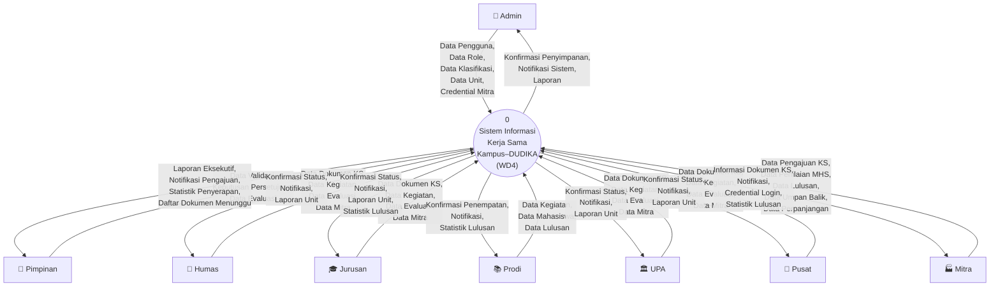
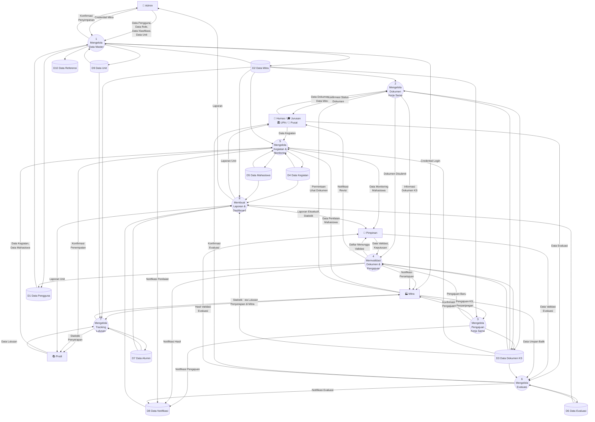
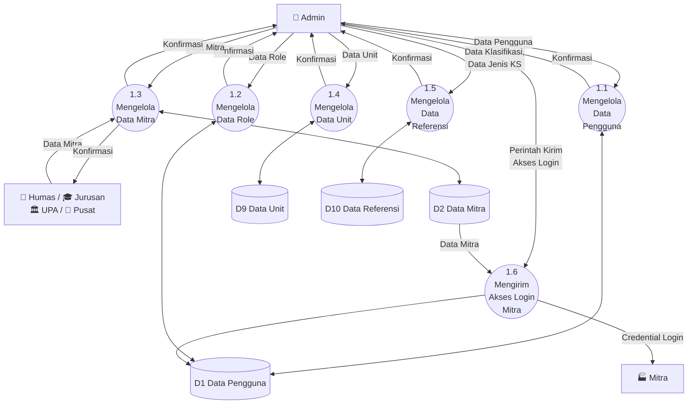
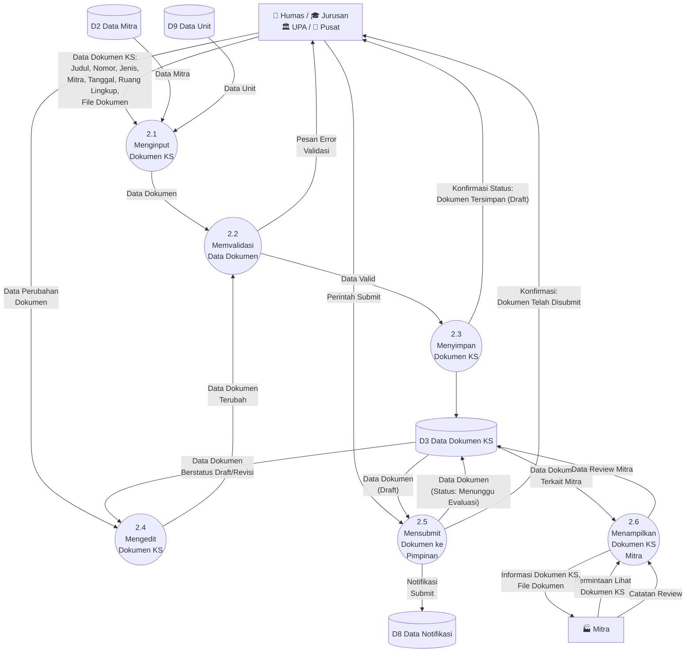
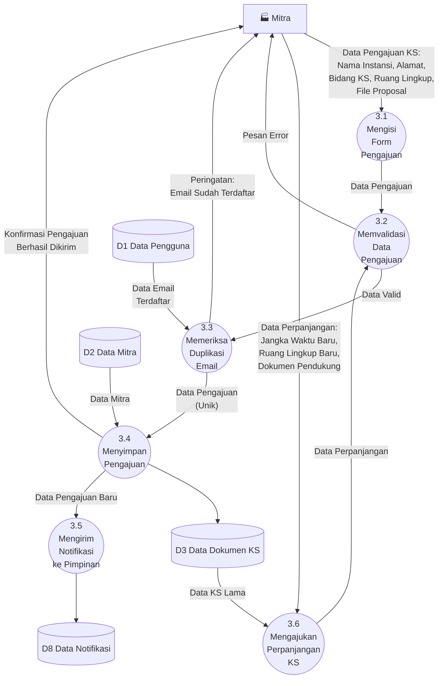
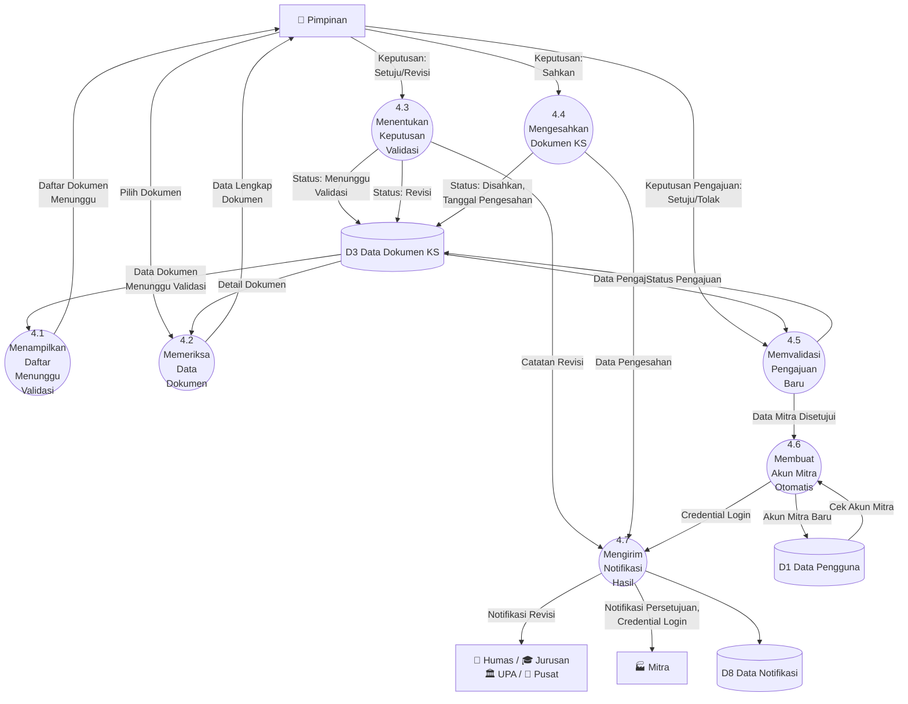
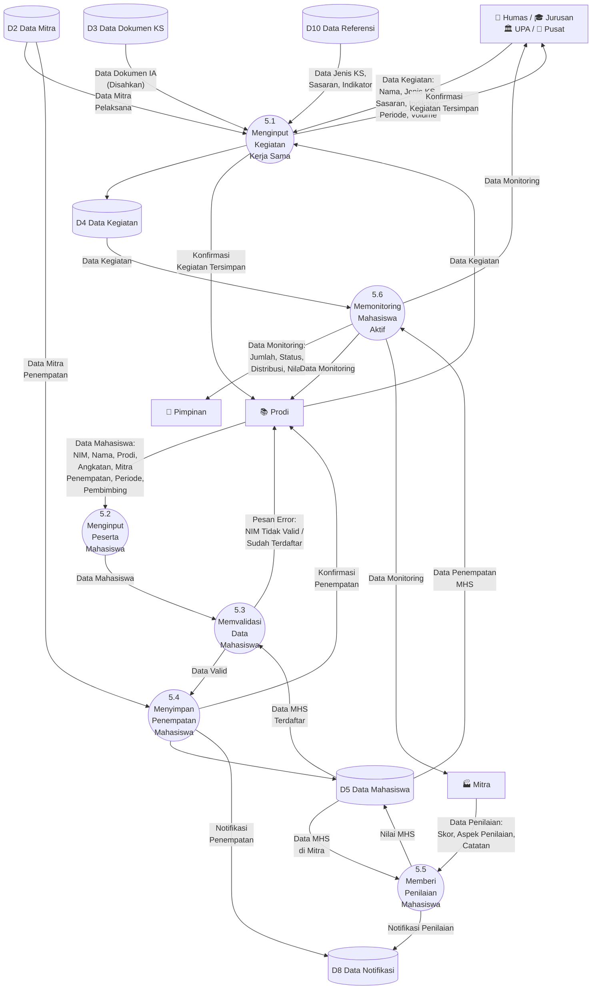
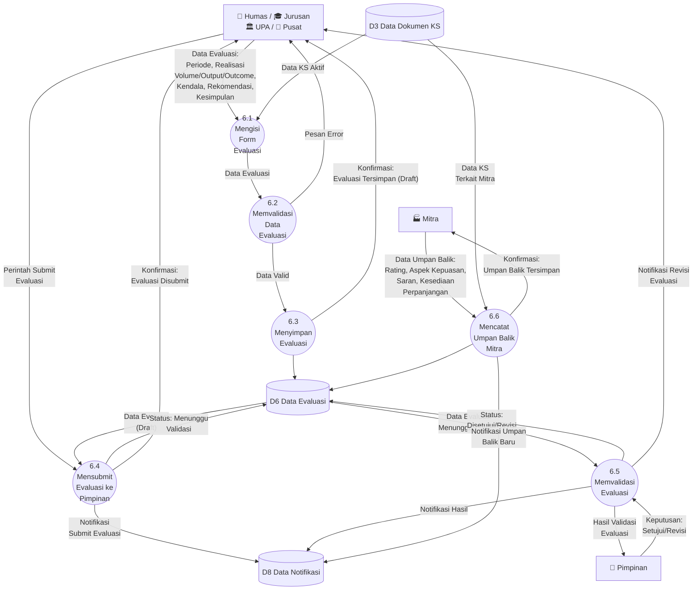
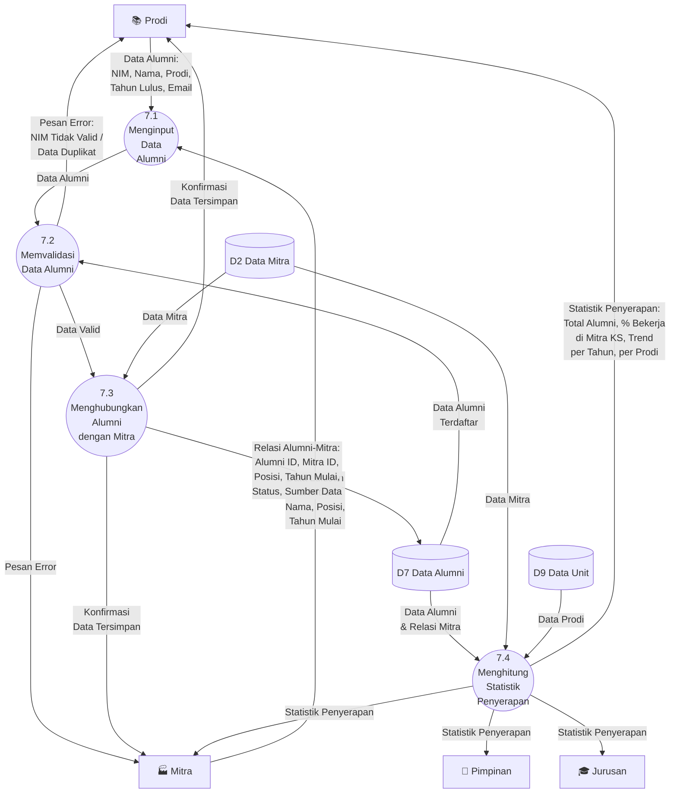
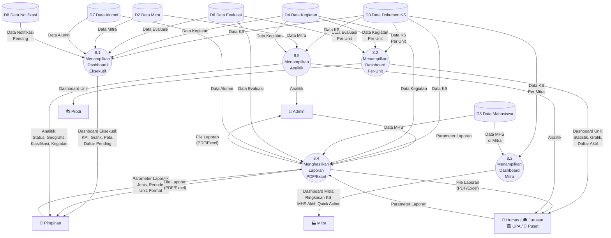

# 📊 Analysis DFD (Data Flow Diagram) — Sistem Informasi Kerja Sama Kampus–DUDIKA (WD4)

> **Versi**: 1.0 — Dokumen Analisis Data Flow Diagram  
> **Tanggal**: 30 Juli 2026  
> **Referensi**: [analysis-use-case.md](file:///c:/laragon/www/wd4/pengembangan-sistem/analysis-use-case.md) | [planning.md](file:///c:/laragon/www/wd4/pengembangan-sistem/planning.md) | [skils-dfd.md](file:///c:/laragon/www/wd4/skils-diagram/skils-dfd.md)

---

## Daftar Isi

1. [Pendahuluan](#1-pendahuluan)
2. [Identifikasi Komponen DFD](#2-identifikasi-komponen-dfd)
3. [Context Diagram](#3-context-diagram)
4. [DFD Level 0](#4-dfd-level-0)
5. [DFD Level 1 — Mengelola Data Master](#5-dfd-level-1--mengelola-data-master)
6. [DFD Level 1 — Mengelola Dokumen Kerja Sama](#6-dfd-level-1--mengelola-dokumen-kerja-sama)
7. [DFD Level 1 — Mengelola Pengajuan Kerja Sama](#7-dfd-level-1--mengelola-pengajuan-kerja-sama)
8. [DFD Level 1 — Memvalidasi Dokumen dan Pengajuan](#8-dfd-level-1--memvalidasi-dokumen-dan-pengajuan)
9. [DFD Level 1 — Mengelola Kegiatan dan Monitoring](#9-dfd-level-1--mengelola-kegiatan-dan-monitoring)
10. [DFD Level 1 — Mengelola Evaluasi](#10-dfd-level-1--mengelola-evaluasi)
11. [DFD Level 1 — Mengelola Tracking Lulusan](#11-dfd-level-1--mengelola-tracking-lulusan)
12. [DFD Level 1 — Membuat Laporan dan Dashboard](#12-dfd-level-1--membuat-laporan-dan-dashboard)
13. [Ringkasan Balancing DFD](#13-ringkasan-balancing-dfd)
14. [Checklist Validasi DFD](#14-checklist-validasi-dfd)

---

## 1. Pendahuluan

### 1.1 Tujuan Dokumen

Dokumen ini menggambarkan **Data Flow Diagram (DFD)** untuk Sistem Informasi Kerja Sama Kampus–DUDIKA (WD4). DFD digunakan untuk menjelaskan bagaimana data mengalir dari satu proses ke proses lain, dari mana data berasal, dan ke mana data ditujukan.

### 1.2 Fokus DFD

DFD dalam dokumen ini menjawab pertanyaan:

```text
1. Dari mana data berasal?          → External Entity
2. Data apa yang mengalir?          → Data Flow
3. Proses apa yang mengolah data?   → Process
4. Di mana data disimpan?           → Data Store
5. Ke mana data/informasi dikirim?  → External Entity
```

### 1.3 Struktur Level DFD

```text
Context Diagram    → Gambaran umum seluruh sistem (1 proses utama)
        ↓
DFD Level 0        → Proses-proses utama sistem (8 proses)
        ↓
DFD Level 1        → Detail setiap proses utama (dekomposisi)
```

### 1.4 Konvensi Penamaan

| Komponen | Aturan Penamaan | Contoh |
|----------|----------------|--------|
| **External Entity** | Kata benda (role/pihak luar) | Admin, Pimpinan, Mitra |
| **Process** | Kata kerja + objek | Mengelola Data Mitra |
| **Data Flow** | Nama data (kata benda) | Data Pengajuan, Hasil Validasi |
| **Data Store** | Kode D + Nama kumpulan data | D1 Data Pengguna |

---

## 2. Identifikasi Komponen DFD

### 2.1 External Entity

Pihak di luar sistem yang memberikan data ke atau menerima data dari sistem:

| Kode | External Entity | Deskripsi | Data yang Dikirim | Data yang Diterima |
|------|----------------|-----------|-------------------|-------------------|
| E1 | **Admin** | Pengelola sistem & data master | Data Pengguna, Data Role, Data Klasifikasi, Data Unit, Credential Mitra | Konfirmasi Penyimpanan, Notifikasi Sistem |
| E2 | **Pimpinan** | Pengambil keputusan strategis | Data Validasi, Data Evaluasi, Keputusan Persetujuan | Laporan Eksekutif, Notifikasi Pengajuan, Statistik Penyerapan |
| E3 | **Humas** | Administrasi & komunikasi mitra | Data Dokumen KS, Data Kegiatan, Data Evaluasi, Data Mitra | Konfirmasi Status, Notifikasi, Laporan Unit |
| E4 | **Jurusan** | Pengelola KS tingkat jurusan | Data Dokumen KS, Data Kegiatan, Data Evaluasi, Data Mitra | Konfirmasi Status, Notifikasi, Laporan Unit, Statistik Lulusan |
| E5 | **Prodi** | Pengelola kegiatan mahasiswa | Data Kegiatan, Data Mahasiswa, Data Lulusan | Konfirmasi Penempatan, Notifikasi, Statistik Lulusan |
| E6 | **UPA** | Pengelola KS unit pelaksana | Data Dokumen KS, Data Kegiatan, Data Evaluasi, Data Mitra | Konfirmasi Status, Notifikasi, Laporan Unit |
| E7 | **Pusat** | Pengelola KS tingkat pusat | Data Dokumen KS, Data Kegiatan, Data Evaluasi, Data Mitra | Konfirmasi Status, Notifikasi, Laporan Unit |
| E8 | **Mitra** | Pihak industri eksternal | Data Pengajuan KS, Data Penilaian MHS, Data Lulusan, Data Umpan Balik, Data Perpanjangan | Informasi Dokumen KS, Notifikasi, Credential Login, Statistik Lulusan |

---

### 2.2 Data Store

Tempat penyimpanan data yang digunakan oleh sistem:

| Kode | Data Store | Deskripsi | Tabel Database Terkait |
|------|-----------|-----------|----------------------|
| D1 | Data Pengguna | Data akun, profil, dan role pengguna | `users`, `profiles`, `roles` |
| D2 | Data Mitra | Data instansi mitra/DUDIKA | `mitras`, `klasifikasis` |
| D3 | Data Dokumen Kerja Sama | Data dokumen MoU, MoA, IA/SPK | `cooperations`, `laporan_files`, `pks_numbers` |
| D4 | Data Kegiatan | Data kegiatan pelaksanaan KS | `kegiatan_kerjasamas`, `detail_kegiatans` |
| D5 | Data Mahasiswa | Data mahasiswa peserta kegiatan | `mahasiswas`, `kegiatan_mahasiswas`, `pembimbings` |
| D6 | Data Evaluasi | Data evaluasi & umpan balik KS | `evaluasis` |
| D7 | Data Alumni | Data lulusan & relasi dengan mitra | `alumnis`, `alumni_mitras` |
| D8 | Data Notifikasi | Data notifikasi sistem | `notifikasis` |
| D9 | Data Unit | Data jurusan, prodi, UPA, pusat | `jurusans`, `prodis`, `upas`, `pusats` |
| D10 | Data Referensi | Data jenis KS, sasaran, indikator | `jenis_kerjasamas`, `sasarans`, `indikators` |

---

### 2.3 Proses Utama (Level 0)

| Kode | Proses | Deskripsi |
|------|--------|-----------|
| P1 | Mengelola Data Master | Mengelola data pengguna, role, mitra, unit, klasifikasi, dan referensi |
| P2 | Mengelola Dokumen Kerja Sama | Menginput, mengedit, dan mensubmit dokumen MoU/MoA/IA |
| P3 | Mengelola Pengajuan Kerja Sama | Memproses pengajuan dan perpanjangan KS dari mitra |
| P4 | Memvalidasi Dokumen dan Pengajuan | Pimpinan memvalidasi dan mengesahkan dokumen serta pengajuan |
| P5 | Mengelola Kegiatan dan Monitoring | Menginput kegiatan, peserta mahasiswa, dan penilaian |
| P6 | Mengelola Evaluasi | Mengisi, mensubmit, dan memvalidasi evaluasi KS |
| P7 | Mengelola Tracking Lulusan | Menginput dan mengelola data penyerapan lulusan di mitra |
| P8 | Membuat Laporan dan Dashboard | Menghasilkan dashboard, laporan, dan analitik |

---

## 3. Context Diagram

Context Diagram menggambarkan sistem secara keseluruhan sebagai **satu proses tunggal** yang berinteraksi dengan semua external entity.

### 3.1 Diagram



### 3.2 Tabel Aliran Data Context Diagram

| External Entity | Data Flow Masuk (→ Sistem) | Data Flow Keluar (Sistem →) |
|-----------------|---------------------------|----------------------------|
| Admin | Data Pengguna, Data Role, Data Klasifikasi, Data Unit, Credential Mitra | Konfirmasi Penyimpanan, Notifikasi Sistem, Laporan |
| Pimpinan | Data Validasi, Keputusan Persetujuan, Data Evaluasi | Laporan Eksekutif, Notifikasi Pengajuan, Statistik Penyerapan, Daftar Dokumen Menunggu |
| Humas | Data Dokumen KS, Data Kegiatan, Data Evaluasi, Data Mitra | Konfirmasi Status, Notifikasi, Laporan Unit |
| Jurusan | Data Dokumen KS, Data Kegiatan, Data Evaluasi, Data Mitra | Konfirmasi Status, Notifikasi, Laporan Unit, Statistik Lulusan |
| Prodi | Data Kegiatan, Data Mahasiswa, Data Lulusan | Konfirmasi Penempatan, Notifikasi, Statistik Lulusan |
| UPA | Data Dokumen KS, Data Kegiatan, Data Evaluasi, Data Mitra | Konfirmasi Status, Notifikasi, Laporan Unit |
| Pusat | Data Dokumen KS, Data Kegiatan, Data Evaluasi, Data Mitra | Konfirmasi Status, Notifikasi, Laporan Unit |
| Mitra | Data Pengajuan KS, Data Penilaian MHS, Data Lulusan, Data Umpan Balik, Data Perpanjangan | Informasi Dokumen KS, Notifikasi, Credential Login, Statistik Lulusan |

---

## 4. DFD Level 0

DFD Level 0 memecah sistem menjadi **8 proses utama** beserta data store dan aliran data antar proses.

### 4.1 Diagram



### 4.2 Tabel Aliran Data Level 0

| Dari | Ke | Data Flow | Keterangan |
|------|----|-----------|------------|
| Admin | P1 | Data Pengguna, Data Role, Data Klasifikasi, Data Unit | Input master data |
| P1 | Admin | Konfirmasi Penyimpanan | Feedback operasi CRUD |
| P1 | D1 | Data Pengguna | Simpan data user |
| P1 | D2 | Data Mitra | Simpan data mitra |
| P1 | D9 | Data Unit | Simpan data jurusan/prodi/UPA/pusat |
| P1 | D10 | Data Referensi | Simpan jenis KS, sasaran, indikator |
| Admin | P1 | Credential Mitra | Kirim akses login ke mitra |
| P1 | Mitra | Credential Login | Email berisi username & password |
| Humas/Jurusan/UPA/Pusat | P2 | Data Dokumen KS, Data Mitra | Input dokumen MoU/MoA/IA |
| P2 | Humas/Jurusan/UPA/Pusat | Konfirmasi Status Dokumen | Feedback penyimpanan dokumen |
| P2 | D3 | Data Dokumen KS | Simpan dokumen ke database |
| D2 | P2 | Data Mitra | Baca data mitra untuk relasi |
| P2 | P4 | Dokumen Disubmit | Dokumen yang disubmit ke Pimpinan |
| Mitra | P3 | Data Pengajuan KS, Data Perpanjangan | Pengajuan dari portal mitra |
| P3 | Mitra | Konfirmasi Pengajuan | Feedback pengajuan berhasil |
| P3 | D3 | Data Dokumen KS | Simpan pengajuan sebagai draft |
| P3 | P4 | Pengajuan Baru | Forward pengajuan ke Pimpinan |
| Pimpinan | P4 | Data Validasi, Keputusan | Keputusan validasi/pengesahan |
| P4 | Pimpinan | Daftar Menunggu Validasi | Daftar dokumen/pengajuan pending |
| P4 | D3 | Data Dokumen KS (Update Status) | Update status dokumen |
| P4 | D1 | Data Pengguna (Akun Mitra) | Auto-create akun saat persetujuan |
| P4 | D8 | Notifikasi Hasil | Notifikasi keputusan |
| P4 | Humas/Jurusan/UPA/Pusat | Notifikasi Revisi | Informasi revisi ke unit |
| P4 | Mitra | Notifikasi Persetujuan | Informasi hasil pengajuan |
| Humas/Jurusan/UPA/Pusat | P5 | Data Kegiatan | Input data kegiatan KS |
| Prodi | P5 | Data Kegiatan, Data Mahasiswa | Input kegiatan & peserta MHS |
| Mitra | P5 | Data Penilaian Mahasiswa | Penilaian dari mitra |
| P5 | D4 | Data Kegiatan | Simpan data kegiatan |
| P5 | D5 | Data Mahasiswa | Simpan data penempatan MHS |
| P5 | Pimpinan | Data Monitoring Mahasiswa | Statistik monitoring |
| P5 | Prodi | Konfirmasi Penempatan | Feedback penempatan MHS |
| Humas/Jurusan/UPA/Pusat | P6 | Data Evaluasi | Input evaluasi KS |
| Pimpinan | P6 | Data Validasi Evaluasi | Keputusan validasi evaluasi |
| Mitra | P6 | Data Umpan Balik | Feedback dari mitra |
| P6 | D6 | Data Evaluasi | Simpan data evaluasi |
| P6 | Humas/Jurusan/UPA/Pusat | Konfirmasi Evaluasi | Feedback evaluasi tersimpan |
| P6 | Pimpinan | Hasil Validasi Evaluasi | Hasil keputusan evaluasi |
| Prodi | P7 | Data Lulusan | Input data alumni |
| Mitra | P7 | Data Lulusan di Mitra | Konfirmasi alumni bekerja |
| P7 | D7 | Data Alumni | Simpan relasi alumni-mitra |
| P7 | Prodi/Mitra | Statistik Penyerapan | Data penyerapan lulusan |
| D3, D4, D5, D6, D7, D2 | P8 | Data untuk Laporan | Sumber data laporan |
| P8 | Pimpinan | Laporan Eksekutif, Statistik | Dashboard & laporan |
| P8 | Humas/Jurusan/UPA/Pusat/Prodi | Laporan Unit | Laporan per unit |
| Mitra | P2 | Permintaan Lihat Dokumen | Request akses dokumen |
| P2 | Mitra | Informasi Dokumen KS | Data dokumen terkait mitra |

---

## 5. DFD Level 1 — Mengelola Data Master

Dekomposisi dari **P1. Mengelola Data Master**

### 5.1 Diagram



### 5.2 Deskripsi Proses

| Kode | Proses | Input | Output | Data Store |
|------|--------|-------|--------|------------|
| 1.1 | Mengelola Data Pengguna | Data Pengguna (Nama, NIK, Email, Password, Role) | Konfirmasi Penyimpanan | D1 (Read/Write) |
| 1.2 | Mengelola Data Role | Data Role (Nama Role, Permission) | Konfirmasi Penyimpanan | D1 (Read/Write) |
| 1.3 | Mengelola Data Mitra | Data Mitra (Nama, Alamat, Klasifikasi, Email, Telp) | Konfirmasi Penyimpanan | D2 (Read/Write) |
| 1.4 | Mengelola Data Unit | Data Unit (Nama, Kode, Ketua/Kepala) | Konfirmasi Penyimpanan | D9 (Read/Write) |
| 1.5 | Mengelola Data Referensi | Data Klasifikasi, Data Jenis KS, Data Sasaran | Konfirmasi Penyimpanan | D10 (Read/Write) |
| 1.6 | Mengirim Akses Login Mitra | Perintah Kirim, Data Mitra | Credential Login (Email ke Mitra) | D1 (Write), D2 (Read) |

---

## 6. DFD Level 1 — Mengelola Dokumen Kerja Sama

Dekomposisi dari **P2. Mengelola Dokumen Kerja Sama**

### 6.1 Diagram



### 6.2 Deskripsi Proses

| Kode | Proses | Input | Output | Data Store |
|------|--------|-------|--------|------------|
| 2.1 | Menginput Dokumen KS | Data Dokumen KS (Judul, Nomor, Jenis, Mitra, Tanggal, File) | Data Dokumen (ke validasi) | D2 (Read), D9 (Read) |
| 2.2 | Memvalidasi Data Dokumen | Data Dokumen | Data Valid / Pesan Error | — |
| 2.3 | Menyimpan Dokumen KS | Data Valid | Konfirmasi (Status Draft) | D3 (Write) |
| 2.4 | Mengedit Dokumen KS | Data Perubahan, Data Dokumen Lama | Data Terubah (ke validasi) | D3 (Read) |
| 2.5 | Mensubmit Dokumen ke Pimpinan | Perintah Submit, Data Dokumen Draft | Status: Menunggu Evaluasi | D3 (Write), D8 (Write) |
| 2.6 | Menampilkan Dokumen KS Mitra | Permintaan Lihat, Catatan Review | Informasi Dokumen, Data Review | D3 (Read/Write) |

---

## 7. DFD Level 1 — Mengelola Pengajuan Kerja Sama

Dekomposisi dari **P3. Mengelola Pengajuan Kerja Sama**

### 7.1 Diagram



### 7.2 Deskripsi Proses

| Kode | Proses | Input | Output | Data Store |
|------|--------|-------|--------|------------|
| 3.1 | Mengisi Form Pengajuan | Data Pengajuan KS (Nama, Alamat, Bidang, Ruang Lingkup, Proposal) | Data Pengajuan (ke validasi) | — |
| 3.2 | Memvalidasi Data Pengajuan | Data Pengajuan | Data Valid / Pesan Error | — |
| 3.3 | Memeriksa Duplikasi Email | Data Pengajuan, Data Email Terdaftar | Pengajuan Unik / Peringatan Duplikat | D1 (Read) |
| 3.4 | Menyimpan Pengajuan | Data Pengajuan Unik | Konfirmasi Pengajuan | D3 (Write), D2 (Read) |
| 3.5 | Mengirim Notifikasi ke Pimpinan | Data Pengajuan Baru | Notifikasi | D8 (Write) |
| 3.6 | Mengajukan Perpanjangan KS | Data Perpanjangan, Data KS Lama | Data Perpanjangan (ke validasi) | D3 (Read) |

---

## 8. DFD Level 1 — Memvalidasi Dokumen dan Pengajuan

Dekomposisi dari **P4. Memvalidasi Dokumen dan Pengajuan**

### 8.1 Diagram



### 8.2 Deskripsi Proses

| Kode | Proses | Input | Output | Data Store |
|------|--------|-------|--------|------------|
| 4.1 | Menampilkan Daftar Menunggu Validasi | Data Dokumen Menunggu | Daftar Dokumen Menunggu (ke Pimpinan) | D3 (Read) |
| 4.2 | Memeriksa Data Dokumen | Pilihan Dokumen | Data Lengkap Dokumen | D3 (Read) |
| 4.3 | Menentukan Keputusan Validasi | Keputusan Pimpinan (Setuju/Revisi) | Status Baru, Catatan | D3 (Write) |
| 4.4 | Mengesahkan Dokumen KS | Keputusan Sahkan | Status Disahkan, Tanggal Pengesahan | D3 (Write) |
| 4.5 | Memvalidasi Pengajuan Baru | Keputusan Setuju/Tolak, Data Pengajuan | Status Pengajuan, Data Mitra Disetujui | D3 (Read/Write) |
| 4.6 | Membuat Akun Mitra Otomatis | Data Mitra Disetujui, Cek Akun | Akun Mitra Baru, Credential | D1 (Read/Write) |
| 4.7 | Mengirim Notifikasi Hasil | Catatan, Data Pengesahan, Credential | Notifikasi ke Unit & Mitra | D8 (Write) |

---

## 9. DFD Level 1 — Mengelola Kegiatan dan Monitoring

Dekomposisi dari **P5. Mengelola Kegiatan dan Monitoring**

### 9.1 Diagram



### 9.2 Deskripsi Proses

| Kode | Proses | Input | Output | Data Store |
|------|--------|-------|--------|------------|
| 5.1 | Menginput Kegiatan KS | Data Kegiatan, Data IA, Data Referensi, Data Mitra | Konfirmasi Tersimpan | D4 (Write), D3 (Read), D10 (Read), D2 (Read) |
| 5.2 | Menginput Peserta Mahasiswa | Data Mahasiswa (NIM, Nama, Prodi, Mitra, Pembimbing) | Data Mahasiswa (ke validasi) | — |
| 5.3 | Memvalidasi Data Mahasiswa | Data Mahasiswa, Data MHS Terdaftar | Data Valid / Pesan Error | D5 (Read) |
| 5.4 | Menyimpan Penempatan Mahasiswa | Data Valid | Konfirmasi Penempatan | D5 (Write), D2 (Read), D8 (Write) |
| 5.5 | Memberi Penilaian Mahasiswa | Data Penilaian (Skor, Aspek, Catatan) | Nilai MHS Tersimpan | D5 (Read/Write), D8 (Write) |
| 5.6 | Memonitoring Mahasiswa Aktif | Data Kegiatan, Data Penempatan | Data Monitoring (Jumlah, Status, Distribusi) | D4 (Read), D5 (Read) |

---

## 10. DFD Level 1 — Mengelola Evaluasi

Dekomposisi dari **P6. Mengelola Evaluasi**

### 10.1 Diagram



### 10.2 Deskripsi Proses

| Kode | Proses | Input | Output | Data Store |
|------|--------|-------|--------|------------|
| 6.1 | Mengisi Form Evaluasi | Data Evaluasi (Periode, Realisasi, Kendala, Rekomendasi) | Data Evaluasi (ke validasi) | D3 (Read) |
| 6.2 | Memvalidasi Data Evaluasi | Data Evaluasi | Data Valid / Pesan Error | — |
| 6.3 | Menyimpan Evaluasi | Data Valid | Konfirmasi (Status Draft) | D6 (Write) |
| 6.4 | Mensubmit Evaluasi ke Pimpinan | Perintah Submit, Data Evaluasi Draft | Status: Menunggu Validasi | D6 (Write), D8 (Write) |
| 6.5 | Memvalidasi Evaluasi | Keputusan Pimpinan, Data Evaluasi | Status: Disetujui/Revisi | D6 (Read/Write), D8 (Write) |
| 6.6 | Mencatat Umpan Balik Mitra | Data Umpan Balik (Rating, Saran), Data KS | Konfirmasi Tersimpan | D6 (Write), D3 (Read), D8 (Write) |

---

## 11. DFD Level 1 — Mengelola Tracking Lulusan

Dekomposisi dari **P7. Mengelola Tracking Lulusan**

### 11.1 Diagram



### 11.2 Deskripsi Proses

| Kode | Proses | Input | Output | Data Store |
|------|--------|-------|--------|------------|
| 7.1 | Menginput Data Alumni | Data Alumni (NIM, Nama, Prodi, Tahun Lulus), Data Lulusan di Mitra | Data Alumni (ke validasi) | — |
| 7.2 | Memvalidasi Data Alumni | Data Alumni, Data Alumni Terdaftar | Data Valid / Pesan Error | D7 (Read) |
| 7.3 | Menghubungkan Alumni dengan Mitra | Data Valid | Relasi Alumni-Mitra | D7 (Write), D2 (Read) |
| 7.4 | Menghitung Statistik Penyerapan | Data Alumni, Data Mitra, Data Prodi | Statistik Penyerapan Lulusan | D7 (Read), D2 (Read), D9 (Read) |

---

## 12. DFD Level 1 — Membuat Laporan dan Dashboard

Dekomposisi dari **P8. Membuat Laporan dan Dashboard**

### 12.1 Diagram



### 12.2 Deskripsi Proses

| Kode | Proses | Input | Output | Data Store |
|------|--------|-------|--------|------------|
| 8.1 | Menampilkan Dashboard Eksekutif | Data KS, Data Kegiatan, Data Evaluasi, Data Mitra, Data Alumni, Notifikasi Pending | Dashboard Eksekutif (KPI, Grafik, Peta, Daftar Pending) | D3, D4, D6, D2, D7, D8 (Read) |
| 8.2 | Menampilkan Dashboard Per-Unit | Data KS/Kegiatan/Evaluasi per Unit | Dashboard Unit (Statistik, Grafik, Daftar Aktif) | D3, D4, D6 (Read) |
| 8.3 | Menampilkan Dashboard Mitra | Data KS per Mitra, Data MHS di Mitra | Dashboard Mitra (Ringkasan, MHS Aktif, Quick Action) | D3, D5 (Read) |
| 8.4 | Menghasilkan Laporan PDF/Excel | Parameter Laporan, Data dari Multiple Store | File Laporan (PDF/Excel) | D3, D4, D5, D6, D7 (Read) |
| 8.5 | Menampilkan Analitik | Data KS, Data Mitra, Data Kegiatan | Visualisasi Analitik (Status, Geo, Klasifikasi) | D3, D2, D4 (Read) |

---

## 13. Ringkasan Balancing DFD

Tabel berikut menunjukkan konsistensi aliran data dari Context Diagram ke DFD Level 0 dan Level 1.

### 13.1 Balancing Context Diagram ↔ DFD Level 0

| External Entity | Data Flow (Context) | Proses Level 0 yang Menerima/Mengirim |
|-----------------|--------------------|------------------------------------|
| Admin | Data Pengguna, Data Role, Data Klasifikasi, Data Unit → | P1 (Mengelola Data Master) |
| Admin | Credential Mitra → | P1 (Mengelola Data Master) |
| Admin | ← Konfirmasi Penyimpanan, Notifikasi, Laporan | P1, P8 |
| Pimpinan | Data Validasi, Keputusan → | P4 (Memvalidasi Dokumen & Pengajuan) |
| Pimpinan | Data Evaluasi → | P6 (Mengelola Evaluasi) |
| Pimpinan | ← Laporan Eksekutif, Notifikasi, Statistik, Daftar Menunggu | P4, P5, P7, P8 |
| Humas/Jurusan/UPA/Pusat | Data Dokumen KS, Data Mitra → | P2 (Mengelola Dokumen KS), P1 |
| Humas/Jurusan/UPA/Pusat | Data Kegiatan → | P5 (Mengelola Kegiatan) |
| Humas/Jurusan/UPA/Pusat | Data Evaluasi → | P6 (Mengelola Evaluasi) |
| Humas/Jurusan/UPA/Pusat | ← Konfirmasi Status, Notifikasi, Laporan Unit | P2, P4, P6, P8 |
| Prodi | Data Kegiatan, Data Mahasiswa → | P5 (Mengelola Kegiatan) |
| Prodi | Data Lulusan → | P7 (Mengelola Tracking Lulusan) |
| Prodi | ← Konfirmasi Penempatan, Notifikasi, Statistik Lulusan | P5, P7, P8 |
| Mitra | Data Pengajuan KS, Data Perpanjangan → | P3 (Mengelola Pengajuan KS) |
| Mitra | Data Penilaian MHS → | P5 (Mengelola Kegiatan) |
| Mitra | Data Lulusan, Data Umpan Balik → | P6, P7 |
| Mitra | ← Informasi Dokumen KS, Notifikasi, Credential, Statistik | P1, P2, P4, P5, P7, P8 |

### 13.2 Balancing DFD Level 0 ↔ DFD Level 1

| Proses Level 0 | Sub-Proses Level 1 | Data Flow Eksternal Konsisten? |
|----------------|--------------------|-----------------------------|
| P1 Mengelola Data Master | 1.1–1.6 | ✅ Ya |
| P2 Mengelola Dokumen KS | 2.1–2.6 | ✅ Ya |
| P3 Mengelola Pengajuan KS | 3.1–3.6 | ✅ Ya |
| P4 Memvalidasi Dokumen & Pengajuan | 4.1–4.7 | ✅ Ya |
| P5 Mengelola Kegiatan & Monitoring | 5.1–5.6 | ✅ Ya |
| P6 Mengelola Evaluasi | 6.1–6.6 | ✅ Ya |
| P7 Mengelola Tracking Lulusan | 7.1–7.4 | ✅ Ya |
| P8 Membuat Laporan & Dashboard | 8.1–8.5 | ✅ Ya |

---

## 14. Checklist Validasi DFD

### 14.1 Context Diagram

- [x] Hanya memiliki satu proses utama (Sistem Informasi Kerja Sama WD4)
- [x] Semua External Entity teridentifikasi (8 entitas)
- [x] Semua data flow masuk (input) tergambar
- [x] Semua data flow keluar (output) tergambar
- [x] Tidak memiliki Data Store
- [x] Tidak memiliki proses internal

### 14.2 DFD Level 0

- [x] Semua proses utama teridentifikasi (8 proses)
- [x] External Entity konsisten dengan Context Diagram
- [x] Data Flow eksternal konsisten dengan Context Diagram
- [x] Data Store digunakan secara logis (10 data store)
- [x] Semua proses memiliki input dan output
- [x] Tidak ada proses Black Hole (tanpa output)
- [x] Tidak ada proses Miracle (tanpa input)
- [x] External Entity tidak langsung terhubung ke Data Store

### 14.3 DFD Level 1

- [x] Proses merupakan hasil dekomposisi dari Level 0
- [x] Penomoran konsisten (1.1, 1.2, ... 8.1, 8.2, dst.)
- [x] External Entity tetap konsisten
- [x] Data Flow eksternal tetap konsisten (balancing)
- [x] Data Store digunakan secara logis
- [x] Tidak ada aliran data yang tidak jelas
- [x] Setiap proses memiliki transformasi data yang jelas

### 14.4 Visual

- [x] Arah aliran data jelas
- [x] Nama menggunakan konvensi yang benar (kata kerja untuk proses, kata benda untuk entity/data flow/data store)
- [x] Penomoran mudah dipahami
- [x] Diagram dapat dipahami tanpa penjelasan lisan

---

> [!NOTE]
> **Ringkasan DFD**:
> - **Context Diagram**: 1 proses utama, 8 external entity
> - **DFD Level 0**: 8 proses utama, 10 data store
> - **DFD Level 1**: 42 sub-proses (dekomposisi dari 8 proses utama)
> - **Total Data Store**: 10 penyimpanan data

> [!IMPORTANT]
> Dokumen ini menggambarkan aliran data sistem secara **konseptual**. Setiap data store berkorespondensi dengan tabel database yang tercantum di dokumen [planning.md](file:///c:/laragon/www/wd4/pengembangan-sistem/planning.md). Untuk detail struktur data, lihat ERD pada bagian rancangan database.

> [!TIP]
> Untuk traceability, kode proses DFD (P1–P8 dan sub-proses 1.1–8.5) dapat direferensikan silang dengan kode use case (UC01–UC37) dari dokumen [analysis-use-case.md](file:///c:/laragon/www/wd4/pengembangan-sistem/analysis-use-case.md) untuk memastikan konsistensi antar diagram.
