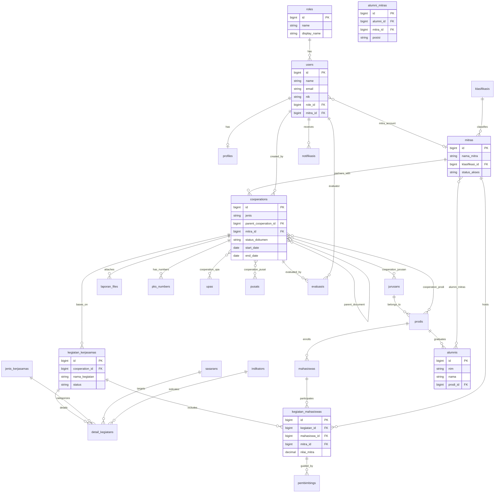

# 📊 Analysis Entity Relationship Diagram (ERD) — Sistem Informasi Kerja Sama Kampus–DUDIKA (WD4)

> **Versi**: 1.0 — Dokumen Analisis Entity Relationship Diagram  
> **Tanggal**: 30 Juli 2026  
> **Referensi**: [analysis-dfd.md](file:///c:/laragon/www/wd4/pengembangan-sistem/analysis-dfd.md) | [analysis-use-case.md](file:///c:/laragon/www/wd4/pengembangan-sistem/analysis-use-case.md) | [planning.md](file:///c:/laragon/www/wd4/pengembangan-sistem/planning.md) | [skils-erd.md](file:///c:/laragon/www/wd4/skils-diagram/skils-erd.md)

---

## Daftar Isi

1. [Pendahuluan](#1-pendahuluan)
2. [Pemetaan Data Store DFD ke Entitas Database](#2-pemetaan-data-store-dfd-ke-entitas-database)
3. [Diagram ERD Konseptual & Logikal](#3-diagram-erd-konseptual--logikal)
4. [Spesifikasi Detail Tabel Database](#4-spesifikasi-detail-tabel-database)
   - 4.1 [Subsistem Master Data & Pengguna](#41-subsistem-master-data--pengguna)
   - 4.2 [Subsistem Unit Kerja & Akademik](#42-subsistem-unit-kerja--akademik)
   - 4.3 [Subsistem Dokumen Kerja Sama](#43-subsistem-dokumen-kerja-sama)
   - 4.4 [Subsistem Pivot Dokumen ↔ Unit](#44-subsistem-pivot-dokumen--unit)
   - 4.5 [Subsistem Kegiatan & Penempatan Mahasiswa](#45-subsistem-kegiatan--penempatan-mahasiswa)
   - 4.6 [Subsistem Evaluasi & Umpan Balik](#46-subsistem-evaluasi--umpan-balik)
   - 4.7 [Subsistem Tracking Lulusan](#47-subsistem-tracking-lulusan)
   - 4.8 [Subsistem Notifikasi](#48-subsistem-notifikasi)
5. [Matriks Relasi & Kardinalitas](#5-matriks-relasi--kardinalitas)
6. [Analisis Normalisasi Database](#6-analisis-normalisasi-database)
7. [Traceability Matriks (DFD ↔ ERD ↔ Use Case)](#7-traceability-matriks-dfd--erd--use-case)

---

## 1. Pendahuluan

Dokumen ini mendefinisikan **Entity Relationship Diagram (ERD)** untuk Sistem Informasi Kerja Sama Kampus–DUDIKA (WD4). Seluruh tabel dan relasi dirancang untuk mengakomodasi alur data yang didefinisikan pada [analysis-dfd.md](file:///c:/laragon/www/wd4/pengembangan-sistem/analysis-dfd.md) (Data Store D1 hingga D10) dan 37 Use Case pada [analysis-use-case.md](file:///c:/laragon/www/wd4/pengembangan-sistem/analysis-use-case.md).

---

## 2. Pemetaan Data Store DFD ke Entitas Database

Setiap **Data Store** pada DFD diimplementasikan ke dalam satu atau beberapa tabel basis data relasional:

| Kode DFD | Data Store DFD | Entitas / Tabel Database | Fungsi & Peran |
|---|---|---|---|
| **D1** | Data Pengguna | `roles`<br>`users`<br>`profiles` | Menyimpan kredensial, peranan hak akses (RBAC), dan informasi detail pengguna |
| **D2** | Data Mitra | `klasifikasis`<br>`mitras` | Menyimpan klasifikasi industri dan profil instansi mitra/DUDIKA |
| **D3** | Data Dokumen Kerja Sama | `cooperations`<br>`laporan_files`<br>`pks_numbers`<br>`cooperation_jurusan`<br>`cooperation_prodi`<br>`cooperation_upa`<br>`cooperation_pusat` | Menyimpan rantai dokumen legal (MoU → MoA → IA), berkas PDF lampiran, nomor PKS, dan tabel pivot keterikatan unit |
| **D4** | Data Kegiatan | `kegiatan_kerjasamas`<br>`detail_kegiatans` | Menyimpan program/kegiatan pelaksanaan kerja sama beserta indikator capaian |
| **D5** | Data Mahasiswa | `mahasiswas`<br>`kegiatan_mahasiswas`<br>`pembimbings` | Menyimpan data peserta mahasiswa, penempatan magang/kegiatan di mitra, penilaian industri, dan pembimbing |
| **D6** | Data Evaluasi | `evaluasis` | Menyimpan data formulir evaluasi berkala oleh unit dan umpan balik (*feedback*) dari mitra |
| **D7** | Data Alumni | `alumnis`<br>`alumni_mitras` | Menyimpan repositori lulusan dan status penyerapan tenaga kerja di perusahaan mitra |
| **D8** | Data Notifikasi | `notifikasis` | Menyimpan riwayat notifikasi sistem, peringatan *early warning*, dan status baca |
| **D9** | Data Unit | `jurusans`<br>`prodis`<br>`upas`<br>`pusats` | Menyimpan struktur organisasi kampus penanggung jawab kerja sama |
| **D10** | Data Referensi | `jenis_kerjasamas`<br>`sasarans`<br>`indikators` | Menyimpan kriteria referensi jenis kegiatan, sasaran IKU, dan indikator kinerja |

---

## 3. Diagram ERD Konseptual & Logikal

Diagram berikut menggambarkan seluruh struktur entitas, kunci utama (*Primary Key*), kunci asing (*Foreign Key*), serta kardinalitas relasi antar tabel.



---

## 4. Spesifikasi Detail Tabel Database

### 4.1 Subsistem Master Data & Pengguna

#### 1. Tabel `roles`
Menyimpan data peranan hak akses pengguna dalam sistem (RBAC).

| Nama Kolom | Tipe Data | Nullable | Key | Default | Keterangan |
|---|---|---|---|---|---|
| `id` | BIGINT UNSIGNED | NO | PK | Auto-Increment | Identitas unik role |
| `name` | VARCHAR(50) | NO | UNIQUE | - | Kode role (`admin`, `pimpinan`, `humas`, `jurusan`, `prodi`, `upa`, `pusat`, `mitra`) |
| `display_name` | VARCHAR(100) | NO | - | - | Nama tampilan role (misal: "Program Studi") |
| `description` | TEXT | YES | - | NULL | Deskripsi wewenang role |
| `created_at` | TIMESTAMP | YES | - | NULL | Waktu pembuatan data |
| `updated_at` | TIMESTAMP | YES | - | NULL | Waktu perbaruan data |

#### 2. Tabel `users`
Menyimpan akun pengguna internal kampus dan akun portal mitra.

| Nama Kolom | Tipe Data | Nullable | Key | Default | Keterangan |
|---|---|---|---|---|---|
| `id` | BIGINT UNSIGNED | NO | PK | Auto-Increment | Identitas unik user |
| `name` | VARCHAR(255) | NO | - | - | Nama lengkap pengguna / person in charge |
| `email` | VARCHAR(255) | NO | UNIQUE | - | Email unik untuk login |
| `nik` | VARCHAR(50) | YES | UNIQUE | NULL | NIK / NIP / NIDN (khusus user internal) |
| `password` | VARCHAR(255) | NO | - | - | Hash password bcrypt |
| `role_id` | BIGINT UNSIGNED | NO | FK | - | Relasi ke `roles.id` |
| `mitra_id` | BIGINT UNSIGNED | YES | FK | NULL | Relasi ke `mitras.id` (khusus user role `mitra`) |
| `remember_token` | VARCHAR(100) | YES | - | NULL | Token "remember me" session |
| `created_at` | TIMESTAMP | YES | - | NULL | Waktu pembuatan data |
| `updated_at` | TIMESTAMP | YES | - | NULL | Waktu perbaruan data |

#### 3. Tabel `profiles`
Menyimpan profil detail pengguna.

| Nama Kolom | Tipe Data | Nullable | Key | Default | Keterangan |
|---|---|---|---|---|---|
| `id` | BIGINT UNSIGNED | NO | PK | Auto-Increment | Identitas unik profil |
| `user_id` | BIGINT UNSIGNED | NO | FK, UNIQUE | - | Relasi ke `users.id` (One-to-One) |
| `phone` | VARCHAR(20) | YES | - | NULL | Nomor telepon / WhatsApp |
| `avatar` | VARCHAR(255) | YES | - | NULL | Path berkas foto profil |
| `address` | TEXT | YES | - | NULL | Alamat rumah / domisili |
| `created_at` | TIMESTAMP | YES | - | NULL | Waktu pembuatan data |
| `updated_at` | TIMESTAMP | YES | - | NULL | Waktu perbaruan data |

#### 4. Tabel `klasifikasis`
Menyimpan klasifikasi kategori industri mitra.

| Nama Kolom | Tipe Data | Nullable | Key | Default | Keterangan |
|---|---|---|---|---|---|
| `id` | BIGINT UNSIGNED | NO | PK | Auto-Increment | Identitas unik klasifikasi |
| `nama` | VARCHAR(100) | NO | UNIQUE | - | Nama klasifikasi (BUMN, Swasta, Pemerintah, Edukasi, dll) |
| `keterangan` | TEXT | YES | - | NULL | Deskripsi klasifikasi |
| `created_at` | TIMESTAMP | YES | - | NULL | Waktu pembuatan data |
| `updated_at` | TIMESTAMP | YES | - | NULL | Waktu perbaruan data |

#### 5. Tabel `mitras`
Menyimpan data profil perusahaan/instansi mitra DUDIKA.

| Nama Kolom | Tipe Data | Nullable | Key | Default | Keterangan |
|---|---|---|---|---|---|
| `id` | BIGINT UNSIGNED | NO | PK | Auto-Increment | Identitas unik mitra |
| `nama_mitra` | VARCHAR(255) | NO | - | - | Nama resmi perusahaan/instansi |
| `klasifikasi_id` | BIGINT UNSIGNED | YES | FK | NULL | Relasi ke `klasifikasis.id` |
| `alamat` | TEXT | YES | - | NULL | Alamat kantor pusat / cabang |
| `kota` | VARCHAR(100) | YES | - | NULL | Kota / Kabupaten |
| `provinsi` | VARCHAR(100) | YES | - | NULL | Provinsi |
| `telepon` | VARCHAR(50) | YES | - | NULL | Telepon kantor / HP kontak |
| `email` | VARCHAR(255) | YES | - | NULL | Email resmi instansi |
| `website` | VARCHAR(255) | YES | - | NULL | Website resmi instansi |
| `status_akses` | ENUM | NO | - | 'Pending' | Status akun (`Pending`, `Aktif`, `Nonaktif`) |
| `created_at` | TIMESTAMP | YES | - | NULL | Waktu pembuatan data |
| `updated_at` | TIMESTAMP | YES | - | NULL | Waktu perbaruan data |

---

### 4.2 Subsistem Unit Kerja & Akademik

#### 6. Tabel `jurusans`
Menyimpan data unit Jurusan.

| Nama Kolom | Tipe Data | Nullable | Key | Default | Keterangan |
|---|---|---|---|---|---|
| `id` | BIGINT UNSIGNED | NO | PK | Auto-Increment | Identitas unik jurusan |
| `kode_jurusan` | VARCHAR(20) | NO | UNIQUE | - | Kode unik jurusan |
| `nama_jurusan` | VARCHAR(150) | NO | - | - | Nama lengkap jurusan |
| `created_at` | TIMESTAMP | YES | - | NULL | Waktu pembuatan data |
| `updated_at` | TIMESTAMP | YES | - | NULL | Waktu perbaruan data |

#### 7. Tabel `prodis`
Menyimpan data Program Studi yang berada di bawah Jurusan.

| Nama Kolom | Tipe Data | Nullable | Key | Default | Keterangan |
|---|---|---|---|---|---|
| `id` | BIGINT UNSIGNED | NO | PK | Auto-Increment | Identitas unik prodi |
| `jurusan_id` | BIGINT UNSIGNED | NO | FK | - | Relasi ke `jurusans.id` |
| `kode_prodi` | VARCHAR(20) | NO | UNIQUE | - | Kode unik program studi |
| `nama_prodi` | VARCHAR(150) | NO | - | - | Nama lengkap program studi |
| `jenjang` | VARCHAR(20) | YES | - | NULL | Jenjang studi (D3, D4, S1, S2) |
| `created_at` | TIMESTAMP | YES | - | NULL | Waktu pembuatan data |
| `updated_at` | TIMESTAMP | YES | - | NULL | Waktu perbaruan data |

#### 8. Tabel `upas`
Menyimpan data Unit Pelaksana Akademik (UPA).

| Nama Kolom | Tipe Data | Nullable | Key | Default | Keterangan |
|---|---|---|---|---|---|
| `id` | BIGINT UNSIGNED | NO | PK | Auto-Increment | Identitas unik UPA |
| `nama_upa` | VARCHAR(150) | NO | UNIQUE | - | Nama lengkap UPA |
| `keterangan` | TEXT | YES | - | NULL | Deskripsi tugas UPA |
| `created_at` | TIMESTAMP | YES | - | NULL | Waktu pembuatan data |
| `updated_at` | TIMESTAMP | YES | - | NULL | Waktu perbaruan data |

#### 9. Tabel `pusats`
Menyimpan data Pusat Riset / Unit Khusus Kampus.

| Nama Kolom | Tipe Data | Nullable | Key | Default | Keterangan |
|---|---|---|---|---|---|
| `id` | BIGINT UNSIGNED | NO | PK | Auto-Increment | Identitas unik pusat |
| `nama_pusat` | VARCHAR(150) | NO | UNIQUE | - | Nama lengkap pusat riset/unit |
| `keterangan` | TEXT | YES | - | NULL | Deskripsi tugas pusat |
| `created_at` | TIMESTAMP | YES | - | NULL | Waktu pembuatan data |
| `updated_at` | TIMESTAMP | YES | - | NULL | Waktu perbaruan data |

---

### 4.3 Subsistem Dokumen Kerja Sama

#### 10. Tabel `cooperations`
Tabel utama dokumen legal kerja sama, mendukung struktur hierarki bertingkat (*Self-Referencing Tree*: MoU → MoA → IA).

| Nama Kolom | Tipe Data | Nullable | Key | Default | Keterangan |
|---|---|---|---|---|---|
| `id` | BIGINT UNSIGNED | NO | PK | Auto-Increment | Identitas unik dokumen kerja sama |
| `parent_cooperation_id` | BIGINT UNSIGNED | YES | FK | NULL | Self-referencing ke `cooperations.id` (Dokumen induk: MoU → MoA → IA) |
| `mitra_id` | BIGINT UNSIGNED | NO | FK | - | Relasi ke `mitras.id` |
| `created_by` | BIGINT UNSIGNED | NO | FK | - | Relasi ke `users.id` (Penginput dokumen) |
| `judul` | VARCHAR(255) | NO | - | - | Judul kerja sama / perikatan |
| `jenis` | ENUM | NO | - | 'MoU' | Jenis dokumen (`MoU`, `MoA`, `IA`, `SPK`) |
| `tingkat` | ENUM | YES | - | 'Institusi' | Cakupan (`Institusi`, `Jurusan`, `Prodi`, `Pusat/UPA`) |
| `ruang_lingkup` | TEXT | YES | - | NULL | Deskripsi ruang lingkup kerja sama |
| `start_date` | DATE | NO | - | - | Tanggal mulai berlaku |
| `end_date` | DATE | NO | - | - | Tanggal berakhir |
| `status_dokumen` | ENUM | NO | - | 'Draft' | Alur dokumen (`Draft`, `Menunggu Evaluasi`, `Menunggu Validasi`, `Disahkan`, `Revisi`) |
| `status_berlaku` | ENUM | NO | - | 'Aktif' | Status masa aktif (`Aktif`, `Akan Berakhir`, `Kadaluarsa`, `Diperpanjang`) |
| `catatan_pimpinan` | TEXT | YES | - | NULL | Catatan evaluasi/revisi dari pimpinan |
| `created_at` | TIMESTAMP | YES | - | NULL | Waktu pembuatan data |
| `updated_at` | TIMESTAMP | YES | - | NULL | Waktu perbaruan data |

#### 11. Tabel `pks_numbers`
Menyimpan nomor-nomor resmi perikatan PKS / MoU / IA dari masing-masing pihak.

| Nama Kolom | Tipe Data | Nullable | Key | Default | Keterangan |
|---|---|---|---|---|---|
| `id` | BIGINT UNSIGNED | NO | PK | Auto-Increment | Identitas unik nomor PKS |
| `cooperation_id` | BIGINT UNSIGNED | NO | FK | - | Relasi ke `cooperations.id` |
| `nomor_pihak_kampus` | VARCHAR(100) | YES | - | NULL | Nomor registrasi dokumen internal kampus |
| `nomor_pihak_mitra` | VARCHAR(100) | YES | - | NULL | Nomor registrasi dokumen dari pihak mitra |
| `created_at` | TIMESTAMP | YES | - | NULL | Waktu pembuatan data |
| `updated_at` | TIMESTAMP | YES | - | NULL | Waktu perbaruan data |

#### 12. Tabel `laporan_files`
Menyimpan lampiran berkas digital (PDF scan dokumen legal).

| Nama Kolom | Tipe Data | Nullable | Key | Default | Keterangan |
|---|---|---|---|---|---|
| `id` | BIGINT UNSIGNED | NO | PK | Auto-Increment | Identitas unik berkas |
| `cooperation_id` | BIGINT UNSIGNED | NO | FK | - | Relasi ke `cooperations.id` |
| `file_name` | VARCHAR(255) | NO | - | - | Nama asli berkas upload |
| `file_path` | VARCHAR(255) | NO | - | - | Relative path penyimpanan berkas di server |
| `file_size` | INT | YES | - | NULL | Ukuran berkas (dalam bytes) |
| `created_at` | TIMESTAMP | YES | - | NULL | Waktu pembuatan data |
| `updated_at` | TIMESTAMP | YES | - | NULL | Waktu perbaruan data |

---

### 4.4 Subsistem Pivot Dokumen ↔ Unit

Tabel pivot untuk mengelola keterikatan dokumen kerja sama dengan unit-unit di kampus (Many-to-Many).

#### 13. Tabel `cooperation_jurusan`
| Nama Kolom | Tipe Data | Nullable | Key | Default | Keterangan |
|---|---|---|---|---|---|
| `cooperation_id` | BIGINT UNSIGNED | NO | PK, FK | - | Relasi ke `cooperations.id` |
| `jurusan_id` | BIGINT UNSIGNED | NO | PK, FK | - | Relasi ke `jurusans.id` |

#### 14. Tabel `cooperation_prodi`
| Nama Kolom | Tipe Data | Nullable | Key | Default | Keterangan |
|---|---|---|---|---|---|
| `cooperation_id` | BIGINT UNSIGNED | NO | PK, FK | - | Relasi ke `cooperations.id` |
| `prodi_id` | BIGINT UNSIGNED | NO | PK, FK | - | Relasi ke `prodis.id` |

#### 15. Tabel `cooperation_upa`
| Nama Kolom | Tipe Data | Nullable | Key | Default | Keterangan |
|---|---|---|---|---|---|
| `cooperation_id` | BIGINT UNSIGNED | NO | PK, FK | - | Relasi ke `cooperations.id` |
| `upa_id` | BIGINT UNSIGNED | NO | PK, FK | - | Relasi ke `upas.id` |

#### 16. Tabel `cooperation_pusat`
| Nama Kolom | Tipe Data | Nullable | Key | Default | Keterangan |
|---|---|---|---|---|---|
| `cooperation_id` | BIGINT UNSIGNED | NO | PK, FK | - | Relasi ke `cooperations.id` |
| `pusat_id` | BIGINT UNSIGNED | NO | PK, FK | - | Relasi ke `pusats.id` |

---

### 4.5 Subsistem Kegiatan & Penempatan Mahasiswa

#### 17. Tabel `jenis_kerjasamas`
Menyimpan referensi kategori kegiatan (misal: Pemagangan, Penelitian Bersama, Sertifikasi, Dosen Tamu).

| Nama Kolom | Tipe Data | Nullable | Key | Default | Keterangan |
|---|---|---|---|---|---|
| `id` | BIGINT UNSIGNED | NO | PK | Auto-Increment | Identitas unik jenis |
| `nama` | VARCHAR(100) | NO | UNIQUE | - | Nama jenis kerja sama |
| `created_at` | TIMESTAMP | YES | - | NULL | Waktu pembuatan data |
| `updated_at` | TIMESTAMP | YES | - | NULL | Waktu perbaruan data |

#### 18. Tabel `sasarans`
Menyimpan referensi sasaran IKU perguruan tinggi.

| Nama Kolom | Tipe Data | Nullable | Key | Default | Keterangan |
|---|---|---|---|---|---|
| `id` | BIGINT UNSIGNED | NO | PK | Auto-Increment | Identitas unik sasaran |
| `deskripsi` | TEXT | NO | - | - | Deskripsi sasaran strategis |
| `created_at` | TIMESTAMP | YES | - | NULL | Waktu pembuatan data |
| `updated_at` | TIMESTAMP | YES | - | NULL | Waktu perbaruan data |

#### 19. Tabel `indikators`
Menyimpan indikator capaian kegiatan.

| Nama Kolom | Tipe Data | Nullable | Key | Default | Keterangan |
|---|---|---|---|---|---|
| `id` | BIGINT UNSIGNED | NO | PK | Auto-Increment | Identitas unik indikator |
| `deskripsi` | TEXT | NO | - | - | Deskripsi indikator IKU |
| `created_at` | TIMESTAMP | YES | - | NULL | Waktu pembuatan data |
| `updated_at` | TIMESTAMP | YES | - | NULL | Waktu perbaruan data |

#### 20. Tabel `kegiatan_kerjasamas`
Menyimpan data induk pelaksanaan program kegiatan yang diturunkan dari dokumen IA.

| Nama Kolom | Tipe Data | Nullable | Key | Default | Keterangan |
|---|---|---|---|---|---|
| `id` | BIGINT UNSIGNED | NO | PK | Auto-Increment | Identitas unik kegiatan |
| `cooperation_id` | BIGINT UNSIGNED | YES | FK | NULL | Link ke dokumen IA `cooperations.id` |
| `nama_kegiatan` | VARCHAR(255) | NO | - | - | Nama kegiatan / program |
| `periode_mulai` | DATE | YES | - | NULL | Tanggal mulai kegiatan |
| `periode_selesai` | DATE | YES | - | NULL | Tanggal selesai kegiatan |
| `status` | ENUM | NO | - | 'Perencanaan' | Status (`Perencanaan`, `Berjalan`, `Selesai`) |
| `created_at` | TIMESTAMP | YES | - | NULL | Waktu pembuatan data |
| `updated_at` | TIMESTAMP | YES | - | NULL | Waktu perbaruan data |

#### 21. Tabel `detail_kegiatans`
Menyimpan indikator detail, volume luaran, output, dan outcome dari suatu kegiatan.

| Nama Kolom | Tipe Data | Nullable | Key | Default | Keterangan |
|---|---|---|---|---|---|
| `id` | BIGINT UNSIGNED | NO | PK | Auto-Increment | Identitas unik detail |
| `kegiatan_kerjasama_id` | BIGINT UNSIGNED | NO | FK | - | Relasi ke `kegiatan_kerjasamas.id` |
| `jenis_kerjasama_id` | BIGINT UNSIGNED | YES | FK | NULL | Relasi ke `jenis_kerjasamas.id` |
| `sasaran_id` | BIGINT UNSIGNED | YES | FK | NULL | Relasi ke `sasarans.id` |
| `indikator_id` | BIGINT UNSIGNED | YES | FK | NULL | Relasi ke `indikators.id` |
| `volume_luaran` | INT | YES | - | 0 | Target jumlah volume luaran |
| `keterangan_luaran` | VARCHAR(255) | YES | - | NULL | Keterangan fisik luaran |
| `output` | TEXT | YES | - | NULL | Output yang dihasilkan |
| `outcome` | TEXT | YES | - | NULL | Dampak / outcome kegiatan |
| `created_at` | TIMESTAMP | YES | - | NULL | Waktu pembuatan data |
| `updated_at` | TIMESTAMP | YES | - | NULL | Waktu perbaruan data |

#### 22. Tabel `mahasiswas`
Menyimpan data profil mahasiswa peserta program kegiatan.

| Nama Kolom | Tipe Data | Nullable | Key | Default | Keterangan |
|---|---|---|---|---|---|
| `id` | BIGINT UNSIGNED | NO | PK | Auto-Increment | Identitas unik mahasiswa |
| `nim` | VARCHAR(30) | NO | UNIQUE | - | Nomor Induk Mahasiswa |
| `nama` | VARCHAR(255) | NO | - | - | Nama lengkap mahasiswa |
| `prodi_id` | BIGINT UNSIGNED | NO | FK | - | Relasi ke `prodis.id` |
| `angkatan` | VARCHAR(10) | YES | - | NULL | Tahun angkatan |
| `email` | VARCHAR(255) | YES | - | NULL | Email mahasiswa |
| `telepon` | VARCHAR(30) | YES | - | NULL | Nomor kontak |
| `status` | ENUM | NO | - | 'Aktif' | Status akademik (`Aktif`, `Lulus`, `Cuti`, `DO`) |
| `created_at` | TIMESTAMP | YES | - | NULL | Waktu pembuatan data |
| `updated_at` | TIMESTAMP | YES | - | NULL | Waktu perbaruan data |

#### 23. Tabel `kegiatan_mahasiswas`
Menyimpan penempatan individu mahasiswa ke mitra dalam suatu kegiatan, beserta nilai dari mitra.

| Nama Kolom | Tipe Data | Nullable | Key | Default | Keterangan |
|---|---|---|---|---|---|
| `id` | BIGINT UNSIGNED | NO | PK | Auto-Increment | Identitas unik penempatan |
| `kegiatan_id` | BIGINT UNSIGNED | NO | FK | - | Relasi ke `kegiatan_kerjasamas.id` |
| `mahasiswa_id` | BIGINT UNSIGNED | NO | FK | - | Relasi ke `mahasiswas.id` |
| `mitra_id` | BIGINT UNSIGNED | NO | FK | - | Relasi ke `mitras.id` |
| `periode_mulai` | DATE | YES | - | NULL | Tanggal mulai penempatan |
| `periode_selesai` | DATE | YES | - | NULL | Tanggal selesai penempatan |
| `status` | ENUM | NO | - | 'Berjalan' | Status (`Berjalan`, `Selesai`, `Batal`) |
| `nilai_mitra` | DECIMAL(5,2) | YES | - | NULL | Nilai angka dari industri (0-100) |
| `catatan_mitra` | TEXT | YES | - | NULL | Catatan evaluasi performa dari mitra |
| `created_at` | TIMESTAMP | YES | - | NULL | Waktu pembuatan data |
| `updated_at` | TIMESTAMP | YES | - | NULL | Waktu perbaruan data |

#### 24. Tabel `pembimbings`
Menyimpan dosen pembimbing internal & mentor industri eksternal.

| Nama Kolom | Tipe Data | Nullable | Key | Default | Keterangan |
|---|---|---|---|---|---|
| `id` | BIGINT UNSIGNED | NO | PK | Auto-Increment | Identitas unik pembimbing |
| `kegiatan_mahasiswa_id` | BIGINT UNSIGNED | NO | FK | - | Relasi ke `kegiatan_mahasiswas.id` |
| `nama_pembimbing` | VARCHAR(255) | NO | - | - | Nama lengkap pembimbing/mentor |
| `tipe` | ENUM | NO | - | 'Internal' | Asal pembimbing (`Internal`, `Eksternal`) |
| `kontak` | VARCHAR(100) | YES | - | NULL | Email / No HP pembimbing |
| `created_at` | TIMESTAMP | YES | - | NULL | Waktu pembuatan data |
| `updated_at` | TIMESTAMP | YES | - | NULL | Waktu perbaruan data |

---

### 4.6 Subsistem Evaluasi & Umpan Balik

#### 25. Tabel `evaluasis`
Menyimpan form evaluasi berkala oleh unit kampus serta umpan balik dari mitra.

| Nama Kolom | Tipe Data | Nullable | Key | Default | Keterangan |
|---|---|---|---|---|---|
| `id` | BIGINT UNSIGNED | NO | PK | Auto-Increment | Identitas unik evaluasi |
| `cooperation_id` | BIGINT UNSIGNED | NO | FK | - | Relasi ke `cooperations.id` |
| `evaluator_id` | BIGINT UNSIGNED | YES | FK | NULL | Relasi ke `users.id` (Evaluator) |
| `tipe_evaluasi` | ENUM | NO | - | 'Internal' | Sumber (`Internal`, `Umpan_Balik_Mitra`) |
| `score` | DECIMAL(5,2) | YES | - | NULL | Nilai evaluasi (1-100) / Rating (1-5) |
| `realisasi_volume` | INT | YES | - | NULL | Realisasi volume luaran yang tercapai |
| `realisasi_output` | TEXT | YES | - | NULL | Realisasi output |
| `realisasi_outcome` | TEXT | YES | - | NULL | Realisasi outcome |
| `kendala` | TEXT | YES | - | NULL | Kendala/hambatan pelaksanaan |
| `rekomendasi` | TEXT | YES | - | NULL | Rekomendasi tindak lanjut |
| `kesimpulan` | ENUM | YES | - | 'Baik' | Kesimpulan (`Sangat Baik`, `Baik`, `Cukup`, `Perlu Perbaikan`) |
| `status_validasi` | ENUM | NO | - | 'Draft' | Status (`Draft`, `Menunggu Validasi`, `Divalidasi`, `Perlu Revisi`) |
| `created_at` | TIMESTAMP | YES | - | NULL | Waktu pembuatan data |
| `updated_at` | TIMESTAMP | YES | - | NULL | Waktu perbaruan data |

---

### 4.7 Subsistem Tracking Lulusan

#### 26. Tabel `alumnis`
Menyimpan repositori data lulusan / alumni.

| Nama Kolom | Tipe Data | Nullable | Key | Default | Keterangan |
|---|---|---|---|---|---|
| `id` | BIGINT UNSIGNED | NO | PK | Auto-Increment | Identitas unik alumni |
| `nim` | VARCHAR(30) | NO | UNIQUE | - | NIM saat kuliah |
| `nama` | VARCHAR(255) | NO | - | - | Nama lengkap alumni |
| `prodi_id` | BIGINT UNSIGNED | NO | FK | - | Relasi ke `prodis.id` |
| `tahun_lulus` | YEAR | NO | - | - | Tahun kelulusan |
| `email` | VARCHAR(255) | YES | - | NULL | Email kontak alumni |
| `telepon` | VARCHAR(30) | YES | - | NULL | Nomor WhatsApp / kontak |
| `created_at` | TIMESTAMP | YES | - | NULL | Waktu pembuatan data |
| `updated_at` | TIMESTAMP | YES | - | NULL | Waktu perbaruan data |

#### 27. Tabel `alumni_mitras`
Menyimpan relasi kerja antara alumni dengan perusahaan mitra DUDIKA.

| Nama Kolom | Tipe Data | Nullable | Key | Default | Keterangan |
|---|---|---|---|---|---|
| `id` | BIGINT UNSIGNED | NO | PK | Auto-Increment | Identitas unik penyerapan |
| `alumni_id` | BIGINT UNSIGNED | NO | FK | - | Relasi ke `alumnis.id` |
| `mitra_id` | BIGINT UNSIGNED | NO | FK | - | Relasi ke `mitras.id` |
| `posisi` | VARCHAR(150) | YES | - | NULL | Jabatan / posisi pekerjaan |
| `tahun_mulai` | YEAR | YES | - | NULL | Tahun awal bekerja di mitra |
| `status` | ENUM | NO | - | 'Aktif' | Status pekerjaan (`Aktif`, `Resign`, `Kontrak_Selesai`) |
| `sumber_data` | ENUM | NO | - | 'Prodi' | Penginput data (`Prodi`, `Mitra`, `Tracer_Study`) |
| `created_at` | TIMESTAMP | YES | - | NULL | Waktu pembuatan data |
| `updated_at` | TIMESTAMP | YES | - | NULL | Waktu perbaruan data |

---

### 4.8 Subsistem Notifikasi

#### 28. Tabel `notifikasis`
Menyimpan riwayat notifikasi sistem dan *early warning* dokumen kadaluarsa.

| Nama Kolom | Tipe Data | Nullable | Key | Default | Keterangan |
|---|---|---|---|---|---|
| `id` | BIGINT UNSIGNED | NO | PK | Auto-Increment | Identitas unik notifikasi |
| `user_id` | BIGINT UNSIGNED | NO | FK | - | Relasi ke `users.id` (Penerima notifikasi) |
| `title` | VARCHAR(255) | NO | - | - | Judul notifikasi |
| `message` | TEXT | NO | - | - | Isi pesan notifikasi |
| `type` | VARCHAR(50) | YES | - | 'info' | Kategori (`warning`, `info`, `success`, `danger`) |
| `url` | VARCHAR(255) | YES | - | NULL | URL tautan ke dokumen / fitur |
| `is_read` | BOOLEAN | NO | - | false | Status baca (`true` / `false`) |
| `created_at` | TIMESTAMP | YES | - | NULL | Waktu pemunculan notifikasi |
| `updated_at` | TIMESTAMP | YES | - | NULL | Waktu perbaruan data |

---

## 5. Matriks Relasi & Kardinalitas

Tabel berikut meringkas seluruh relasi antar entitas beserta kardinalitas dan aksi *Cascade*:

| Tabel Asal (Parent) | Tabel Tujuan (Child) | Relasi | Primary Key | Foreign Key | Constraint ON DELETE |
|---|---|:---:|---|---|---|
| `roles` | `users` | 1 : N | `roles.id` | `users.role_id` | `RESTRICT` |
| `users` | `profiles` | 1 : 1 | `users.id` | `profiles.user_id` | `CASCADE` |
| `mitras` | `users` | 1 : N | `mitras.id` | `users.mitra_id` | `SET NULL` |
| `klasifikasis` | `mitras` | 1 : N | `klasifikasis.id` | `mitras.klasifikasi_id` | `SET NULL` |
| `jurusans` | `prodis` | 1 : N | `jurusans.id` | `prodis.jurusan_id` | `CASCADE` |
| `cooperations` | `cooperations` | 1 : N | `cooperations.id` | `cooperations.parent_cooperation_id` | `SET NULL` |
| `mitras` | `cooperations` | 1 : N | `mitras.id` | `cooperations.mitra_id` | `RESTRICT` |
| `users` | `cooperations` | 1 : N | `users.id` | `cooperations.created_by` | `RESTRICT` |
| `cooperations` | `pks_numbers` | 1 : N | `cooperations.id` | `pks_numbers.cooperation_id` | `CASCADE` |
| `cooperations` | `laporan_files` | 1 : N | `cooperations.id` | `laporan_files.cooperation_id` | `CASCADE` |
| `cooperations` | `cooperation_jurusan` | M : N | `cooperations.id` | `cooperation_jurusan.cooperation_id` | `CASCADE` |
| `jurusans` | `cooperation_jurusan` | M : N | `jurusans.id` | `cooperation_jurusan.jurusan_id` | `CASCADE` |
| `cooperations` | `kegiatan_kerjasamas` | 1 : N | `cooperations.id` | `kegiatan_kerjasamas.cooperation_id` | `SET NULL` |
| `kegiatan_kerjasamas` | `detail_kegiatans` | 1 : N | `kegiatan_kerjasamas.id` | `detail_kegiatans.kegiatan_kerjasama_id` | `CASCADE` |
| `jenis_kerjasamas` | `detail_kegiatans` | 1 : N | `jenis_kerjasamas.id` | `detail_kegiatans.jenis_kerjasama_id` | `SET NULL` |
| `prodis` | `mahasiswas` | 1 : N | `prodis.id` | `mahasiswas.prodi_id` | `RESTRICT` |
| `kegiatan_kerjasamas` | `kegiatan_mahasiswas` | 1 : N | `kegiatan_kerjasamas.id` | `kegiatan_mahasiswas.kegiatan_id` | `CASCADE` |
| `mahasiswas` | `kegiatan_mahasiswas` | 1 : N | `mahasiswas.id` | `kegiatan_mahasiswas.mahasiswa_id` | `CASCADE` |
| `mitras` | `kegiatan_mahasiswas` | 1 : N | `mitras.id` | `kegiatan_mahasiswas.mitra_id` | `RESTRICT` |
| `kegiatan_mahasiswas` | `pembimbings` | 1 : N | `kegiatan_mahasiswas.id` | `pembimbings.kegiatan_mahasiswa_id` | `CASCADE` |
| `cooperations` | `evaluasis` | 1 : N | `cooperations.id` | `evaluasis.cooperation_id` | `CASCADE` |
| `prodis` | `alumnis` | 1 : N | `prodis.id` | `alumnis.prodi_id` | `RESTRICT` |
| `alumnis` | `alumni_mitras` | M : N | `alumnis.id` | `alumni_mitras.alumni_id` | `CASCADE` |
| `mitras` | `alumni_mitras` | M : N | `mitras.id` | `alumni_mitras.mitra_id` | `CASCADE` |
| `users` | `notifikasis` | 1 : N | `users.id` | `notifikasis.user_id` | `CASCADE` |

---

## 6. Analisis Normalisasi Database

Seluruh perancangan tabel telah diuji melalui tahap normalisasi hingga **Bentuk Normal Ketiga (3NF)**:

```text
Unnormalized Form (UNF)
       ↓  (Hilangkan repeating groups)
First Normal Form (1NF)
       ↓  (Hilangkan ketergantungan parsial / Partial Dependency)
Second Normal Form (2NF)
       ↓  (Hilangkan ketergantungan transitif / Transitive Dependency)
Third Normal Form (3NF)
```

1. **Bentuk Normal Pertama (1NF)**:
   - Setiap kolom hanya berisi nilai tunggal (*atomic value*).
   - Tidak ada atribut berulang (*multivalued attributes*). Misal: nomor PKS dipisahkan ke tabel `pks_numbers` dan lampiran PDF dipisahkan ke `laporan_files`.
2. **Bentuk Normal Kedua (2NF)**:
   - Memenuhi 1NF.
   - Seluruh atribut non-key bergantung penuh secara fungsional pada Primary Key (*Full Functional Dependency*).
   - Pada tabel pivot (`cooperation_jurusan`, `cooperation_prodi`, dll.), atribut composite key (`cooperation_id`, `jurusan_id`) mengatur relasi M:N secara penuh.
3. **Bentuk Normal Ketiga (3NF)**:
   - Memenuhi 2NF.
   - Tidak ada atribut non-key yang bergantung pada atribut non-key lainnya (*No Transitive Dependency*).
   - Data profil mitra (`mitras`), unit jurusan/prodi (`jurusans`, `prodis`), dan klasifikasi (`klasifikasis`) dipisahkan dari tabel `cooperations` sehingga tidak terjadi anomali redundansi data saat pengeditan.

---

## 7. Traceability Matriks (DFD ↔ ERD ↔ Use Case)

Matriks ini memastikan **seluruh data store dari DFD** dan **seluruh use case sistem** terakomodasi oleh struktur tabel database:

| Data Store DFD | Tabel Database ERD | Use Case Terkait | Cakupan Operasi |
|---|---|---|---|
| **D1** Data Pengguna | `roles`<br>`users`<br>`profiles` | UC01, UC02, UC07, UC36, UC37 | Kelola user, role, authentication, login mitra |
| **D2** Data Mitra | `klasifikasis`<br>`mitras` | UC04, UC06, UC07, UC15 | Kelola mitra, klasifikasi, registrasi pengajuan mitra |
| **D3** Data Dokumen KS | `cooperations`<br>`pks_numbers`<br>`laporan_files`<br>`cooperation_jurusan` dll. | UC08, UC09, UC10, UC11, UC12, UC13, UC14, UC18 | Alur dokumen (MoU/MoA/IA), submit, validasi, pengesahan, perpanjangan |
| **D4** Data Kegiatan | `jenis_kerjasamas`<br>`kegiatan_kerjasamas`<br>`detail_kegiatans` | UC03, UC19 | Pendaftaran kegiatan kerja sama, sasaran IKU, indikator |
| **D5** Data Mahasiswa | `mahasiswas`<br>`kegiatan_mahasiswas`<br>`pembimbings` | UC20, UC21, UC22 | Penempatan mahasiswa, penilaian industri, pembimbingan, monitoring |
| **D6** Data Evaluasi | `evaluasis` | UC23, UC24, UC25, UC26 | Evaluasi berkala unit, validasi pimpinan, umpan balik mitra |
| **D7** Data Alumni | `alumnis`<br>`alumni_mitras` | UC32, UC33 | Input data alumni bekerja di mitra, statistik penyerapan IKU |
| **D8** Data Notifikasi | `notifikasis` | UC34, UC35 | Sistem notifikasi real-time & hubungi admin |
| **D9** Data Unit | `jurusans`<br>`prodis`<br>`upas`<br>`pusats` | UC05, UC28 | Master unit internal & dashboard per-unit |
| **D10** Data Referensi | `sasarans`<br>`indikators` | UC03, UC19 | Parameter IKU & indikator capaian |

---

> [!NOTE]
> **Total Tabel Database**: 28 Tabel (termasuk 4 tabel pivot relasi Many-to-Many).  
> **Struktur Utama**: Terintegrasi penuh dengan alur DFD (D1–D10) dan 37 Use Case sistem.

> [!IMPORTANT]
> Seluruh nama tabel dan tipe data telah menyesuaikan standar konvensi Laravel Eloquent ORM (snake_case jamak/tunggal) untuk memudahkan implementasi migrasi database (`php artisan migrate`).

> [!TIP]
> Referensi dokumen analisis lainnya:
> - [analysis-use-case.md](file:///c:/laragon/www/wd4/pengembangan-sistem/analysis-use-case.md) — Analisis Aktor & Use Case Diagram
> - [analysis-flowchart.md](file:///c:/laragon/www/wd4/pengembangan-sistem/analysis-flowchart.md) — Analisis Activity Diagram & Flowchart Skenario
> - [analysis-dfd.md](file:///c:/laragon/www/wd4/pengembangan-sistem/analysis-dfd.md) — Analisis Data Flow Diagram (Context, Level 0, Level 1)
