# 📊 Analysis Flowchart / Activity Diagram — Sistem Informasi Kerja Sama Kampus–DUDIKA (WD4)

> **Versi**: 1.0 — Dokumen Analisis Activity Diagram  
> **Tanggal**: 30 Juli 2026  
> **Referensi**: [analysis-use-case.md](file:///c:/laragon/www/wd4/pengembangan-sistem/analysis-use-case.md) | [planning.md](file:///c:/laragon/www/wd4/pengembangan-sistem/planning.md) | [skils-uml.md](file:///c:/laragon/www/wd4/skils-diagram/skils-uml.md)

---

## Daftar Isi

1. [Pendahuluan](#1-pendahuluan)
2. [Subsistem Autentikasi](#2-subsistem-autentikasi)
3. [Subsistem Master Data](#3-subsistem-master-data)
4. [Subsistem Dokumen Kerja Sama](#4-subsistem-dokumen-kerja-sama)
5. [Subsistem Pengajuan Kerja Sama](#5-subsistem-pengajuan-kerja-sama)
6. [Subsistem Kegiatan dan Monitoring](#6-subsistem-kegiatan-dan-monitoring)
7. [Subsistem Evaluasi](#7-subsistem-evaluasi)
8. [Subsistem Laporan dan Dashboard](#8-subsistem-laporan-dan-dashboard)
9. [Subsistem Tracking Lulusan](#9-subsistem-tracking-lulusan)
10. [Subsistem Komunikasi](#10-subsistem-komunikasi)
11. [Alur Proses Bisnis Utama End-to-End](#11-alur-proses-bisnis-utama-end-to-end)

---

## 1. Pendahuluan

Dokumen ini menjelaskan **Activity Diagram / Flowchart** untuk setiap fungsi (use case) yang terdapat pada Sistem Informasi Kerja Sama Kampus–DUDIKA (WD4). Setiap diagram menggambarkan alur langkah demi langkah yang dilakukan oleh aktor dan sistem.

### 1.1 Konvensi Diagram

Diagram dalam dokumen ini menggunakan **Mermaid Flowchart** dengan konvensi berikut:

```text
Simbol                  | Arti
──────────────────────────────────────────────
●  (Start)              | Awal proses
◉  (End)                | Akhir proses
[ Aktivitas ]           | Aktivitas / aksi
{ Kondisi? }            | Decision / percabangan
[/ Input /]             | Input data
[[ Sub-proses ]]        | Sub-proses / include
|Swimlane|              | Penanggung jawab aktivitas
```

### 1.2 Kode Referensi Use Case

Setiap activity diagram mereferensikan kode use case dari dokumen [analysis-use-case.md](file:///c:/laragon/www/wd4/pengembangan-sistem/analysis-use-case.md) (UC01–UC37) untuk menjaga **traceability** antar diagram.

---

## 2. Subsistem Autentikasi

### 2.1 UC36 — Login

**Aktor**: Semua pengguna (Admin, Pimpinan, Humas, Jurusan, Prodi, UPA, Pusat, Mitra)

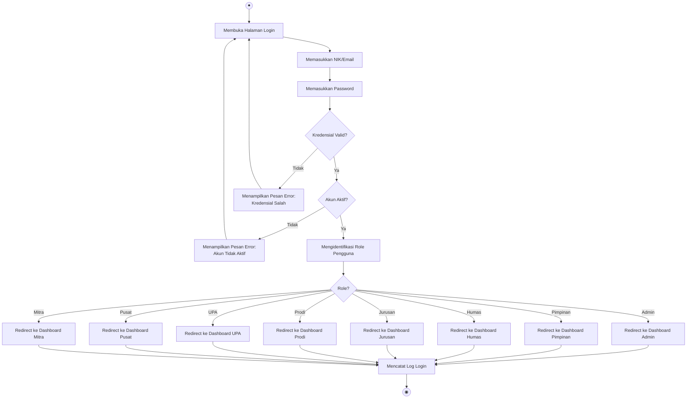

**Langkah-langkah:**

| No | Langkah | Pelaku | Keterangan |
|----|---------|--------|------------|
| 1 | Membuka halaman login | Pengguna | Mengakses URL login sistem |
| 2 | Memasukkan NIK/Email | Pengguna | Input field NIK atau email |
| 3 | Memasukkan Password | Pengguna | Input field password |
| 4 | Memvalidasi kredensial | Sistem | Mencocokkan dengan database |
| 5 | Memeriksa status akun | Sistem | Pastikan akun berstatus aktif |
| 6 | Mengidentifikasi role | Sistem | Menentukan role pengguna |
| 7 | Redirect ke dashboard | Sistem | Mengarahkan ke dashboard sesuai role |
| 8 | Mencatat log login | Sistem | Menyimpan log aktivitas login |

---

### 2.2 UC37 — Logout

**Aktor**: Semua pengguna

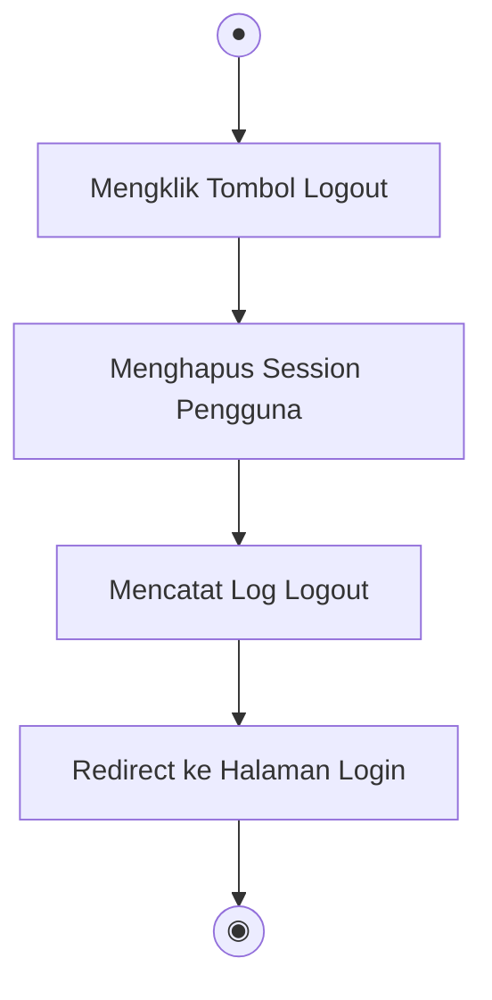

---

## 3. Subsistem Master Data

### 3.1 UC01 — Mengelola Data Pengguna

**Aktor**: Admin

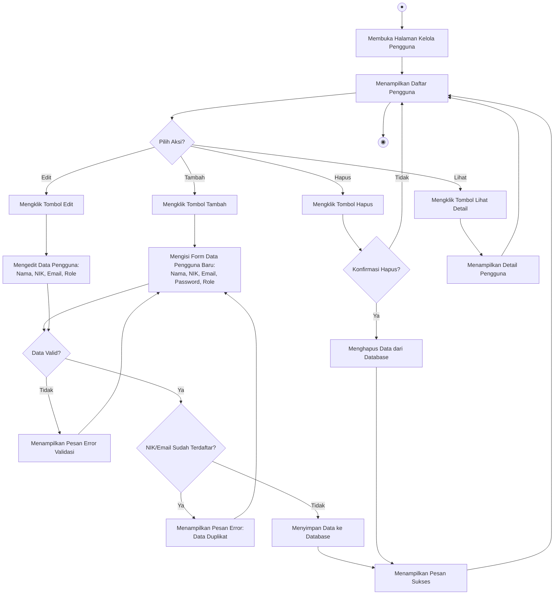

**Langkah-langkah:**

| No | Langkah | Pelaku | Keterangan |
|----|---------|--------|------------|
| 1 | Membuka halaman kelola pengguna | Admin | Navigasi menu Master Data > Pengguna |
| 2 | Melihat daftar pengguna | Sistem | Menampilkan tabel pengguna |
| 3 | Memilih aksi CRUD | Admin | Tambah / Edit / Hapus / Lihat |
| 4 | Mengisi/mengubah form | Admin | Input: Nama, NIK, Email, Password, Role |
| 5 | Memvalidasi data | Sistem | Cek kelengkapan & format data |
| 6 | Memeriksa duplikasi | Sistem | Cek NIK/Email sudah terdaftar |
| 7 | Menyimpan data | Sistem | Insert/Update ke database |
| 8 | Menampilkan notifikasi | Sistem | Pesan sukses atau error |

---

### 3.2 UC02 — Mengelola Data Role

**Aktor**: Admin

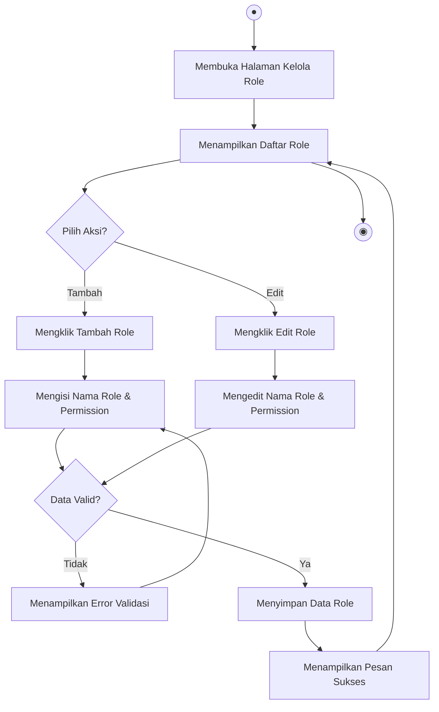

---

### 3.3 UC03 — Mengelola Jenis Kerja Sama

**Aktor**: Admin

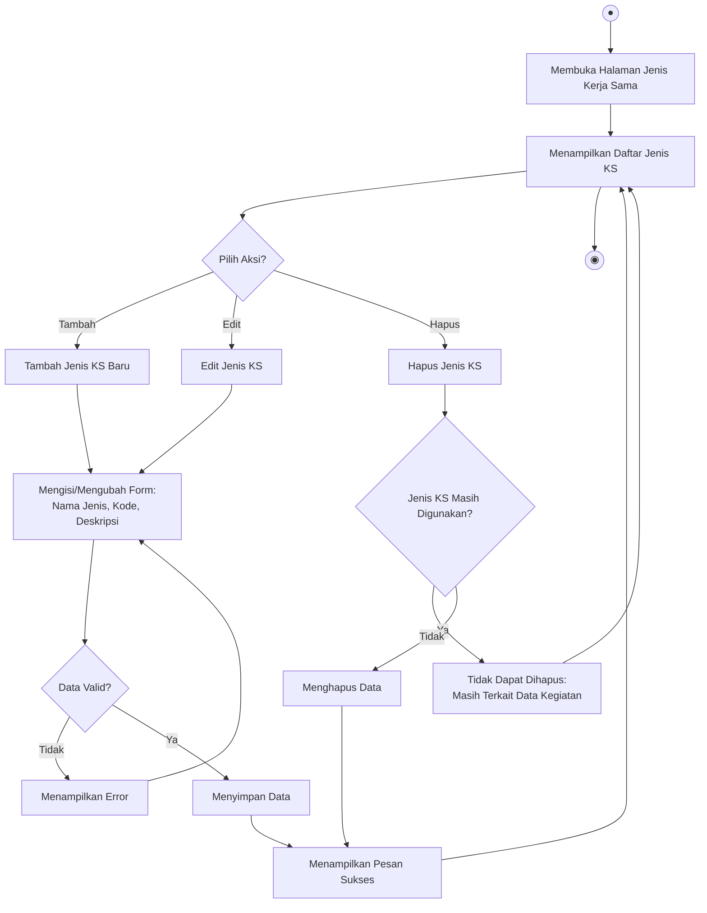

---

### 3.4 UC04 — Mengelola Data Mitra

**Aktor**: Admin, Humas, Jurusan, UPA, Pusat

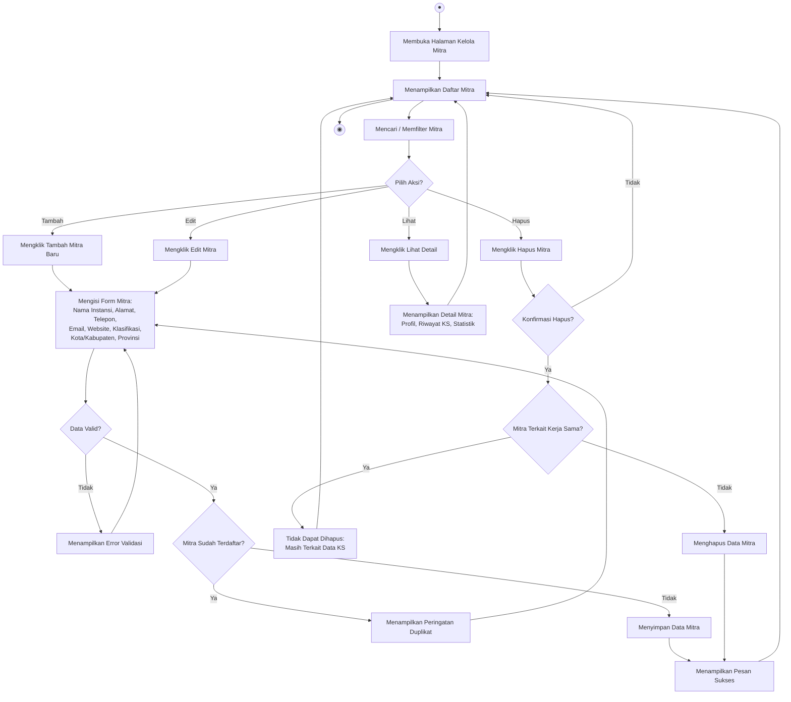

---

### 3.5 UC05 — Mengelola Data Humas/Jurusan/Prodi/UPA/Pusat

**Aktor**: Admin

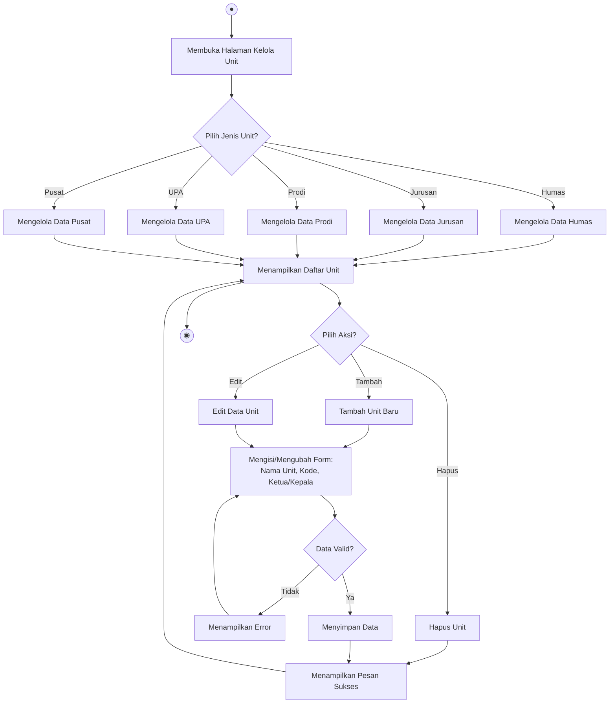

---

### 3.6 UC06 — Mengelola Data Klasifikasi

**Aktor**: Admin

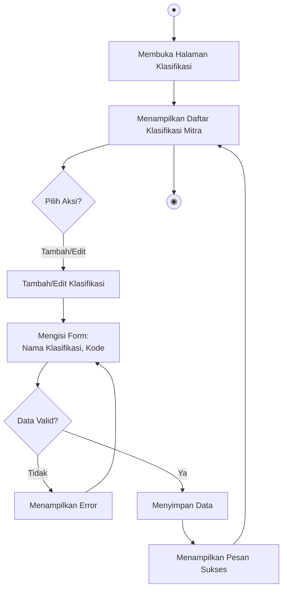

---

### 3.7 UC07 — Mengirim Akses Login Mitra

**Aktor**: Admin

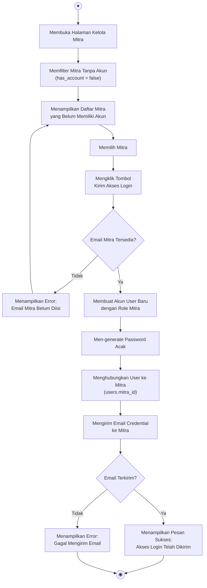

**Langkah-langkah:**

| No | Langkah | Pelaku | Keterangan |
|----|---------|--------|------------|
| 1 | Membuka halaman kelola mitra | Admin | Menu Master Data > Mitra |
| 2 | Memfilter mitra tanpa akun | Admin | Filter `has_account = false` |
| 3 | Memilih mitra target | Admin | Klik mitra dari daftar |
| 4 | Mengklik "Kirim Akses Login" | Admin | Tombol aksi per-mitra |
| 5 | Memvalidasi email mitra | Sistem | Pastikan email terisi |
| 6 | Membuat akun user baru | Sistem | Auto-create user role mitra |
| 7 | Generate password acak | Sistem | Password aman auto-generated |
| 8 | Menghubungkan user ke mitra | Sistem | Set `users.mitra_id` |
| 9 | Mengirim email credential | Sistem | Kirim email berisi login info |

---

## 4. Subsistem Dokumen Kerja Sama

### 4.1 UC08 — Menginput Dokumen Kerja Sama

**Aktor**: Humas, Jurusan, UPA, Pusat

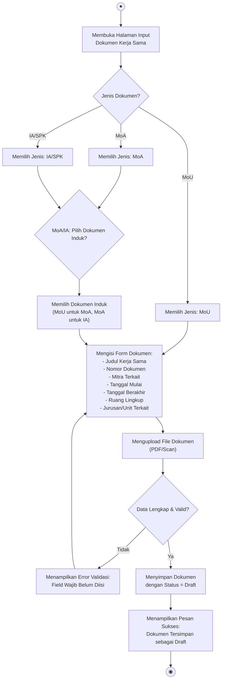

**Langkah-langkah:**

| No | Langkah | Pelaku | Keterangan |
|----|---------|--------|------------|
| 1 | Membuka halaman input dokumen | Unit | Menu Dokumen > Tambah Baru |
| 2 | Memilih jenis dokumen | Unit | MoU / MoA / IA / SPK |
| 3 | Memilih dokumen induk | Unit | Untuk MoA/IA (hierarki dokumen) |
| 4 | Mengisi form dokumen | Unit | Judul, nomor, mitra, tanggal, ruang lingkup |
| 5 | Mengupload file dokumen | Unit | PDF / Scan dokumen asli |
| 6 | Memvalidasi data | Sistem | Cek kelengkapan field wajib |
| 7 | Menyimpan dokumen | Sistem | Status awal = Draft |

---

### 4.2 UC09 — Mengedit Dokumen Kerja Sama

**Aktor**: Humas, Jurusan, UPA, Pusat

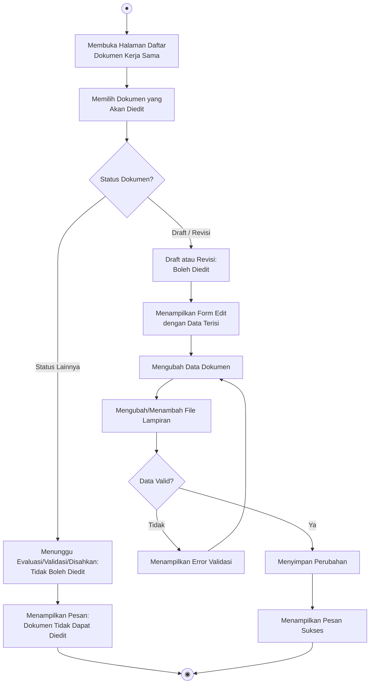

---

### 4.3 UC10 — Mensubmit Dokumen ke Pimpinan

**Aktor**: Humas, Jurusan, UPA, Pusat

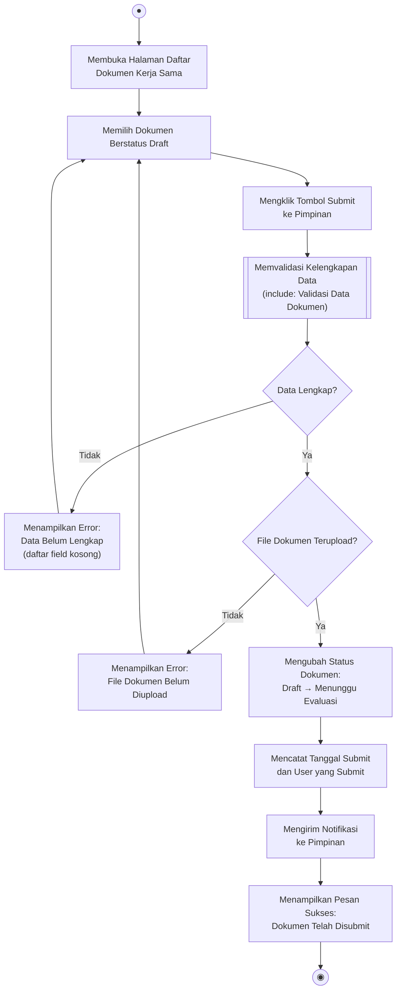

**Langkah-langkah:**

| No | Langkah | Pelaku | Keterangan |
|----|---------|--------|------------|
| 1 | Memilih dokumen berstatus Draft | Unit | Dari daftar dokumen |
| 2 | Mengklik tombol Submit | Unit | Tombol "Submit ke Pimpinan" |
| 3 | Memvalidasi kelengkapan | Sistem | Cek semua field wajib & file |
| 4 | Mengubah status dokumen | Sistem | Draft → Menunggu Evaluasi |
| 5 | Mencatat log submit | Sistem | Tanggal, user, timestamp |
| 6 | Mengirim notifikasi | Sistem | Notifikasi ke Pimpinan |

---

### 4.4 UC11 — Memvalidasi Dokumen Kerja Sama

**Aktor**: Pimpinan

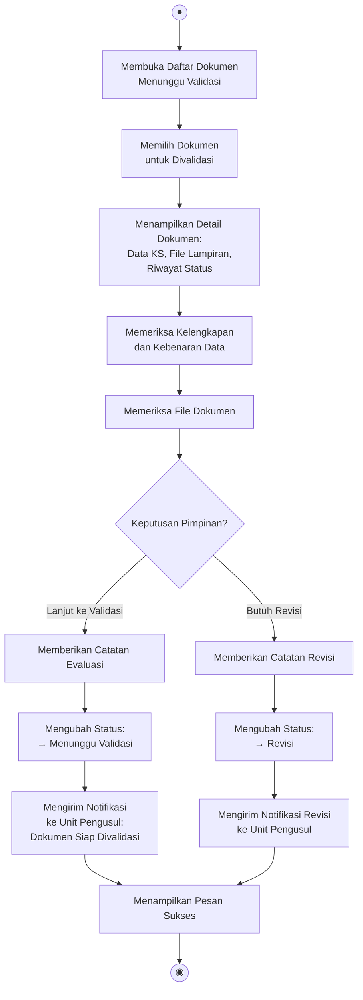

---

### 4.5 UC12 — Mengesahkan Dokumen Kerja Sama

**Aktor**: Pimpinan

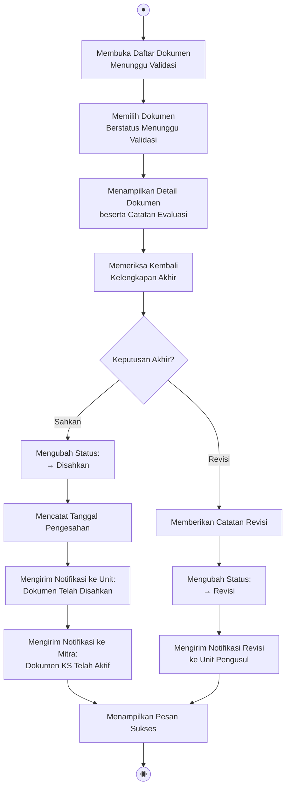

**Langkah-langkah:**

| No | Langkah | Pelaku | Keterangan |
|----|---------|--------|------------|
| 1 | Membuka daftar dokumen menunggu validasi | Pimpinan | Dashboard > Dokumen Menunggu |
| 2 | Memilih dokumen | Pimpinan | Klik dokumen dari daftar |
| 3 | Memeriksa detail & catatan evaluasi | Pimpinan | Review data dan file |
| 4 | Memberikan keputusan | Pimpinan | Sahkan / Revisi |
| 5 | Mengubah status dokumen | Sistem | → Disahkan atau → Revisi |
| 6 | Mencatat tanggal pengesahan | Sistem | Timestamp pengesahan |
| 7 | Mengirim notifikasi ke unit & mitra | Sistem | Pemberitahuan hasil |

---

### 4.6 UC13 — Mereview Draf Dokumen Online

**Aktor**: Mitra

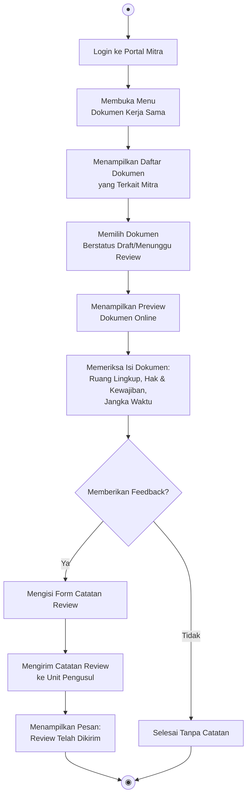

---

### 4.7 UC14 — Melihat Dokumen Kerja Sama Sendiri

**Aktor**: Mitra

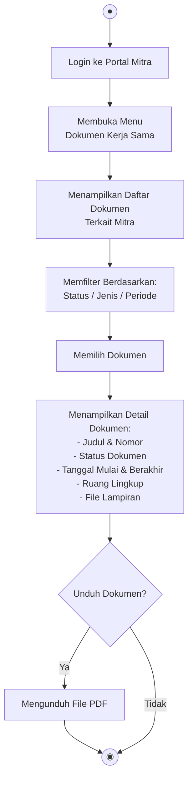

---

## 5. Subsistem Pengajuan Kerja Sama

### 5.1 UC15 — Mengajukan Kerja Sama Baru

**Aktor**: Mitra

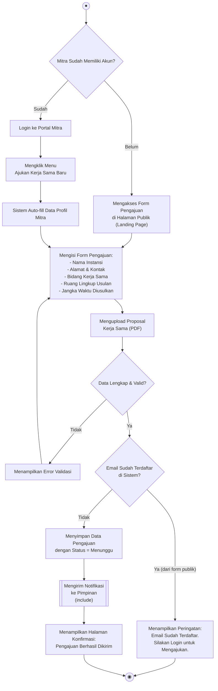

**Langkah-langkah:**

| No | Langkah | Pelaku | Keterangan |
|----|---------|--------|------------|
| 1 | Mengakses form pengajuan | Mitra | Via landing page (publik) atau dashboard mitra |
| 2 | Mengisi data instansi | Mitra | Auto-fill jika sudah login |
| 3 | Mengisi ruang lingkup usulan | Mitra | Bidang & scope kerja sama |
| 4 | Mengupload proposal | Mitra | File PDF proposal |
| 5 | Memvalidasi data | Sistem | Cek kelengkapan & duplikasi email |
| 6 | Menyimpan pengajuan | Sistem | Status = Menunggu |
| 7 | Mengirim notifikasi | Sistem | Notifikasi ke Pimpinan |

---

### 5.2 UC16 — Menerima Pengajuan Kerja Sama Baru

**Aktor**: Pimpinan

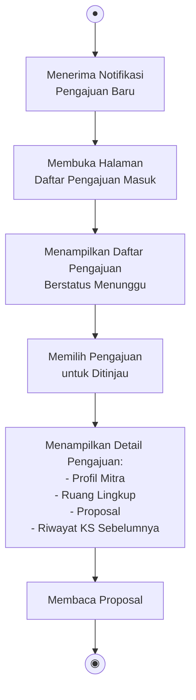

---

### 5.3 UC17 — Memvalidasi Pengajuan Kerja Sama Baru

**Aktor**: Pimpinan

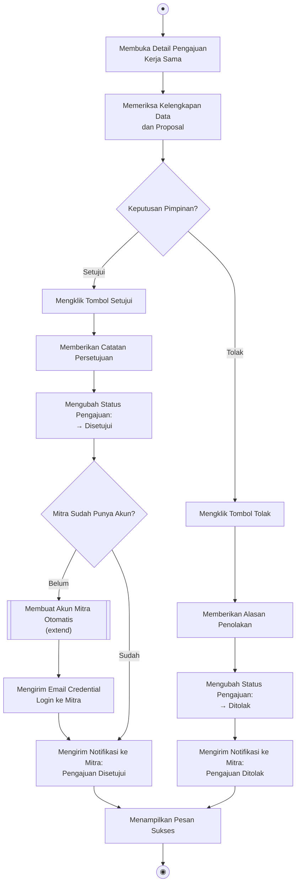

**Langkah-langkah:**

| No | Langkah | Pelaku | Keterangan |
|----|---------|--------|------------|
| 1 | Membuka detail pengajuan | Pimpinan | Dari daftar pengajuan |
| 2 | Memeriksa data & proposal | Pimpinan | Review kelengkapan |
| 3 | Memberikan keputusan | Pimpinan | Setujui / Tolak |
| 4 | Jika disetujui: buat akun mitra | Sistem | Auto-create jika belum punya akun |
| 5 | Mengirim credential login | Sistem | Email ke mitra (jika akun baru) |
| 6 | Mengirim notifikasi hasil | Sistem | Notifikasi ke mitra |

---

### 5.4 UC18 — Mengajukan Perpanjangan Kerja Sama

**Aktor**: Mitra

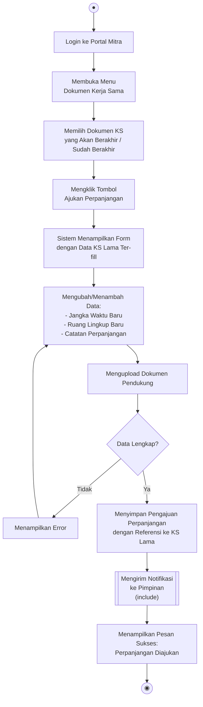

---

## 6. Subsistem Kegiatan dan Monitoring

### 6.1 UC19 — Menginput Kegiatan Kerja Sama

**Aktor**: Humas, Jurusan, Prodi, UPA, Pusat

```mermaid
flowchart TD
    Start(("●"))
    A["Membuka Halaman\nInput Kegiatan Kerja Sama"]
    B["Memilih Dokumen IA/SPK\nyang Sudah Disahkan"]
    C{"Dokumen IA Tersedia?"}
    D["Menampilkan Pesan:\nBelum Ada Dokumen IA yang Disahkan"]
    
    E["Mengisi Form Kegiatan:\n- Nama Kegiatan\n- Jenis Kerja Sama\n  (Magang/Penelitian/Pelatihan/\n  Sertifikasi/Pengabdian)\n- Sasaran\n- Indikator\n- Periode Pelaksanaan\n- Volume Luaran"]
    F["Menentukan Mitra\nPelaksana Kegiatan"]
    G{"Data Lengkap & Valid?"}
    H["Menampilkan Error Validasi"]
    I["Menyimpan Data Kegiatan\nTerhubung ke Dokumen IA"]
    J["Menampilkan Pesan Sukses"]
    End(("◉"))

    Start --> A --> B --> C
    C -- Tidak --> D --> End
    C -- Ya --> E --> F --> G
    G -- Tidak --> H --> E
    G -- Ya --> I --> J --> End
```

**Langkah-langkah:**

| No | Langkah | Pelaku | Keterangan |
|----|---------|--------|------------|
| 1 | Membuka halaman input kegiatan | Unit/Prodi | Menu Kegiatan > Tambah |
| 2 | Memilih dokumen IA terkait | Unit/Prodi | Pilih IA yang sudah disahkan |
| 3 | Mengisi detail kegiatan | Unit/Prodi | Nama, jenis, sasaran, indikator |
| 4 | Menentukan mitra pelaksana | Unit/Prodi | Pilih mitra dari daftar |
| 5 | Memvalidasi data | Sistem | Cek kelengkapan |
| 6 | Menyimpan data kegiatan | Sistem | Link ke dokumen IA |

---

### 6.2 UC20 — Menginput Peserta Mahasiswa Kegiatan

**Aktor**: Prodi

```mermaid
flowchart TD
    Start(("●"))
    A["Membuka Halaman\nKegiatan Kerja Sama"]
    B["Memilih Kegiatan yang\nAkan Ditambah Peserta"]
    C["Mengklik Tombol\nTambah Peserta Mahasiswa"]
    D{"Metode Input?"}
    
    E1["Input Manual:\nMengisi Form per Mahasiswa"]
    E2["Import Excel:\nMengupload File Excel\nDaftar Mahasiswa"]
    
    F["Mengisi Data Mahasiswa:\n- NIM\n- Nama\n- Prodi\n- Angkatan"]
    G["Menentukan Mitra Penempatan"]
    H["Menentukan Periode:\nTanggal Mulai & Selesai"]
    I["Menentukan Pembimbing:\n- Dosen Internal\n- Pembimbing Mitra (Eksternal)"]
    
    J[["Memvalidasi Data Mahasiswa\n(include)"]]
    K{"Data Valid?"}
    L["Menampilkan Error:\n- NIM Tidak Ditemukan\n- Mahasiswa Sudah Terdaftar\n- Data Tidak Lengkap"]
    M["Menyimpan Data Penempatan\nMahasiswa"]
    N["Menampilkan Pesan Sukses:\nPeserta Berhasil Ditambahkan"]
    End(("◉"))

    Start --> A --> B --> C --> D
    D -- Manual --> E1 --> F
    D -- Import --> E2 --> F
    F --> G --> H --> I --> J --> K
    K -- Tidak --> L --> F
    K -- Ya --> M --> N --> End
```

**Langkah-langkah:**

| No | Langkah | Pelaku | Keterangan |
|----|---------|--------|------------|
| 1 | Memilih kegiatan | Prodi | Dari daftar kegiatan |
| 2 | Memilih metode input | Prodi | Manual atau import Excel |
| 3 | Mengisi data mahasiswa | Prodi | NIM, nama, prodi, angkatan |
| 4 | Menentukan mitra penempatan | Prodi | Pilih mitra dari daftar |
| 5 | Menentukan periode | Prodi | Tanggal mulai & selesai |
| 6 | Menentukan pembimbing | Prodi | Dosen internal & pembimbing mitra |
| 7 | Memvalidasi data | Sistem | Cek NIM, duplikasi, kelengkapan |
| 8 | Menyimpan penempatan | Sistem | Data ke tabel `kegiatan_mahasiswas` |

---

### 6.3 UC21 — Memberi Penilaian Mahasiswa

**Aktor**: Mitra

```mermaid
flowchart TD
    Start(("●"))
    A["Login ke Portal Mitra"]
    B["Membuka Menu\nPenilaian Mahasiswa"]
    C["Menampilkan Daftar Mahasiswa\nyang Ditempatkan di Mitra"]
    D["Memfilter Berdasarkan:\nKegiatan / Periode / Status"]
    E["Memilih Mahasiswa\nyang Akan Dinilai"]
    F["Mengisi Form Penilaian:\n- Skor Kinerja (1-100)\n- Aspek Penilaian:\n  • Kedisiplinan\n  • Kompetensi Teknis\n  • Kerja Sama Tim\n  • Inisiatif\n  • Komunikasi\n- Catatan/Komentar Mitra"]
    G{"Data Penilaian Lengkap?"}
    H["Menampilkan Error:\nField Wajib Belum Diisi"]
    I["Menyimpan Penilaian\nke Data Kegiatan Mahasiswa"]
    J["Mengirim Notifikasi\nke Prodi & Jurusan"]
    K["Menampilkan Pesan Sukses:\nPenilaian Telah Disimpan"]
    End(("◉"))

    Start --> A --> B --> C --> D --> E --> F --> G
    G -- Tidak --> H --> F
    G -- Ya --> I --> J --> K --> End
```

---

### 6.4 UC22 — Memonitoring Mahasiswa Aktif

**Aktor**: Pimpinan, Jurusan, Prodi, Mitra

```mermaid
flowchart TD
    Start(("●"))
    A["Membuka Halaman\nMonitoring Mahasiswa"]
    B["Menampilkan Dashboard\nMonitoring Mahasiswa"]
    C["Memfilter Data:\n- Per Mitra\n- Per Kegiatan\n- Per Prodi\n- Per Periode\n- Per Status"]
    D["Menampilkan Data:\n- Jumlah Mahasiswa Aktif\n- Distribusi per Mitra\n- Status Penempatan\n- Progress Penilaian"]
    E{"Lihat Detail?"}
    F["Menampilkan Detail\nper Mahasiswa:\n- Profil MHS\n- Mitra Penempatan\n- Pembimbing\n- Nilai (jika ada)\n- Status"]
    End(("◉"))

    Start --> A --> B --> C --> D --> E
    E -- Ya --> F --> End
    E -- Tidak --> End
```

---

## 7. Subsistem Evaluasi

### 7.1 UC23 — Mengisi Form Evaluasi

**Aktor**: Humas, Jurusan, UPA, Pusat

```mermaid
flowchart TD
    Start(("●"))
    A["Membuka Halaman\nEvaluasi Kerja Sama"]
    B["Memilih Dokumen KS\nyang Akan Dievaluasi"]
    C{"KS Berstatus Aktif?"}
    D["Menampilkan Pesan:\nKS Tidak Dalam Status Aktif"]
    E["Menampilkan Form Evaluasi:\n- Periode Evaluasi\n- Realisasi Volume Luaran\n- Realisasi Output\n- Realisasi Outcome\n- Kendala/Hambatan\n- Rekomendasi\n- Kesimpulan"]
    F["Mengisi Data Evaluasi"]
    G[["Memvalidasi Data Evaluasi\n(include)"]]
    H{"Data Valid?"}
    I["Menampilkan Error Validasi"]
    J["Menyimpan Evaluasi\ndengan Status = Draft"]
    K["Menampilkan Pesan Sukses:\nEvaluasi Tersimpan"]
    End(("◉"))

    Start --> A --> B --> C
    C -- Tidak --> D --> End
    C -- Ya --> E --> F --> G --> H
    H -- Tidak --> I --> F
    H -- Ya --> J --> K --> End
```

**Langkah-langkah:**

| No | Langkah | Pelaku | Keterangan |
|----|---------|--------|------------|
| 1 | Memilih dokumen KS | Unit | Pilih KS aktif untuk evaluasi |
| 2 | Mengisi form evaluasi | Unit | Realisasi, kendala, rekomendasi |
| 3 | Memvalidasi data | Sistem | Cek kelengkapan field |
| 4 | Menyimpan evaluasi | Sistem | Status = Draft |

---

### 7.2 UC24 — Mensubmit Evaluasi ke Pimpinan

**Aktor**: Humas, Jurusan, UPA, Pusat

```mermaid
flowchart TD
    Start(("●"))
    A["Membuka Halaman\nDaftar Evaluasi"]
    B["Memilih Evaluasi\nBerstatus Draft"]
    C["Memeriksa Kelengkapan\nData Evaluasi"]
    D{"Data Lengkap?"}
    E["Menampilkan Error:\nEvaluasi Belum Lengkap"]
    F["Mengklik Tombol\nSubmit ke Pimpinan"]
    G["Mengubah Status Evaluasi:\nDraft → Menunggu Validasi"]
    H["Mengirim Notifikasi\nke Pimpinan"]
    I["Menampilkan Pesan Sukses:\nEvaluasi Telah Disubmit"]
    End(("◉"))

    Start --> A --> B --> C --> D
    D -- Tidak --> E --> B
    D -- Ya --> F --> G --> H --> I --> End
```

---

### 7.3 UC25 — Memvalidasi Evaluasi

**Aktor**: Pimpinan

```mermaid
flowchart TD
    Start(("●"))
    A["Membuka Daftar Evaluasi\nMenunggu Validasi"]
    B["Memilih Evaluasi\nuntuk Divalidasi"]
    C["Menampilkan Detail Evaluasi:\n- Data KS Terkait\n- Realisasi vs Target\n- Kendala & Rekomendasi\n- Riwayat Evaluasi Sebelumnya"]
    D["Memeriksa Evaluasi"]
    E{"Keputusan?"}

    F["Menyetujui Evaluasi"]
    G["Mengubah Status:\n→ Divalidasi"]
    H["Memberikan Catatan\nPimpinan"]
    I["Mengirim Notifikasi\nke Unit Pengusul"]

    J["Meminta Revisi"]
    K["Memberikan Catatan Revisi"]
    L["Mengubah Status:\n→ Perlu Revisi"]
    M["Mengirim Notifikasi Revisi\nke Unit Pengusul"]

    N["Menampilkan Pesan Sukses"]
    End(("◉"))

    Start --> A --> B --> C --> D --> E
    E -- Setujui --> F --> G --> H --> I --> N --> End
    E -- Revisi --> J --> K --> L --> M --> N
```

---

### 7.4 UC26 — Memberi Umpan Balik Kerja Sama

**Aktor**: Mitra

```mermaid
flowchart TD
    Start(("●"))
    A["Login ke Portal Mitra"]
    B["Membuka Menu\nUmpan Balik"]
    C["Memilih Dokumen KS\nyang Akan Diberi Feedback"]
    D["Mengisi Form Umpan Balik:\n- Rating Keseluruhan (1-5)\n- Aspek Kepuasan:\n  • Komunikasi Kampus\n  • Kualitas Mahasiswa\n  • Administrasi\n  • Dukungan Teknis\n- Saran & Masukan\n- Kesediaan Perpanjangan"]
    E{"Data Lengkap?"}
    F["Menampilkan Error"]
    G["Menyimpan Umpan Balik"]
    H["Mengirim Notifikasi\nke Unit Terkait & Pimpinan"]
    I["Menampilkan Pesan:\nTerima Kasih atas Umpan Balik"]
    End(("◉"))

    Start --> A --> B --> C --> D --> E
    E -- Tidak --> F --> D
    E -- Ya --> G --> H --> I --> End
```

---

## 8. Subsistem Laporan dan Dashboard

### 8.1 UC27 — Melihat Dashboard Eksekutif

**Aktor**: Pimpinan

```mermaid
flowchart TD
    Start(("●"))
    A["Login sebagai Pimpinan"]
    B["Sistem Memuat Dashboard Eksekutif"]
    C["Mengambil Data Statistik\ndari Database"]
    D["Menampilkan KPI Utama:\n- Total KS Aktif\n- KS Akan Berakhir (30/60/90 hari)\n- KS Baru Bulan Ini\n- Total Mitra Aktif"]
    E["Menampilkan Grafik:\n- Distribusi KS per Unit\n- Trend KS per Tahun\n- Status KS (Pie Chart)\n- Klasifikasi Mitra"]
    F["Menampilkan Tabel:\n- Dokumen Menunggu Validasi\n- Pengajuan Baru Menunggu\n- Evaluasi Menunggu"]
    G["Menampilkan Peta:\nSebaran Geografis Mitra"]
    H{"Filter Data?"}
    I["Memfilter Berdasarkan:\nPeriode / Unit / Status / Klasifikasi"]
    J["Memperbarui Dashboard"]
    End(("◉"))

    Start --> A --> B --> C --> D --> E --> F --> G --> H
    H -- Ya --> I --> J --> D
    H -- Tidak --> End
```

---

### 8.2 UC28 — Melihat Dashboard Per-Unit

**Aktor**: Humas, Jurusan, Prodi, UPA, Pusat

```mermaid
flowchart TD
    Start(("●"))
    A["Login sebagai Unit"]
    B["Sistem Memuat Dashboard Per-Unit"]
    C["Mengambil Data Statistik\nKhusus Unit Bersangkutan"]
    D["Menampilkan Statistik Unit:\n- Total KS yang Dikelola\n- KS Aktif vs Berakhir\n- Mitra Terkait Unit\n- Kegiatan Berjalan"]
    E["Menampilkan Grafik:\n- Status Dokumen\n- Trend KS\n- Jenis Kegiatan"]
    F["Menampilkan Daftar:\n- Dokumen Draft\n- Kegiatan Aktif\n- Evaluasi Pending"]
    G{"Filter / Drill-down?"}
    H["Menerapkan Filter"]
    End(("◉"))

    Start --> A --> B --> C --> D --> E --> F --> G
    G -- Ya --> H --> D
    G -- Tidak --> End
```

---

### 8.3 UC29 — Melihat Dashboard Mitra

**Aktor**: Mitra

```mermaid
flowchart TD
    Start(("●"))
    A["Login ke Portal Mitra"]
    B["Sistem Memuat Dashboard Mitra"]
    C["Mengambil Data KS\nTerkait Mitra"]
    D["Menampilkan Ringkasan:\n- Total KS dengan Kampus\n- KS Aktif\n- KS Akan Berakhir\n- Mahasiswa Ditempatkan"]
    E["Menampilkan Daftar:\n- Dokumen KS Aktif\n- Mahasiswa Saat Ini\n- Penilaian Pending\n- Riwayat Kerja Sama"]
    F["Menampilkan Quick Action:\n- Ajukan KS Baru\n- Ajukan Perpanjangan\n- Beri Penilaian\n- Beri Umpan Balik"]
    End(("◉"))

    Start --> A --> B --> C --> D --> E --> F --> End
```

---

### 8.4 UC30 — Mengekspor Laporan

**Aktor**: Admin, Pimpinan, Humas, Jurusan, UPA, Pusat

```mermaid
flowchart TD
    Start(("●"))
    A["Membuka Halaman Laporan"]
    B["Memilih Jenis Laporan:\n- Laporan KS per Periode\n- Laporan KS per Unit\n- Laporan KS per Mitra\n- Laporan Kegiatan\n- Laporan Evaluasi\n- Laporan Statistik"]
    C["Menentukan Parameter:\n- Rentang Tanggal\n- Unit (opsional)\n- Status (opsional)\n- Klasifikasi (opsional)"]
    D{"Format Export?"}
    E1["Generate PDF"]
    E2["Generate Excel"]
    F["Mengambil Data dari Database\nSesuai Parameter"]
    G["Menyusun Layout Laporan"]
    H["Menampilkan Preview Laporan"]
    I["Mengunduh File Laporan"]
    End(("◉"))

    Start --> A --> B --> C --> D
    D -- PDF --> E1 --> F
    D -- Excel --> E2 --> F
    F --> G --> H --> I --> End
```

**Langkah-langkah:**

| No | Langkah | Pelaku | Keterangan |
|----|---------|--------|------------|
| 1 | Membuka halaman laporan | Pengguna | Menu Laporan |
| 2 | Memilih jenis laporan | Pengguna | Pilih kategori laporan |
| 3 | Menentukan parameter filter | Pengguna | Tanggal, unit, status, dll |
| 4 | Memilih format export | Pengguna | PDF atau Excel |
| 5 | Generate laporan | Sistem | Query database, susun layout |
| 6 | Preview & unduh | Pengguna | Lihat preview, unduh file |

---

### 8.5 UC31 — Melihat Analitik

**Aktor**: Admin, Pimpinan, Humas, Jurusan, UPA, Pusat

```mermaid
flowchart TD
    Start(("●"))
    A["Membuka Halaman Analitik"]
    B{"Pilih Jenis Analitik?"}
    
    C1["Analitik Status KS:\n- Distribusi Status Dokumen\n- Trend Perubahan Status\n- Rata-rata Waktu per Status"]
    C2["Analitik Geografis:\n- Peta Sebaran Mitra\n- Konsentrasi per Wilayah\n- Coverage Area"]
    C3["Analitik Klasifikasi:\n- Distribusi per Klasifikasi Mitra\n- Top Klasifikasi\n- Trend per Klasifikasi"]
    C4["Analitik Kegiatan:\n- Distribusi per Jenis Kegiatan\n- Jumlah Peserta\n- Capaian Output"]

    D["Menampilkan Visualisasi:\nGrafik, Chart, Peta"]
    E{"Filter / Periode?"}
    F["Menerapkan Filter"]
    End(("◉"))

    Start --> A --> B
    B -- Status --> C1 --> D
    B -- Geografis --> C2 --> D
    B -- Klasifikasi --> C3 --> D
    B -- Kegiatan --> C4 --> D
    D --> E
    E -- Ya --> F --> D
    E -- Tidak --> End
```

---

## 9. Subsistem Tracking Lulusan

### 9.1 UC32 — Menginput Data Lulusan Bekerja di Mitra

**Aktor**: Prodi, Mitra

```mermaid
flowchart TD
    Start(("●"))
    A{"Siapa yang Input?"}
    
    B1["Prodi: Membuka Halaman\nTracking Lulusan"]
    B2["Mitra: Login ke Portal\nMembuka Menu Alumni"]

    C{"Metode Input?"}
    D1["Input Manual:\nMengisi Form per Alumni"]
    D2["Import Excel:\nUpload Daftar Alumni"]

    E["Mengisi Data Alumni:\n- NIM\n- Nama\n- Program Studi\n- Tahun Lulus\n- Email / Telp"]
    F["Menentukan Data Pekerjaan:\n- Mitra Tempat Bekerja\n- Posisi/Jabatan\n- Tahun Mulai Bekerja\n- Status (Aktif/Resign)\n- Sumber Data"]
    G[["Memvalidasi Data\n(include)"]]
    H{"Data Valid?"}
    I["Menampilkan Error:\n- NIM Tidak Valid\n- Data Duplikat\n- Field Wajib Kosong"]
    J["Menyimpan Relasi\nAlumni ↔ Mitra"]
    K["Menampilkan Pesan Sukses"]
    End(("◉"))

    Start --> A
    A -- Prodi --> B1 --> C
    A -- Mitra --> B2 --> C
    C -- Manual --> D1 --> E
    C -- Import --> D2 --> E
    E --> F --> G --> H
    H -- Tidak --> I --> E
    H -- Ya --> J --> K --> End
```

**Langkah-langkah:**

| No | Langkah | Pelaku | Keterangan |
|----|---------|--------|------------|
| 1 | Membuka halaman tracking lulusan | Prodi/Mitra | Menu Tracking Lulusan |
| 2 | Memilih metode input | Prodi/Mitra | Manual atau import Excel |
| 3 | Mengisi data alumni | Prodi/Mitra | NIM, nama, prodi, tahun lulus |
| 4 | Menentukan data pekerjaan | Prodi/Mitra | Mitra, posisi, tahun mulai |
| 5 | Memvalidasi data | Sistem | Cek NIM, duplikasi, kelengkapan |
| 6 | Menyimpan relasi alumni-mitra | Sistem | Tabel `alumni_mitras` |

---

### 9.2 UC33 — Melihat Statistik Penyerapan Lulusan

**Aktor**: Pimpinan, Humas, Jurusan, Prodi, Mitra

```mermaid
flowchart TD
    Start(("●"))
    A["Membuka Halaman\nStatistik Penyerapan Lulusan"]
    B["Mengambil Data dari Database:\nalumnis + alumni_mitras"]
    C["Menampilkan Statistik Utama:\n- Total Alumni Terdaftar\n- Alumni Bekerja di Mitra KS\n- Persentase Penyerapan\n- Trend per Tahun"]
    D["Menampilkan Grafik:\n- Penyerapan per Prodi\n- Penyerapan per Mitra\n- Distribusi Posisi\n- Trend Tahunan"]
    E{"Filter Data?"}
    F["Memfilter Berdasarkan:\nProdi / Mitra / Tahun Lulus / Status"]
    G["Memperbarui Statistik"]
    H{"Export Data?"}
    I["Mengunduh Laporan\nPenyerapan Lulusan (PDF/Excel)"]
    End(("◉"))

    Start --> A --> B --> C --> D --> E
    E -- Ya --> F --> G --> C
    E -- Tidak --> H
    H -- Ya --> I --> End
    H -- Tidak --> End
```

---

## 10. Subsistem Komunikasi

### 10.1 UC34 — Menerima Notifikasi Sistem

**Aktor**: Semua pengguna

```mermaid
flowchart TD
    Start(("●"))
    A["Sistem Men-trigger Event:\n- Dokumen Disubmit\n- Pengajuan Baru Masuk\n- Dokumen Disahkan/Revisi\n- KS Akan Berakhir\n- Penilaian Diterima\n- Evaluasi Divalidasi"]
    B["Membuat Record Notifikasi:\n- user_id (penerima)\n- message\n- tipe\n- is_read = false"]
    C["Menampilkan Badge Notifikasi\ndi Header Dashboard"]
    D["Pengguna Mengklik\nIkon Notifikasi"]
    E["Menampilkan Daftar Notifikasi\n(Terbaru di Atas)"]
    F["Pengguna Mengklik\nNotifikasi Tertentu"]
    G["Mengubah Status:\nis_read = true"]
    H["Redirect ke Halaman Terkait"]
    End(("◉"))

    Start --> A --> B --> C --> D --> E --> F --> G --> H --> End
```

---

### 10.2 UC35 — Menghubungi Administrator

**Aktor**: Mitra

```mermaid
flowchart TD
    Start(("●"))
    A["Login ke Portal Mitra"]
    B["Mengklik Menu\nHubungi Administrator"]
    C["Mengisi Form Kontak:\n- Subjek Pesan\n- Kategori:\n  • Kendala Teknis\n  • Pertanyaan Umum\n  • Permintaan Bantuan\n- Isi Pesan\n- Lampiran (opsional)"]
    D{"Data Lengkap?"}
    E["Menampilkan Error"]
    F["Mengirim Pesan\nke Admin"]
    G["Membuat Notifikasi\nuntuk Admin"]
    H["Menampilkan Pesan:\nPesan Anda Telah Terkirim"]
    End(("◉"))

    Start --> A --> B --> C --> D
    D -- Tidak --> E --> C
    D -- Ya --> F --> G --> H --> End
```

---

## 11. Alur Proses Bisnis Utama End-to-End

Bagian ini menggambarkan alur bisnis utama sistem secara end-to-end, menghubungkan beberapa use case dalam satu proses berkelanjutan.

### 11.1 Alur Lengkap: Siklus Hidup Kerja Sama (Lifecycle)

```mermaid
flowchart TD
    Start(("● Mulai"))

    subgraph fase1["📝 Fase 1: Inisiasi"]
        A1["Mitra Mengajukan\nKerja Sama Baru\n(UC15)"]
        A2["Pimpinan Menerima\nPengajuan\n(UC16)"]
        A3{"Pimpinan\nMemvalidasi?\n(UC17)"}
        A4["Pengajuan Ditolak"]
        A5["Pengajuan Disetujui\n+ Akun Mitra Dibuat"]
    end

    subgraph fase2["📄 Fase 2: Administrasi Dokumen"]
        B1["Unit Menginput\nDokumen MoU\n(UC08)"]
        B2["Unit Menginput\nDokumen MoA\n(UC08)"]
        B3["Unit Menginput\nDokumen IA/SPK\n(UC08)"]
        B4["Mitra Mereview\nDraf Online\n(UC13)"]
        B5["Unit Mensubmit\nke Pimpinan\n(UC10)"]
        B6{"Pimpinan\nMemvalidasi?\n(UC11)"}
        B7["Pimpinan\nMengesahkan\n(UC12)"]
        B8["Dokumen\nPerlu Revisi"]
    end

    subgraph fase3["📋 Fase 3: Pelaksanaan"]
        C1["Unit/Prodi\nMenginput Kegiatan\n(UC19)"]
        C2["Prodi Menginput\nPeserta Mahasiswa\n(UC20)"]
        C3["Mitra Memberi\nPenilaian MHS\n(UC21)"]
        C4["Monitoring\nMahasiswa Aktif\n(UC22)"]
    end

    subgraph fase4["⭐ Fase 4: Evaluasi"]
        D1["Unit Mengisi\nForm Evaluasi\n(UC23)"]
        D2["Unit Mensubmit\nEvaluasi\n(UC24)"]
        D3{"Pimpinan\nMemvalidasi?\n(UC25)"}
        D4["Evaluasi\nDisetujui"]
        D5["Evaluasi\nPerlu Revisi"]
        D6["Mitra Memberi\nUmpan Balik\n(UC26)"]
    end

    subgraph fase5["🔄 Fase 5: Perpanjangan / Penutupan"]
        E1{"KS Akan\nBerakhir?"}
        E2["Notifikasi Early Warning\n30/60/90 Hari\n(UC34)"]
        E3{"Mitra Ajukan\nPerpanjangan?\n(UC18)"}
        E4["Proses Perpanjangan\n→ Kembali ke Fase 2"]
        E5["KS Selesai / Ditutup"]
    end

    subgraph fase6["🎓 Fase 6: Tracking"]
        F1["Prodi/Mitra Input\nData Lulusan di Mitra\n(UC32)"]
        F2["Melihat Statistik\nPenyerapan\n(UC33)"]
    end

    Start --> A1 --> A2 --> A3
    A3 -- Tolak --> A4
    A3 -- Setujui --> A5 --> B1

    B1 --> B2 --> B3
    B3 --> B4
    B4 --> B5
    B5 --> B6
    B6 -- Revisi --> B8 --> B1
    B6 -- Lanjut --> B7

    B7 --> C1 --> C2 --> C3
    C3 --> C4

    C4 --> D1 --> D2 --> D3
    D3 -- Revisi --> D5 --> D1
    D3 -- Setujui --> D4
    D4 --> D6

    D6 --> E1
    E1 -- Ya --> E2 --> E3
    E3 -- Ya --> E4 --> B1
    E3 -- Tidak --> E5

    C3 --> F1 --> F2
    E5 --> F2
```

---

### 11.2 Alur: Pengelolaan Dokumen Kerja Sama dengan Swimlane

```text
+-----------+-----------------+-------------+----------+
|   Unit    |     Sistem      |  Pimpinan   |  Mitra   |
+-----------+-----------------+-------------+----------+
|           |                 |             |          |
| ● Start   |                 |             |          |
|   ↓       |                 |             |          |
| Input     |                 |             |          |
| Dokumen   |                 |             |          |
| (UC08)    |                 |             |          |
|   ↓       |                 |             |          |
| Upload    |                 |             |          |
| File      |                 |             |          |
|   ↓       |                 |             |          |
|---------->| Validasi Data   |             |          |
|           |   ↓             |             |          |
|           | [Data Valid?]   |             |          |
|           |  / Ya    \ Tdk  |             |          |
|           | ↓         ↓     |             |          |
|           | Simpan   Error  |             |          |
|           | (Draft)    |    |             |          |
|           |   ↓       ↓    |             |          |
|<----------| Kembali        |             |          |
|   ↓       |                |             |          |
| Submit    |                |             |          |
| (UC10)    |                |             |          |
|   ↓       |                |             |          |
|---------->| Ubah Status:   |             |          |
|           | → Menunggu     |             |          |
|           |   Evaluasi     |             |          |
|           |   ↓            |             |          |
|           | Kirim          |             |          |
|           | Notifikasi --->|             |          |
|           |                | Terima      |          |
|           |                | Notifikasi  |          |
|           |                |   ↓         |          |
|           |                | Review -------->       |
|           |                | Draf (UC13) | Review   |
|           |                |             | Dokumen  |
|           |                |<---------   | Feedback |
|           |                |   ↓         |          |
|           |                | Validasi    |          |
|           |                | (UC11)      |          |
|           |                |   ↓         |          |
|           |                | [Setuju?]   |          |
|           |                |  / Ya \ Tdk |          |
|           |                | ↓       ↓   |          |
|           |                | Sahkan  Revisi         |
|           |                | (UC12)  ↓   |          |
|           |                |   ↓     |   |          |
|           | Ubah Status <--|   |     |   |          |
|           | → Disahkan     |   |     |   |          |
|           |   ↓            |   |     |   |          |
|           | Notifikasi --->|   ↓   Notifikasi       |
|           |   ↓            |       Revisi            |
|           | Notifikasi ----|-------->|   |          |
|<----------| ke Unit        |   ↓     ↓   |          |
|   ↓       |                |             |          |
| ◉ End     |                |             |          |
+-----------+-----------------+-------------+----------+
```

---

### 11.3 Alur: Monitoring Kegiatan Mahasiswa dengan Swimlane

```text
+----------+-----------+-----------+-----------+
|  Prodi   |  Sistem   |   Mitra   | Pimpinan  |
+----------+-----------+-----------+-----------+
|          |           |           |           |
| ● Start  |           |           |           |
|   ↓      |           |           |           |
| Input    |           |           |           |
| Kegiatan |           |           |           |
| (UC19)   |           |           |           |
|   ↓      |           |           |           |
| Input    |           |           |           |
| Peserta  |           |           |           |
| MHS      |           |           |           |
| (UC20)   |           |           |           |
|   ↓      |           |           |           |
| Tentukan |           |           |           |
| Mitra &  |           |           |           |
| Pembimbing           |           |           |
|   ↓      |           |           |           |
|--------->| Simpan    |           |           |
|          | Data      |           |           |
|          |   ↓       |           |           |
|          | Notifikasi|           |           |
|          |---------->| Terima    |           |
|          |           | Daftar MHS|           |
|          |           |   ↓       |           |
|          |           | Bimbing   |           |
|          |           | Mahasiswa |           |
|          |           |   ↓       |           |
|          |           | Beri      |           |
|          |           | Penilaian |           |
|          |           | (UC21)    |           |
|          |           |   ↓       |           |
|          | Simpan <--|           |           |
|          | Nilai     |           |           |
|          |   ↓       |           |           |
|          | Notifikasi|           |           |
|          |---------->|           |---------->|
|          |           |           | Monitoring|
| Monitoring           |           | MHS       |
| MHS      |           | Monitoring| (UC22)    |
| (UC22)   |           | MHS       |   ↓       |
|   ↓      |           | (UC22)    | Lihat     |
| Evaluasi |           |           | Statistik |
| (UC23)   |           |           |           |
|   ↓      |           |           |           |
| ◉ End    |           |           |           |
+----------+-----------+-----------+-----------+
```

---

### 11.4 Alur Status Dokumen Kerja Sama (State Transition)

```mermaid
stateDiagram-v2
    [*] --> Draft : Unit menginput dokumen (UC08)
    Draft --> Draft : Unit mengedit dokumen (UC09)
    Draft --> Menunggu_Evaluasi : Unit mensubmit ke Pimpinan (UC10)
    Menunggu_Evaluasi --> Menunggu_Validasi : Pimpinan evaluasi lanjut (UC11)
    Menunggu_Evaluasi --> Revisi : Pimpinan meminta revisi (UC11)
    Menunggu_Validasi --> Disahkan : Pimpinan mengesahkan (UC12)
    Menunggu_Validasi --> Revisi : Pimpinan meminta revisi (UC12)
    Revisi --> Draft : Unit memperbaiki dokumen (UC09)

    state Disahkan {
        [*] --> Aktif : Tanggal berlaku dimulai
        Aktif --> Akan_Berakhir : 90 hari sebelum end_date
        Akan_Berakhir --> Berakhir : Melewati end_date
        Akan_Berakhir --> Diperpanjang : Mitra mengajukan perpanjangan (UC18)
        Berakhir --> Diperpanjang : Mitra mengajukan perpanjangan (UC18)
    }
```

---

> [!NOTE]
> **Total Activity Diagram**: Dokumen ini mencakup **37 activity diagram** yang mewakili seluruh use case (UC01–UC37) dari 8 subsistem, ditambah **4 diagram proses bisnis end-to-end** yang menggambarkan alur terintegrasi antar use case.

> [!IMPORTANT]
> Setiap activity diagram menggunakan kode use case yang konsisten dengan dokumen [analysis-use-case.md](file:///c:/laragon/www/wd4/pengembangan-sistem/analysis-use-case.md) untuk menjaga **traceability**. Jika terdapat perubahan use case, activity diagram terkait harus diperbarui.

> [!TIP]
> Gunakan diagram end-to-end di **Bagian 11** untuk memahami keseluruhan proses bisnis sistem. Diagram per-use case di **Bagian 2–10** untuk memahami detail langkah demi langkah setiap fungsi.
