# 📊 Analysis Use Case Diagram — Sistem Informasi Kerja Sama Kampus–DUDIKA (WD4)

> **Versi**: 1.0 — Dokumen Analisis Use Case  
> **Tanggal**: 30 Juli 2026  
> **Referensi**: [planning.md](file:///c:/laragon/www/wd4/planning.md) | [skils-uml.md](file:///c:/laragon/www/wd4/skils-diagram/skils-uml.md)

---

## Daftar Isi
1. [Identifikasi Aktor](#1-identifikasi-aktor)
2. [Identifikasi Use Case per Aktor](#2-identifikasi-use-case-per-aktor)
3. [Use Case Diagram Utama (Keseluruhan Sistem)](#3-use-case-diagram-utama)
4. [Use Case Diagram per Subsistem](#4-use-case-diagram-per-subsistem)
5. [Relasi Include dan Extend](#5-relasi-include-dan-extend)
6. [Deskripsi Use Case](#6-deskripsi-use-case)
7. [Matriks Aktor vs Use Case](#7-matriks-aktor-vs-use-case)

---

## 1. Identifikasi Aktor

Sistem Informasi Kerja Sama WD4 memiliki **8 aktor** yang terbagi menjadi 3 kategori:

### 1.1 Aktor Internal Kampus (Pengelola)

| No | Aktor | Deskripsi | Tipe |
|----|-------|-----------|------|
| 1 | **Admin** | Mengelola seluruh data master, pengguna, referensi, dan pengaturan sistem | Internal |
| 2 | **Pimpinan** | Melakukan monitoring, evaluasi, validasi dokumen, dan pengambilan keputusan strategis | Internal |
| 3 | **Humas** (Unit Kerja) | Asisten Pimpinan; administrasi kerja sama, verifikasi data, komunikasi mitra, pengelolaan dokumen | Internal |

### 1.2 Aktor Internal Kampus (Unit Akademik)

| No | Aktor | Deskripsi | Tipe |
|----|-------|-----------|------|
| 4 | **Jurusan** | Mengelola pelaksanaan kerja sama tingkat jurusan, mengusulkan kegiatan, monitoring & evaluasi | Internal |
| 5 | **Program Studi** (Prodi) | Mengelola kegiatan kerja sama yang berkaitan langsung dengan mahasiswa (magang, penelitian, sertifikasi, pelatihan) | Internal |
| 6 | **UPA** | Mengelola kerja sama di lingkup Unit Pelaksana Akademik | Internal |
| 7 | **Pusat** | Mengelola kerja sama tingkat pusat/unit khusus | Internal |

### 1.3 Aktor Eksternal

| No | Aktor | Deskripsi | Tipe |
|----|-------|-----------|------|
| 8 | **Mitra** (DUDIKA) | Pihak industri eksternal yang berkolaborasi dengan kampus melalui portal khusus | Eksternal |

---

## 2. Identifikasi Use Case per Aktor

### 2.1 Admin

```text
Admin
  ├── Mengelola Data Pengguna
  ├── Mengelola Data Role
  ├── Mengelola Jenis Kerja Sama
  ├── Mengelola Data Mitra
  ├── Mengelola Data Jurusan
  ├── Mengelola Data Prodi
  ├── Mengelola Data UPA
  ├── Mengelola Data Pusat
  ├── Mengelola Data Klasifikasi
  ├── Mengirim Akses Login Mitra
  ├── Melihat Dashboard Statistik
  ├── Mengekspor Laporan
  ├── Melihat Analitik
  └── Menerima Notifikasi Sistem
```

### 2.2 Pimpinan

```text
Pimpinan
  ├── Melihat Dashboard Eksekutif
  ├── Memvalidasi Dokumen Kerja Sama
  ├── Mengesahkan Dokumen Kerja Sama
  ├── Menerima Pengajuan Kerja Sama Baru
  ├── Memvalidasi Pengajuan Kerja Sama Baru
  ├── Memvalidasi Evaluasi
  ├── Memonitoring Mahasiswa Aktif
  ├── Melihat Statistik Penyerapan Lulusan
  ├── Mengekspor Laporan
  ├── Melihat Analitik
  └── Menerima Notifikasi Sistem
```

### 2.3 Humas (Unit Kerja)

```text
Humas
  ├── Melihat Dashboard Per-Unit
  ├── Menginput Dokumen Kerja Sama
  ├── Mengedit Dokumen Kerja Sama
  ├── Mensubmit Dokumen ke Pimpinan
  ├── Mengelola Data Mitra
  ├── Menginput Kegiatan Kerja Sama
  ├── Mengisi Form Evaluasi
  ├── Mensubmit Evaluasi ke Pimpinan
  ├── Mengekspor Laporan
  ├── Melihat Analitik
  ├── Melihat Statistik Penyerapan Lulusan
  └── Menerima Notifikasi Sistem
```

### 2.4 Jurusan

```text
Jurusan
  ├── Melihat Dashboard Per-Unit
  ├── Menginput Dokumen Kerja Sama
  ├── Mengedit Dokumen Kerja Sama
  ├── Mensubmit Dokumen ke Pimpinan
  ├── Mengelola Data Mitra
  ├── Menginput Kegiatan Kerja Sama
  ├── Memonitoring Mahasiswa Aktif
  ├── Mengisi Form Evaluasi
  ├── Mensubmit Evaluasi ke Pimpinan
  ├── Mengekspor Laporan
  ├── Melihat Analitik
  ├── Melihat Statistik Penyerapan Lulusan
  └── Menerima Notifikasi Sistem
```

### 2.5 Program Studi (Prodi)

```text
Prodi
  ├── Melihat Dashboard Per-Unit
  ├── Menginput Kegiatan Kerja Sama
  ├── Menginput Peserta Mahasiswa Kegiatan
  ├── Memonitoring Mahasiswa Aktif
  ├── Menginput Data Lulusan Bekerja di Mitra
  ├── Melihat Statistik Penyerapan Lulusan
  └── Menerima Notifikasi Sistem
```

### 2.6 UPA

```text
UPA
  ├── Melihat Dashboard Per-Unit
  ├── Menginput Dokumen Kerja Sama
  ├── Mengedit Dokumen Kerja Sama
  ├── Mensubmit Dokumen ke Pimpinan
  ├── Mengelola Data Mitra
  ├── Menginput Kegiatan Kerja Sama
  ├── Mengisi Form Evaluasi
  ├── Mensubmit Evaluasi ke Pimpinan
  ├── Mengekspor Laporan
  ├── Melihat Analitik
  └── Menerima Notifikasi Sistem
```

### 2.7 Pusat

```text
Pusat
  ├── Melihat Dashboard Per-Unit
  ├── Menginput Dokumen Kerja Sama
  ├── Mengedit Dokumen Kerja Sama
  ├── Mensubmit Dokumen ke Pimpinan
  ├── Mengelola Data Mitra
  ├── Menginput Kegiatan Kerja Sama
  ├── Mengisi Form Evaluasi
  ├── Mensubmit Evaluasi ke Pimpinan
  ├── Mengekspor Laporan
  ├── Melihat Analitik
  └── Menerima Notifikasi Sistem
```

### 2.8 Mitra (DUDIKA)

```text
Mitra
  ├── Melihat Dashboard Mitra
  ├── Mengajukan Kerja Sama Baru
  ├── Mengajukan Perpanjangan Kerja Sama
  ├── Mereview Draf Dokumen Online
  ├── Melihat Dokumen Kerja Sama Sendiri
  ├── Memberi Penilaian Mahasiswa
  ├── Memonitoring Mahasiswa Aktif
  ├── Memberi Umpan Balik Kerja Sama
  ├── Menginput Data Lulusan Bekerja di Mitra
  ├── Melihat Statistik Penyerapan Lulusan
  ├── Menghubungi Administrator
  └── Menerima Notifikasi Sistem
```

---

## 3. Use Case Diagram Utama

### 3.1 Diagram Keseluruhan Sistem

```mermaid
graph TB
    subgraph boundary["🏛 Sistem Informasi Kerja Sama Kampus–DUDIKA (WD4)"]
        subgraph master["📁 Modul Master Data"]
            UC01["Mengelola Data Pengguna"]
            UC02["Mengelola Data Role"]
            UC03["Mengelola Jenis Kerja Sama"]
            UC04["Mengelola Data Mitra"]
            UC05["Mengelola Data Jurusan/Prodi/UPA/Pusat"]
            UC06["Mengelola Data Klasifikasi"]
            UC07["Mengirim Akses Login Mitra"]
        end

        subgraph dokumen["📄 Modul Dokumen Kerja Sama"]
            UC08["Menginput Dokumen Kerja Sama"]
            UC09["Mengedit Dokumen Kerja Sama"]
            UC10["Mensubmit Dokumen ke Pimpinan"]
            UC11["Memvalidasi Dokumen Kerja Sama"]
            UC12["Mengesahkan Dokumen Kerja Sama"]
            UC13["Mereview Draf Dokumen Online"]
            UC14["Melihat Dokumen Kerja Sama Sendiri"]
        end

        subgraph pengajuan["📝 Modul Pengajuan Kerja Sama"]
            UC15["Mengajukan Kerja Sama Baru"]
            UC16["Menerima Pengajuan Kerja Sama Baru"]
            UC17["Memvalidasi Pengajuan Kerja Sama Baru"]
            UC18["Mengajukan Perpanjangan Kerja Sama"]
        end

        subgraph kegiatan["📋 Modul Kegiatan & Monitoring"]
            UC19["Menginput Kegiatan Kerja Sama"]
            UC20["Menginput Peserta Mahasiswa Kegiatan"]
            UC21["Memberi Penilaian Mahasiswa"]
            UC22["Memonitoring Mahasiswa Aktif"]
        end

        subgraph evaluasi["⭐ Modul Evaluasi"]
            UC23["Mengisi Form Evaluasi"]
            UC24["Mensubmit Evaluasi ke Pimpinan"]
            UC25["Memvalidasi Evaluasi"]
            UC26["Memberi Umpan Balik Kerja Sama"]
        end

        subgraph laporan["📊 Modul Laporan & Dashboard"]
            UC27["Melihat Dashboard Eksekutif"]
            UC28["Melihat Dashboard Per-Unit"]
            UC29["Melihat Dashboard Mitra"]
            UC30["Mengekspor Laporan"]
            UC31["Melihat Analitik"]
        end

        subgraph lulusan["🎓 Modul Tracking Lulusan"]
            UC32["Menginput Data Lulusan Bekerja di Mitra"]
            UC33["Melihat Statistik Penyerapan Lulusan"]
        end

        subgraph komunikasi["🔔 Modul Komunikasi"]
            UC34["Menerima Notifikasi Sistem"]
            UC35["Menghubungi Administrator"]
        end

        subgraph auth["🔐 Modul Autentikasi"]
            UC36["Login"]
            UC37["Logout"]
        end
    end

    Admin((Admin))
    Pimpinan((Pimpinan))
    Humas((Humas))
    Jurusan((Jurusan))
    Prodi((Prodi))
    UPA_Actor((UPA))
    Pusat_Actor((Pusat))
    Mitra((Mitra))

    Admin --- UC01
    Admin --- UC02
    Admin --- UC03
    Admin --- UC04
    Admin --- UC05
    Admin --- UC06
    Admin --- UC07
    Admin --- UC30
    Admin --- UC31
    Admin --- UC34
    Admin --- UC36

    Pimpinan --- UC11
    Pimpinan --- UC12
    Pimpinan --- UC16
    Pimpinan --- UC17
    Pimpinan --- UC22
    Pimpinan --- UC25
    Pimpinan --- UC27
    Pimpinan --- UC30
    Pimpinan --- UC31
    Pimpinan --- UC33
    Pimpinan --- UC34
    Pimpinan --- UC36

    Humas --- UC04
    Humas --- UC08
    Humas --- UC09
    Humas --- UC10
    Humas --- UC19
    Humas --- UC23
    Humas --- UC24
    Humas --- UC28
    Humas --- UC30
    Humas --- UC31
    Humas --- UC33
    Humas --- UC34
    Humas --- UC36

    Jurusan --- UC04
    Jurusan --- UC08
    Jurusan --- UC09
    Jurusan --- UC10
    Jurusan --- UC19
    Jurusan --- UC22
    Jurusan --- UC23
    Jurusan --- UC24
    Jurusan --- UC28
    Jurusan --- UC30
    Jurusan --- UC31
    Jurusan --- UC33
    Jurusan --- UC34
    Jurusan --- UC36

    Prodi --- UC19
    Prodi --- UC20
    Prodi --- UC22
    Prodi --- UC28
    Prodi --- UC32
    Prodi --- UC33
    Prodi --- UC34
    Prodi --- UC36

    UPA_Actor --- UC04
    UPA_Actor --- UC08
    UPA_Actor --- UC09
    UPA_Actor --- UC10
    UPA_Actor --- UC19
    UPA_Actor --- UC23
    UPA_Actor --- UC24
    UPA_Actor --- UC28
    UPA_Actor --- UC30
    UPA_Actor --- UC31
    UPA_Actor --- UC34
    UPA_Actor --- UC36

    Pusat_Actor --- UC04
    Pusat_Actor --- UC08
    Pusat_Actor --- UC09
    Pusat_Actor --- UC10
    Pusat_Actor --- UC19
    Pusat_Actor --- UC23
    Pusat_Actor --- UC24
    Pusat_Actor --- UC28
    Pusat_Actor --- UC30
    Pusat_Actor --- UC31
    Pusat_Actor --- UC34
    Pusat_Actor --- UC36

    Mitra --- UC13
    Mitra --- UC14
    Mitra --- UC15
    Mitra --- UC18
    Mitra --- UC21
    Mitra --- UC22
    Mitra --- UC26
    Mitra --- UC29
    Mitra --- UC32
    Mitra --- UC33
    Mitra --- UC34
    Mitra --- UC35
    Mitra --- UC36
```

---

## 4. Use Case Diagram per Subsistem

Karena diagram utama cukup kompleks, berikut diagram yang dipecah per subsistem agar lebih mudah dibaca.

### 4.1 Subsistem: Master Data

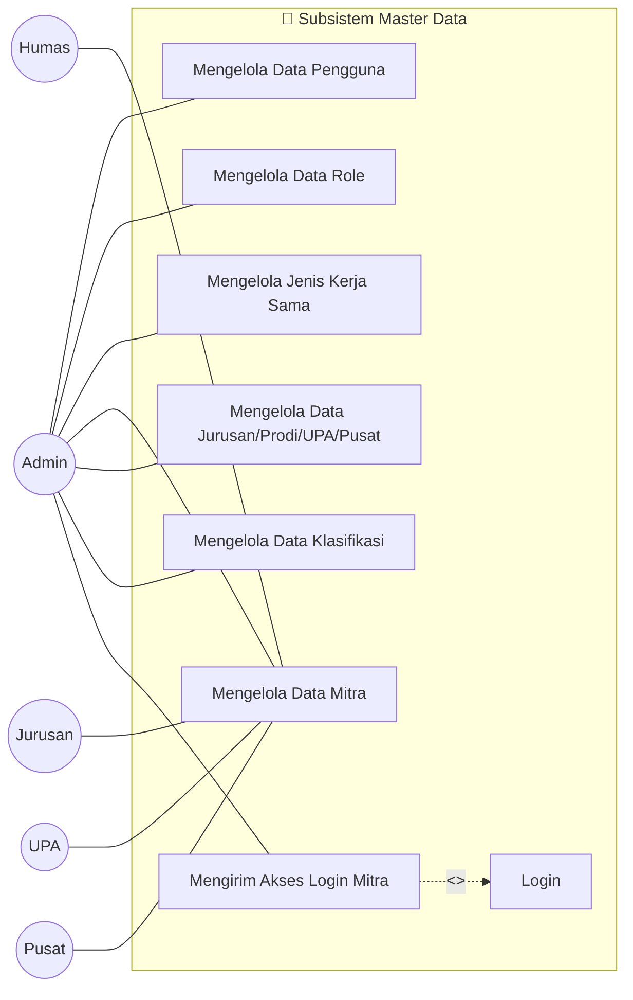

> **Catatan**: Hanya **Admin** yang memiliki akses penuh ke seluruh master data. Humas, Jurusan, UPA, dan Pusat hanya dapat mengelola data mitra.

---

### 4.2 Subsistem: Dokumen Kerja Sama

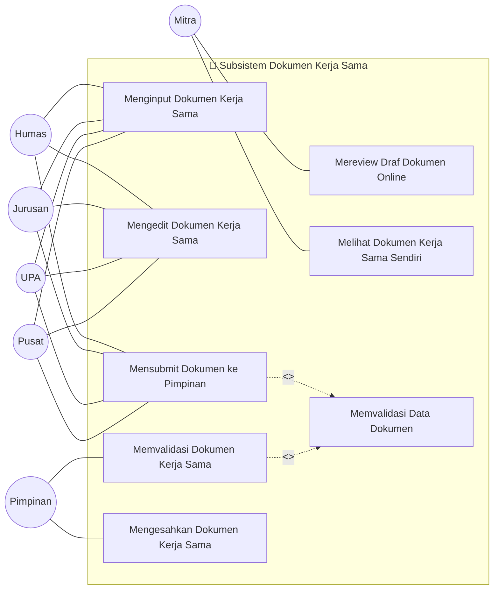

> **Catatan**: Alur dokumen mengikuti hierarki MoU → MoA → IA. Humas, Jurusan, UPA, dan Pusat menginput dan mensubmit dokumen. Pimpinan memvalidasi dan mengesahkan. Mitra dapat mereview draf secara online.

---

### 4.3 Subsistem: Pengajuan Kerja Sama

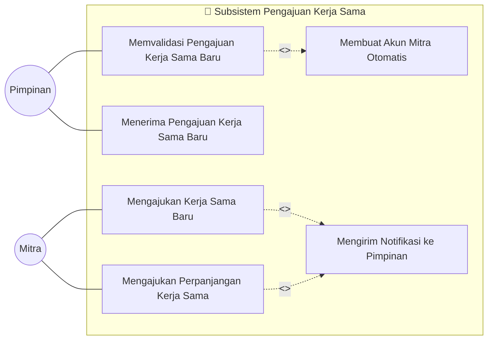

> **Catatan**: Mitra dapat mengajukan kerja sama baru melalui portal maupun dari dashboard mitra. Saat Pimpinan menyetujui pengajuan, sistem secara otomatis membuat akun login mitra (extend).

---

### 4.4 Subsistem: Kegiatan & Monitoring

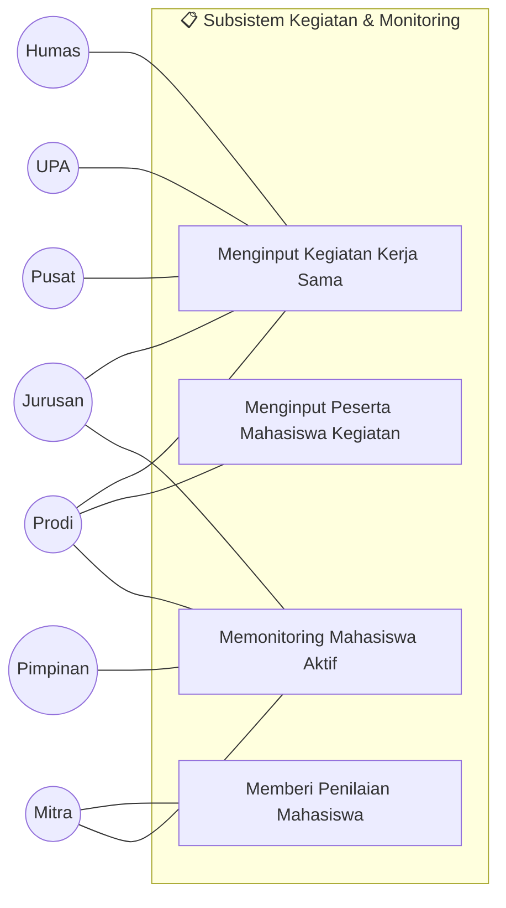

> **Catatan**: Hanya **Prodi** yang dapat menginput peserta/mahasiswa ke kegiatan. Hanya **Mitra** yang memberi penilaian mahasiswa. Monitoring mahasiswa aktif dapat dilakukan oleh Pimpinan, Jurusan, Prodi, dan Mitra.

---

### 4.5 Subsistem: Evaluasi

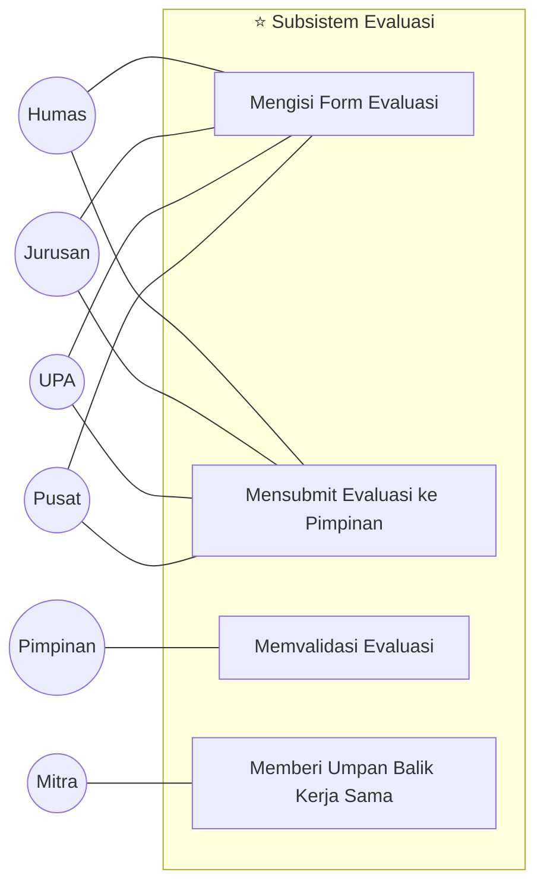

> **Catatan**: Evaluasi kerja sama diisi oleh unit pengusul (Humas, Jurusan, UPA, Pusat), kemudian disubmit ke Pimpinan untuk validasi. Mitra memberikan umpan balik secara terpisah melalui portal mitra.

---

### 4.6 Subsistem: Laporan & Dashboard

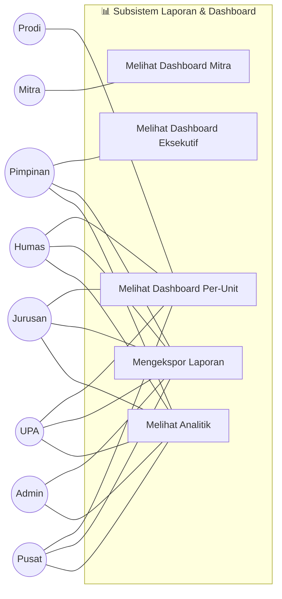

> **Catatan**: Pimpinan memiliki dashboard eksekutif yang menampilkan seluruh data. Setiap unit internal melihat dashboard per-unit masing-masing. Mitra memiliki portal dashboard tersendiri.

---

### 4.7 Subsistem: Tracking Lulusan

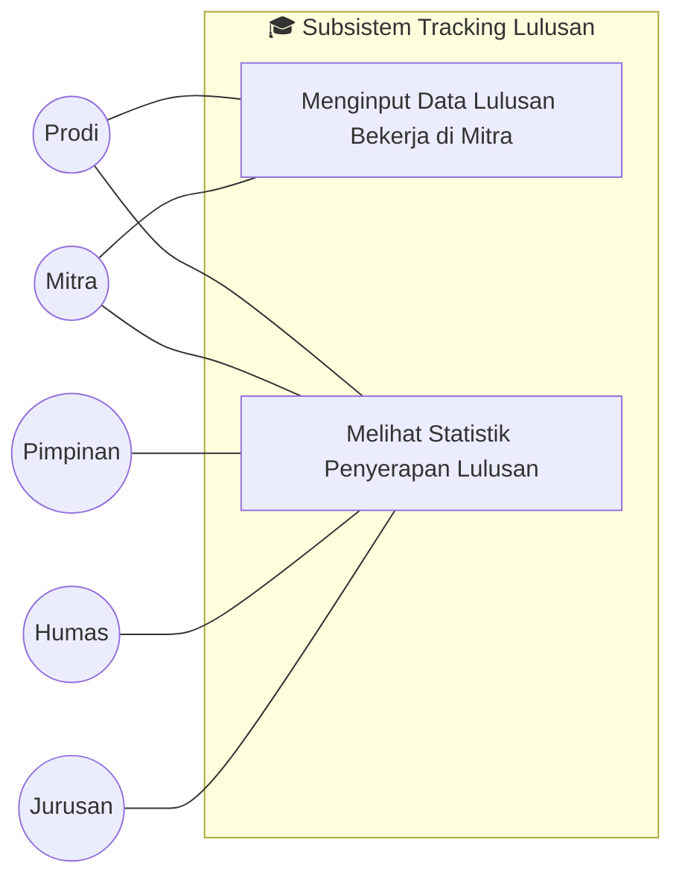

> **Catatan**: Data lulusan diinput oleh **Prodi** (data alumni) dan dikonfirmasi oleh **Mitra** (data karyawan ex-alumni). Statistik penyerapan dapat diakses oleh semua pihak terkait.

---

### 4.8 Subsistem: Komunikasi & Autentikasi

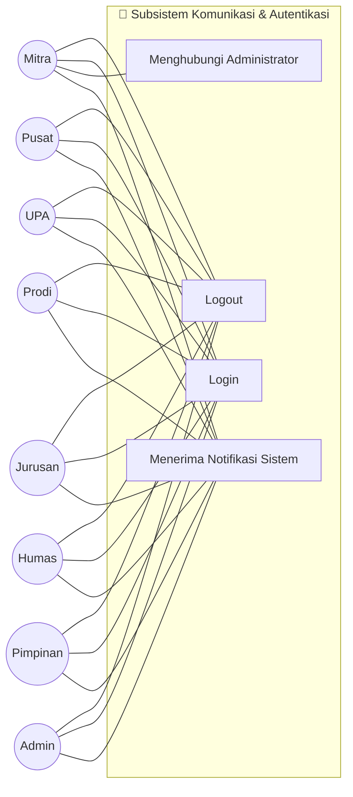

> **Catatan**: Semua aktor dapat login, logout, dan menerima notifikasi. Hanya **Mitra** yang memiliki fitur menghubungi administrator (sebagai pihak eksternal yang mungkin membutuhkan bantuan).

---

## 5. Relasi Include dan Extend

### 5.1 Relasi `<<include>>`

Relasi include menunjukkan use case yang **selalu dijalankan** sebagai bagian dari use case utama.

```text
┌─────────────────────────────────────────────────────────────────────────┐
│ Use Case Utama                │ <<include>>                            │
├───────────────────────────────┼────────────────────────────────────────┤
│ Menginput Dokumen Kerja Sama  │ → Memvalidasi Data Dokumen             │
│ Mensubmit Dokumen ke Pimpinan │ → Memvalidasi Data Dokumen             │
│ Mengajukan Kerja Sama Baru    │ → Mengirim Notifikasi ke Pimpinan      │
│ Mengajukan Perpanjangan KS    │ → Mengirim Notifikasi ke Pimpinan      │
│ Mengirim Akses Login Mitra    │ → Login (generate credential)          │
│ Mengisi Form Evaluasi         │ → Memvalidasi Data Evaluasi            │
│ Menginput Peserta Mahasiswa   │ → Memvalidasi Data Mahasiswa           │
│ Mengekspor Laporan            │ → Mengambil Data Kerja Sama            │
│ Melihat Dashboard             │ → Mengambil Data Statistik             │
└───────────────────────────────┴────────────────────────────────────────┘
```

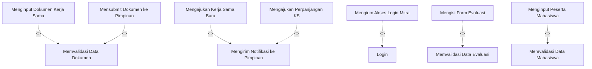

### 5.2 Relasi `<<extend>>`

Relasi extend menunjukkan perilaku **opsional** yang hanya terjadi pada kondisi tertentu.

```text
┌─────────────────────────────────────────────────────────────────────────────┐
│ Use Case Dasar                  │ <<extend>>              │ Kondisi        │
├─────────────────────────────────┼─────────────────────────┼────────────────┤
│ Memvalidasi Pengajuan KS Baru   │ ← Membuat Akun Mitra    │ Jika disetujui │
│                                 │   Otomatis              │                │
│ Mengajukan Kerja Sama Baru      │ ← Mengajukan Perpan-    │ Jika KS sudah  │
│                                 │   jangan Kerja Sama     │ pernah ada     │
│ Memvalidasi Dokumen KS          │ ← Mengirim Notifikasi   │ Jika ditolak/  │
│                                 │   Revisi ke Unit        │ perlu revisi   │
│ Memvalidasi Evaluasi            │ ← Mengirim Notifikasi   │ Jika evaluasi  │
│                                 │   Hasil Evaluasi        │ selesai        │
│ Menginput Kegiatan KS           │ ← Menginput Peserta     │ Jika kegiatan  │
│                                 │   Mahasiswa Kegiatan    │ melibatkan MHS │
└─────────────────────────────────┴─────────────────────────┴────────────────┘
```

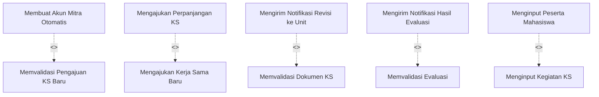

---

## 6. Deskripsi Use Case

### UC01 — Mengelola Data Pengguna

| Aspek | Deskripsi |
|-------|-----------|
| **Aktor** | Admin |
| **Deskripsi** | Admin dapat menambah, mengubah, menghapus, dan melihat data pengguna beserta role-nya |
| **Precondition** | Admin sudah login |
| **Postcondition** | Data pengguna tersimpan/terubah/terhapus di database |
| **Skenario Utama** | 1. Admin membuka halaman kelola pengguna → 2. Admin memilih aksi (tambah/edit/hapus) → 3. Admin mengisi data → 4. Sistem memvalidasi data → 5. Sistem menyimpan data |
| **Skenario Alternatif** | Data tidak valid → Sistem menampilkan pesan error |

---

### UC04 — Mengelola Data Mitra

| Aspek | Deskripsi |
|-------|-----------|
| **Aktor** | Admin, Humas, Jurusan, UPA, Pusat |
| **Deskripsi** | Menambah, mengubah, menghapus, dan melihat data mitra/instansi DUDIKA |
| **Precondition** | Pengguna sudah login dengan role yang sesuai |
| **Postcondition** | Data mitra tersimpan/terubah/terhapus di database |
| **Skenario Utama** | 1. Pengguna membuka halaman data mitra → 2. Pengguna memilih aksi CRUD → 3. Pengguna mengisi/mengubah data → 4. Sistem memvalidasi → 5. Sistem menyimpan |
| **Skenario Alternatif** | Data mitra duplikat → Sistem menampilkan peringatan |

---

### UC07 — Mengirim Akses Login Mitra

| Aspek | Deskripsi |
|-------|-----------|
| **Aktor** | Admin |
| **Deskripsi** | Admin mengirimkan credential login ke mitra eksisting yang belum memiliki akun |
| **Precondition** | Data mitra sudah ada di sistem, mitra belum memiliki akun |
| **Postcondition** | Akun mitra terbuat dan credential dikirim via email |
| **Include** | Login (generate credential) |
| **Skenario Utama** | 1. Admin filter mitra tanpa akun → 2. Admin klik "Kirim Akses Login" → 3. Sistem membuat akun user dengan role mitra → 4. Sistem mengirim email credential |

---

### UC08 — Menginput Dokumen Kerja Sama

| Aspek | Deskripsi |
|-------|-----------|
| **Aktor** | Humas, Jurusan, UPA, Pusat |
| **Deskripsi** | Menginput data dokumen kerja sama baru (MoU/MoA/IA) beserta dokumen pendukung |
| **Precondition** | Pengguna sudah login, data mitra sudah tersedia |
| **Postcondition** | Dokumen kerja sama tersimpan dengan status Draft |
| **Include** | Memvalidasi Data Dokumen |
| **Skenario Utama** | 1. Pengguna mengisi form dokumen KS → 2. Pengguna mengupload dokumen → 3. Sistem memvalidasi → 4. Sistem menyimpan dengan status Draft |

---

### UC10 — Mensubmit Dokumen ke Pimpinan

| Aspek | Deskripsi |
|-------|-----------|
| **Aktor** | Humas, Jurusan, UPA, Pusat |
| **Deskripsi** | Mengirimkan dokumen kerja sama ke Pimpinan untuk proses validasi dan pengesahan |
| **Precondition** | Dokumen berstatus Draft dan data lengkap |
| **Postcondition** | Status dokumen berubah menjadi "Menunggu Evaluasi" |
| **Include** | Memvalidasi Data Dokumen |
| **Skenario Utama** | 1. Pengguna memilih dokumen → 2. Pengguna klik submit → 3. Sistem memvalidasi kelengkapan → 4. Status berubah menjadi "Menunggu Evaluasi" → 5. Notifikasi terkirim ke Pimpinan |

---

### UC11 — Memvalidasi Dokumen Kerja Sama

| Aspek | Deskripsi |
|-------|-----------|
| **Aktor** | Pimpinan |
| **Deskripsi** | Pimpinan memeriksa dan memvalidasi dokumen yang disubmit oleh unit |
| **Precondition** | Dokumen berstatus "Menunggu Evaluasi" atau "Menunggu Validasi" |
| **Postcondition** | Status dokumen berubah (Disahkan / Revisi) |
| **Extend** | Mengirim Notifikasi Revisi ke Unit (jika ditolak) |
| **Skenario Utama** | 1. Pimpinan membuka daftar dokumen menunggu validasi → 2. Pimpinan memeriksa data → 3. Pimpinan memberikan keputusan → 4. Sistem mengubah status |
| **Skenario Alternatif** | Pimpinan menolak → Status = Revisi → Notifikasi dikirim ke unit pengusul |

---

### UC15 — Mengajukan Kerja Sama Baru

| Aspek | Deskripsi |
|-------|-----------|
| **Aktor** | Mitra |
| **Deskripsi** | Mitra mengajukan kerja sama baru melalui form publik atau dashboard mitra |
| **Precondition** | Mitra mengakses halaman pengajuan (publik) atau sudah login (dashboard) |
| **Postcondition** | Data pengajuan tersimpan dan notifikasi terkirim ke Pimpinan |
| **Include** | Mengirim Notifikasi ke Pimpinan |
| **Extend** | Mengajukan Perpanjangan Kerja Sama (jika kerja sama pernah ada) |
| **Skenario Utama** | 1. Mitra mengisi form pengajuan → 2. Mitra mengupload proposal → 3. Sistem memvalidasi data → 4. Sistem menyimpan pengajuan → 5. Notifikasi dikirim ke Pimpinan |

---

### UC17 — Memvalidasi Pengajuan Kerja Sama Baru

| Aspek | Deskripsi |
|-------|-----------|
| **Aktor** | Pimpinan |
| **Deskripsi** | Pimpinan menerima dan memvalidasi pengajuan kerja sama baru dari mitra |
| **Precondition** | Terdapat pengajuan baru yang menunggu validasi |
| **Postcondition** | Pengajuan disetujui atau ditolak |
| **Extend** | Membuat Akun Mitra Otomatis (jika disetujui dan mitra belum punya akun) |
| **Skenario Utama** | 1. Pimpinan membuka daftar pengajuan → 2. Pimpinan memeriksa data → 3. Pimpinan memberikan keputusan → 4. Jika disetujui, sistem membuat akun mitra otomatis |

---

### UC19 — Menginput Kegiatan Kerja Sama

| Aspek | Deskripsi |
|-------|-----------|
| **Aktor** | Humas, Jurusan, Prodi, UPA, Pusat |
| **Deskripsi** | Mendaftarkan kegiatan pelaksanaan kerja sama (magang, penelitian, pelatihan, sertifikasi, pengabdian) |
| **Precondition** | Dokumen kerja sama (IA) sudah disahkan |
| **Postcondition** | Data kegiatan tersimpan dan terhubung ke dokumen IA |
| **Extend** | Menginput Peserta Mahasiswa Kegiatan (jika melibatkan mahasiswa) |
| **Skenario Utama** | 1. Pengguna membuka form kegiatan → 2. Pengguna memilih dokumen IA terkait → 3. Pengguna mengisi detail kegiatan → 4. Sistem menyimpan data |

---

### UC20 — Menginput Peserta Mahasiswa Kegiatan

| Aspek | Deskripsi |
|-------|-----------|
| **Aktor** | Prodi |
| **Deskripsi** | Mendaftarkan mahasiswa sebagai peserta ke kegiatan tertentu dan mitra tertentu |
| **Precondition** | Data kegiatan sudah ada, data mahasiswa tersedia |
| **Postcondition** | Data penempatan mahasiswa tersimpan |
| **Include** | Memvalidasi Data Mahasiswa |
| **Skenario Utama** | 1. Prodi memilih kegiatan → 2. Prodi menginput data mahasiswa → 3. Prodi menentukan mitra penempatan → 4. Sistem memvalidasi → 5. Sistem menyimpan |

---

### UC21 — Memberi Penilaian Mahasiswa

| Aspek | Deskripsi |
|-------|-----------|
| **Aktor** | Mitra |
| **Deskripsi** | Mitra memberikan penilaian terhadap mahasiswa yang ditempatkan di mitra tersebut |
| **Precondition** | Mahasiswa terdaftar di kegiatan yang melibatkan mitra |
| **Postcondition** | Nilai dan catatan tersimpan di data kegiatan mahasiswa |
| **Skenario Utama** | 1. Mitra login ke portal → 2. Mitra membuka daftar mahasiswa → 3. Mitra mengisi form penilaian → 4. Sistem menyimpan nilai |

---

### UC23 — Mengisi Form Evaluasi

| Aspek | Deskripsi |
|-------|-----------|
| **Aktor** | Humas, Jurusan, UPA, Pusat |
| **Deskripsi** | Unit mengisi form evaluasi pelaksanaan kerja sama |
| **Precondition** | Kerja sama berstatus aktif |
| **Postcondition** | Data evaluasi tersimpan |
| **Include** | Memvalidasi Data Evaluasi |
| **Skenario Utama** | 1. Pengguna memilih kerja sama → 2. Pengguna mengisi form evaluasi → 3. Sistem memvalidasi → 4. Sistem menyimpan |

---

### UC27 — Melihat Dashboard Eksekutif

| Aspek | Deskripsi |
|-------|-----------|
| **Aktor** | Pimpinan |
| **Deskripsi** | Pimpinan melihat dashboard ringkasan eksekutif seluruh data kerja sama |
| **Precondition** | Pimpinan sudah login |
| **Postcondition** | Dashboard ditampilkan dengan data terkini |
| **Skenario Utama** | 1. Pimpinan login → 2. Sistem menampilkan dashboard: total KS aktif, akan berakhir, distribusi per unit, penyerapan lulusan |

---

### UC32 — Menginput Data Lulusan Bekerja di Mitra

| Aspek | Deskripsi |
|-------|-----------|
| **Aktor** | Prodi, Mitra |
| **Deskripsi** | Menginput data alumni/lulusan yang bekerja di perusahaan mitra |
| **Precondition** | Data alumni dan data mitra tersedia |
| **Postcondition** | Relasi alumni-mitra tersimpan |
| **Skenario Utama** | 1. Prodi/Mitra membuka halaman tracking lulusan → 2. Pengguna menginput data alumni bekerja di mitra → 3. Sistem menyimpan relasi |

---

### UC36 — Login

| Aspek | Deskripsi |
|-------|-----------|
| **Aktor** | Semua Aktor (Admin, Pimpinan, Humas, Jurusan, Prodi, UPA, Pusat, Mitra) |
| **Deskripsi** | Pengguna masuk ke sistem menggunakan NIK/email dan password |
| **Precondition** | Pengguna memiliki akun aktif |
| **Postcondition** | Pengguna berhasil login dan diarahkan ke dashboard sesuai role |
| **Skenario Utama** | 1. Pengguna membuka halaman login → 2. Pengguna memasukkan credential → 3. Sistem memvalidasi → 4. Sistem mengarahkan ke dashboard sesuai role |
| **Skenario Alternatif** | Credential salah → Sistem menampilkan pesan error |

---

## 7. Matriks Aktor vs Use Case

Tabel ringkasan hubungan antara setiap aktor dengan seluruh use case:

| No | Use Case | Admin | Pimpinan | Humas | Jurusan | Prodi | UPA | Pusat | Mitra |
|----|----------|:-----:|:--------:|:-----:|:-------:|:-----:|:---:|:-----:|:-----:|
| UC01 | Mengelola Data Pengguna | ✅ | - | - | - | - | - | - | - |
| UC02 | Mengelola Data Role | ✅ | - | - | - | - | - | - | - |
| UC03 | Mengelola Jenis Kerja Sama | ✅ | - | - | - | - | - | - | - |
| UC04 | Mengelola Data Mitra | ✅ | - | ✅ | ✅ | - | ✅ | ✅ | - |
| UC05 | Mengelola Data Jurusan/Prodi/UPA/Pusat | ✅ | - | - | - | - | - | - | - |
| UC06 | Mengelola Data Klasifikasi | ✅ | - | - | - | - | - | - | - |
| UC07 | Mengirim Akses Login Mitra | ✅ | - | - | - | - | - | - | - |
| UC08 | Menginput Dokumen Kerja Sama | - | - | ✅ | ✅ | - | ✅ | ✅ | - |
| UC09 | Mengedit Dokumen Kerja Sama | - | - | ✅ | ✅ | - | ✅ | ✅ | - |
| UC10 | Mensubmit Dokumen ke Pimpinan | - | - | ✅ | ✅ | - | ✅ | ✅ | - |
| UC11 | Memvalidasi Dokumen Kerja Sama | - | ✅ | - | - | - | - | - | - |
| UC12 | Mengesahkan Dokumen Kerja Sama | - | ✅ | - | - | - | - | - | - |
| UC13 | Mereview Draf Dokumen Online | - | - | - | - | - | - | - | ✅ |
| UC14 | Melihat Dokumen Kerja Sama Sendiri | - | - | - | - | - | - | - | ✅ |
| UC15 | Mengajukan Kerja Sama Baru | - | - | - | - | - | - | - | ✅ |
| UC16 | Menerima Pengajuan Kerja Sama Baru | - | ✅ | - | - | - | - | - | - |
| UC17 | Memvalidasi Pengajuan Kerja Sama Baru | - | ✅ | - | - | - | - | - | - |
| UC18 | Mengajukan Perpanjangan Kerja Sama | - | - | - | - | - | - | - | ✅ |
| UC19 | Menginput Kegiatan Kerja Sama | - | - | ✅ | ✅ | ✅ | ✅ | ✅ | - |
| UC20 | Menginput Peserta Mahasiswa Kegiatan | - | - | - | - | ✅ | - | - | - |
| UC21 | Memberi Penilaian Mahasiswa | - | - | - | - | - | - | - | ✅ |
| UC22 | Memonitoring Mahasiswa Aktif | - | ✅ | - | ✅ | ✅ | - | - | ✅ |
| UC23 | Mengisi Form Evaluasi | - | - | ✅ | ✅ | - | ✅ | ✅ | - |
| UC24 | Mensubmit Evaluasi ke Pimpinan | - | - | ✅ | ✅ | - | ✅ | ✅ | - |
| UC25 | Memvalidasi Evaluasi | - | ✅ | - | - | - | - | - | - |
| UC26 | Memberi Umpan Balik Kerja Sama | - | - | - | - | - | - | - | ✅ |
| UC27 | Melihat Dashboard Eksekutif | - | ✅ | - | - | - | - | - | - |
| UC28 | Melihat Dashboard Per-Unit | - | - | ✅ | ✅ | ✅ | ✅ | ✅ | - |
| UC29 | Melihat Dashboard Mitra | - | - | - | - | - | - | - | ✅ |
| UC30 | Mengekspor Laporan | ✅ | ✅ | ✅ | ✅ | - | ✅ | ✅ | - |
| UC31 | Melihat Analitik | ✅ | ✅ | ✅ | ✅ | - | ✅ | ✅ | - |
| UC32 | Menginput Data Lulusan di Mitra | - | - | - | - | ✅ | - | - | ✅ |
| UC33 | Melihat Statistik Penyerapan Lulusan | - | ✅ | ✅ | ✅ | ✅ | - | - | ✅ |
| UC34 | Menerima Notifikasi Sistem | ✅ | ✅ | ✅ | ✅ | ✅ | ✅ | ✅ | ✅ |
| UC35 | Menghubungi Administrator | - | - | - | - | - | - | - | ✅ |
| UC36 | Login | ✅ | ✅ | ✅ | ✅ | ✅ | ✅ | ✅ | ✅ |
| UC37 | Logout | ✅ | ✅ | ✅ | ✅ | ✅ | ✅ | ✅ | ✅ |

---

> [!NOTE]
> **Total Use Case**: 37 use case utama yang mencakup 8 subsistem  
> **Total Aktor**: 8 aktor (7 internal + 1 eksternal)

> [!IMPORTANT]
> Dokumen ini merupakan bagian dari proses analisis sistem yang harus divalidasi bersama stakeholder sebelum dilanjutkan ke tahap Activity Diagram dan Class Diagram. Pastikan setiap use case telah sesuai dengan kebutuhan bisnis yang sebenarnya.

> [!TIP]
> Untuk traceability, setiap use case di dokumen ini menggunakan kode **UC01–UC37** yang dapat direferensikan pada dokumen Activity Diagram, Sequence Diagram, dan Class Diagram selanjutnya.
