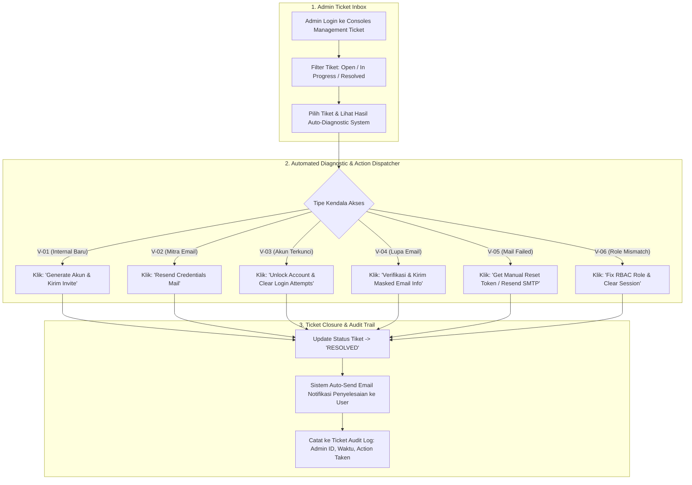

# Perancangan & Spesifikasi Sistem: Fitur Bantuan Akses Login (Helpdesk Administrator)
*Dokumen Arsitektur, Algoritma, Flowchart, dan Frontend Design System untuk Sistem Informasi Kerja Sama WD4*

---

## 1. Filosofi Algoritmik & Prinsip Desain (Algorithmic Philosophy & Design Core)

### Nama Gerakan / Algoritma: **Deterministic Triage & Human-in-the-Loop Safeguard**

> **Filosofi**: *Akses sistem bukan sekadar hak login, melainkan pintu gerbang legalitas kerja sama institusi. Masalah akses harus ditangani dengan klasifikasi deterministik presisi tinggi, perlindungan privasi ketat (Zero Data Leakage), dan alur penyelesaian yang empatik tanpa membingungkan pengguna.*

### 4 Pilar Filosofi Utama:
1. **Algorithmic Emergency & Zero-Guess Routing**: Setiap jenis kendala akses (6 vektor utama) diklasifikasikan secara matematis berdasarkan kombinasi `User Context` (Internal vs Mitra) dan `Issue Signature` (Lockout, Email Missing, Auth Mismatch, Email Not Sent, Unregistered, RBAC Misconfiguration).
2. **Intentional & Distinctive Frontend Experience**: Memadukan estetika *Glassmorphic Modern Dark/Light Theme*, mikro-interaksi responsif, dan *micro-copywriting* yang jernih agar pengguna yang sedang frustrasi karena tidak bisa login merasa terbantu dan tenang.
3. **Structured & Modular Laravel Architecture**: Memisahkan logika klasifikasi (*Triage Service*), aksi resolusi (*Resolver Service*), antarmuka publik (*Auth Help Modal/Form*), serta konsol pengelola admin (*Admin Access Ticket Center*).
4. **100% Native & Independent System (Zero 2nd/3rd Party Dependencies)**: Seluruh alur—mulai dari pelaporan kendala, generasi nomor tiket & token pelacakan, *auto-triage*, pengecekan status tiket publik mandiri (`/helpdesk/status`), hingga eksekusi resolusi oleh Admin—**berjalan 100% di dalam sistem WD4 secara internal**, tanpa memerlukan aplikasi/layanan pihak kedua maupun ketiga (seperti WhatsApp API eksternal, Mailgun SaaS portal, atau platform helpdesk luar).

---

## 2. Analisis 6 Vektor Permasalahan Akses & Algoritma Penanganannya

Sistem bantuan akses menangani 6 kendala utama yang sering dihadapi oleh User Internal (Pimpinan, Humas, Jurusan, Prodi, UPA, Pusat) maupun Pihak Eksternal (Mitra DUDIKA):

| ID Vektor | Kendala Akses | Tipe User | Input yang Diperlukan | Algoritma Auto-Triage & Aksi Admin |
| :--- | :--- | :--- | :--- | :--- |
| **V-01** | User internal belum dibuatkan akun | Internal Kampus | Nama Lengkap, NIP, Email Instansi, Unit Kerja, Jabatan, Role yang diajukan | **Check & Provision**: System mengecek NIP di data pegawai. Jika valid & belum ada akun, Admin klik *"Buat Akun & Send Invite"*. |
| **V-02** | Mitra belum menerima email akses | Mitra DUDIKA | Nama Perusahaan, Email Penanggung Jawab, Kode Pengajuan / Judul Kerja Sama | **Check & Dispatch**: System mencari `mitra_id` berdasarkan email/kode pengajuan. Admin klik *"Regenerate & Kirim Ulang Email Akses"*. |
| **V-03** | Akun terkunci (*Lockout*) | Semua User | Email / NIP, Alasan / Detail Percobaan Login | **Unlock & Force Reset**: System mengecek `failed_attempts > 5` atau `is_locked = true`. Admin klik *"Unlock Account & Force Reset Password"*. |
| **V-04** | Lupa email yang terdaftar | Semua User | Identitas Pendukung (NIP / Nama PT & Penandatangan MoU) | **Privacy-Safe Lookup**: Admin memverifikasi identitas di backend. Email tidak pernah ditampilkan secara publik (mencegah scraper). |
| **V-05** | Password reset tidak masuk email | Semua User | Email / NIP, Waktu Percobaan Reset terakhir | **Mail Log Diagnostic & Manual Dispatch**: System mengecek log SMTP/Mailgun internal. Admin dapat mengunduh / menyalin temporary link aktivasi manual jika SMTP bermasalah. |
| **V-06** | Role / Dashboard salah setelah login | Semua User | Email, Role yang Muncul vs Role yang Seharusnya | **RBAC Sync & Session Purge**: Admin memeriksa tabel `model_has_roles` & unit relation, memperbaiki pivot role, dan mempurge aktif session token user. |

---

## 3. Alur Proses & Flowchart Sistem (System Workflow & State Machine)

### Flowchart 1: Alur Pengajuan Bantuan Akses Native WD4 dari Sisi Pengguna (Client Flow)

```mermaid
graph TD
    subgraph 1. Auth Page Entrypoint (Landing Page / Login / Forgot Password)
        A1[User Akses Halaman Login / Forgot Password] --> A2[User Mengalami Kendala Akses]
        A2 --> A3[Klik Link Component: 'Butuh bantuan akses? Hubungi administrator']
        A3 --> A4[Sistem WD4 Langsung Membuka Native Modal Helpdesk Form]
    end

    subgraph 2. Native Dynamic Ticket Form (In-System)
        A4 --> B1[User Memilih Kategori Kendala V-01 s/d V-06]
        B1 --> B2{Form Load Bidang Isian Dynamic}
        B2 -- Internal (V-01, V-06) --> B3[Input NIP, Unit Kerja, Role]
        B2 -- Mitra (V-02) --> B4[Input Nama Perusahaan & Kode Pengajuan]
        B2 -- General (V-03, V-04, V-05) --> B5[Input Email / NIP & Deskripsi Kendala]
        B3 & B4 & B5 --> B6[User Submit Tiket Bantuan ke Database WD4]
    end

    subgraph 3. Auto-Triage & Native Tracking
        B6 --> C1[System Assign Ticket Number: TKT-YYYYMMDD-XXXX & Secret Token]
        C1 --> C2[System Jalankan Algoritma Auto-Classification & Prioritas]
        C2 --> C3[System Menampilkan Halaman / Pop-up Sukses + Kode Tiket]
        C3 --> C4[User Dapat Cek Status Tiket Mandiri 100% Native di /helpdesk/status]
        C2 --> C5[Tiket Otomatis Masuk ke Inbox Dashboard Management Admin WD4]
    end
```

---

### Flowchart 2: Alur Resolusi Tiket oleh Administrator (Admin Resolution Center Flow)



---

## 4. Perancangan UI/UX & Frontend Design System

Sesuai dengan panduan **Frontend Design**, tampilan bantuan akses dirancang dengan pendekatan yang unik, berkarakter, dan sangat memperhatikan kenyamanan pengguna (*user-centric & empathetic copy*).

### A. Palet Warna & Visual Identity (Theme Tokens)
Menggunakan tema **Modern Slate Glassmorphism with Dynamic Accents**:

```css
:root {
  /* Surface & Backgrounds */
  --bg-auth-gradient: linear-gradient(135deg, #0f172a 0%, #1e1b4b 50%, #0f172a 100%);
  --glass-card-bg: rgba(30, 41, 59, 0.7);
  --glass-card-border: rgba(255, 255, 255, 0.12);
  --glass-card-shadow: 0 20px 40px rgba(0, 0, 0, 0.35);

  /* Typography Colors */
  --text-primary: #f8fafc;
  --text-secondary: #94a3b8;
  --text-muted: #64748b;

  /* Intent & Status Accents */
  --accent-primary: #6366f1;       /* Indigo 500 */
  --accent-hover: #4f46e5;         /* Indigo 600 */
  --accent-cyan: #06b6d4;          /* Cyan 500 */
  --status-urgent: #ef4444;        /* Red 500 */
  --status-success: #10b981;       /* Emerald 500 */
  --status-warning: #f59e0b;       /* Amber 500 */
}
```

### B. Micro-Copywriting & Tone Guidelines
1. **Teks Link Pemicu**: `Butuh bantuan akses? Hubungi administrator` (Disertai ikon `help-circle` atau `headset`).
2. **Prinsip Larangan**: **DILARANG** menggunakan kata *"Belum punya akun?"* atau *"Daftar di sini"* pada area ini agar mitra industri tidak terkecoh mengira akun bisa didaftarkan secara mandiri tanpa persetujuan pengajuan.
3. **Pesan Kegagalan & Status**: Menjelaskan masalah secara gamblang tanpa istilah teknis menyeramkan.
   - *Contoh*: "Kami menemukan bahwa akun Anda sedang terkunci demi alasan keamanan karena beberapa kali kegagalan kata sandi. Silakan gunakan formulir ini untuk membuka kunci."

### C. Design Component Wireframe & Snippet HTML/Blade Component

#### 1) Auth Link Component (`resources/views/auth/components/help-link.blade.php`)
```html
<div class="mt-6 text-center text-sm border-t border-slate-700/60 pt-4">
    <a href="javascript:void(0)" 
       onclick="openAccessHelpModal()"
       class="inline-flex items-center gap-2 text-slate-400 hover:text-indigo-400 font-medium transition-all duration-200 group">
        <svg class="w-4 h-4 stroke-current text-indigo-400 group-hover:scale-110 transition-transform" fill="none" viewBox="0 0 24 24">
            <path stroke-linecap="round" stroke-linejoin="round" stroke-width="2" d="M18.364 5.636l-3.536 3.536m0 5.656l3.536 3.536M9.172 9.172L5.636 5.636m3.536 9.192l-3.536 3.536M21 12a9 9 0 11-18 0 9 9 0 0118 0zm-5 0a4 4 0 11-8 0 4 4 0 018 0z"/>
        </svg>
        <span>Butuh bantuan akses? Hubungi administrator</span>
    </a>
</div>
```

#### 2) Access Ticket Modal (`resources/views/auth/components/help-modal.blade.php`)
```html
<!-- Modal Backdrop -->
<div id="accessHelpModal" class="fixed inset-0 z-50 hidden backdrop-blur-md bg-slate-950/80 flex items-center justify-center p-4">
    <!-- Glassmorphism Modal Card -->
    <div class="bg-slate-900/90 border border-slate-700/70 rounded-2xl max-w-xl w-full p-6 sm:p-8 shadow-2xl relative overflow-hidden animate-fade-in-up">
        <!-- Accent Glow Line -->
        <div class="absolute top-0 left-0 right-0 h-1 bg-gradient-to-r from-indigo-500 via-cyan-400 to-emerald-400"></div>

        <div class="flex justify-between items-start mb-6">
            <div>
                <h3 class="text-xl font-bold text-white flex items-center gap-2">
                    <i data-lucide="headset" class="w-5 h-5 text-indigo-400"></i>
                    Bantuan Akses & Pemulihan Akun
                </h3>
                <p class="text-xs text-slate-400 mt-1">Tim Admin Humas & Sistem Informasi WD4 siap membantu kendala akses Anda.</p>
            </div>
            <button onclick="closeAccessHelpModal()" class="text-slate-400 hover:text-white p-1 rounded-lg hover:bg-slate-800 transition">
                <i data-lucide="x" class="w-5 h-5"></i>
            </button>
        </div>

        <form action="{{ route('helpdesk.ticket.store') }}" method="POST" id="ticketForm" enctype="multipart/form-data">
            @csrf
            
            <!-- Category Selection -->
            <div class="mb-4">
                <label class="block text-xs font-semibold text-slate-300 uppercase tracking-wider mb-2">Jenis Kendala Akses</label>
                <select name="issue_category" id="issueCategorySelect" onchange="toggleCategoryFields(this.value)" class="w-full bg-slate-800/80 border border-slate-700 rounded-xl px-4 py-2.5 text-sm text-slate-100 focus:ring-2 focus:ring-indigo-500 focus:border-transparent transition">
                    <option value="">-- Pilih Jenis Kendala --</option>
                    <option value="V-01">Akun Baru Internal (Belum dibuatkan akun)</option>
                    <option value="V-02">Mitra Belum Menerima Email Akses / Password</option>
                    <option value="V-03">Akun Terkunci (Gagal Login Berulang)</option>
                    <option value="V-04">Lupa Email Instansi Terdaftar</option>
                    <option value="V-05">Link Reset Password Tidak Masuk Email</option>
                    <option value="V-06">Role / Dashboard Salah Setelah Login</option>
                </select>
            </div>

            <!-- Dynamic Form Fields Area -->
            <div id="dynamicFieldsContainer" class="space-y-4 mb-5">
                <!-- Javascript will dynamically inject fields based on issue_category -->
            </div>

            <!-- Message Description -->
            <div class="mb-5">
                <label class="block text-xs font-semibold text-slate-300 uppercase tracking-wider mb-2">Deskripsi Detail Kendala</label>
                <textarea name="description" rows="3" required placeholder="Jelaskan secara singkat kendala yang Anda alami..." class="w-full bg-slate-800/80 border border-slate-700 rounded-xl p-3 text-sm text-slate-100 placeholder-slate-500 focus:ring-2 focus:ring-indigo-500 transition"></textarea>
            </div>

            <!-- Submit Buttons -->
            <div class="flex items-center justify-end gap-3 pt-4 border-t border-slate-800">
                <button type="button" onclick="closeAccessHelpModal()" class="px-4 py-2 text-xs font-semibold text-slate-400 hover:text-white transition">Batal</button>
                <button type="submit" class="px-5 py-2.5 bg-indigo-600 hover:bg-indigo-500 text-white rounded-xl text-xs font-bold shadow-lg shadow-indigo-600/30 flex items-center gap-2 transition">
                    <i data-lucide="send" class="w-4 h-4"></i>
                    Kirim Tiket Bantuan
                </button>
            </div>
        </form>
    </div>
</div>
```

---

## 5. Struktur Folder & File Modular (Clean Architecture)

Agar pengembangan rapi, terstruktur, dan mudah dipelihara, berikut adalah rancangan direktori file yang dibuat:

```text
c:\laragon\www\wd4\
├── app/
│   ├── Http/
│   │   ├── Controllers/
│   │   │   ├── Helpdesk/
│   │   │   │   └── AccessTicketController.php        <-- Controller Publik (Submit Ticket & Check Status)
│   │   │   └── Admin/
│   │   │       └── ManageAccessTicketController.php  <-- Controller Admin (Resolution Center)
│   │   └── Requests/
│   │       └── StoreAccessTicketRequest.php          <-- Form Request Validation
│   ├── Models/
│   │   ├── AccessTicket.php                           <-- Model Tiket Bantuan Akses
│   │   └── AccessTicketLog.php                        <-- Model Audit Log Aksi Admin
│   ├── Services/
│   │   ├── AccessTicketTriageService.php              <-- Algoritma Auto-Triage & Classification
│   │   └── AccessResolverService.php                  <-- Executive Actions (Unlock, Resend Email, Sync Role)
│   ├── Notifications/
│   │   ├── AccessTicketCreatedNotification.php        <-- Email Konfirmasi Tiket ke User
│   │   └── AccessTicketResolvedNotification.php       <-- Email Notifikasi Penyelesaian
│   └── Mail/
│       └── AccessCredentialsResentMail.php            <-- Mailer Pengiriman Ulang Akses
│
├── database/
│   └── migrations/
│       ├── 2026_07_25_000001_create_access_tickets_table.php
│       └── 2026_07_25_000002_create_access_ticket_logs_table.php
│
├── resources/
│   └── views/
│       ├── auth/
│       │   └── components/
│       │       ├── help-link.blade.php               <-- Widget Link 'Butuh bantuan akses?'
│       │       └── help-modal.blade.php              <-- Modal Form Tiket
│       ├── helpdesk/
│       │   └── ticket-status.blade.php               <-- Halaman Cek Progress Tiket Publik
│       └── admin/
│           └── tickets/
│               ├── index.blade.php                   <-- Admin Inbox Tiket Bantuan
│               └── show.blade.php                    <-- Detail Tiket & Quick Action Buttons
│
└── routes/
    └── web.php                                       <-- Routing Group Helpdesk & Admin Management
```

---

## 6. Algoritma Deterministik & Schema Database

### A. Migration Schema (`create_access_tickets_table.php`)

```php
use Illuminate\Database\Migrations\Migration;
use Illuminate\Database\Schema\Blueprint;
use Illuminate\Support\Facades\Schema;

return new class extends Migration {
    public function up(): void {
        Schema::create('access_tickets', function (Blueprint $table) {
            $table->id();
            $table->string('ticket_number')->unique(); // Format: TKT-20260725-XXXX
            $table->enum('user_type', ['internal', 'mitra', 'unknown'])->default('unknown');
            $table->string('issue_category', 10); // V-01 s/d V-06
            
            // User Data Inputs
            $table->string('reporter_name');
            $table->string('reporter_email');
            $table->string('reporter_phone')->nullable();
            $table->string('nip')->nullable();                // Khusus internal
            $table->string('company_name')->nullable();       // Khusus mitra
            $table->string('proposal_code')->nullable();      // Khusus mitra
            $table->string('unit_or_prodi')->nullable();      // Khusus internal
            $table->string('expected_role')->nullable();      // Khusus internal/V-06
            
            // Description & Attachments
            $table->text('description');
            $table->string('attachment_path')->nullable();
            
            // Triage & Resolution States
            $table->enum('priority', ['low', 'medium', 'high', 'urgent'])->default('medium');
            $table->enum('status', ['open', 'in_progress', 'resolved', 'rejected'])->default('open');
            $table->foreignId('assigned_admin_id')->nullable()->constrained('users')->nullOnDelete();
            $table->text('resolution_notes')->nullable();
            $table->timestamp('resolved_at')->nullable();
            
            $table->timestamps();
        });
    }

    public function down(): void {
        Schema::dropIfExists('access_tickets');
    }
};
```

---

### B. Service Class Algoritma Triage (`AccessTicketTriageService.php`)

```php
namespace App\Services;

use App\Models\AccessTicket;
use App\Models\User;
use App\Models\Mitra;

class AccessTicketTriageService 
{
    /**
     * Menganalisis tiket secara otomatis dan menentukan prioritas serta rekomendasi tindakan admin.
     */
    public function analyzeAndTriage(AccessTicket $ticket): array
    {
        $priority = 'medium';
        $recommendedAction = null;
        $autoDiagnosticLog = [];

        switch ($ticket->issue_category) {
            case 'V-01': // Internal Baru
                $userExists = User::where('email', $ticket->reporter_email)->orWhere('nip', $ticket->nip)->exists();
                if ($userExists) {
                    $priority = 'high';
                    $autoDiagnosticLog[] = 'User dengan NIP/Email tersebut sudah ada di tabel users.';
                    $recommendedAction = 'CHECK_EXISTING_USER';
                } else {
                    $priority = 'medium';
                    $recommendedAction = 'CREATE_INTERNAL_USER';
                }
                break;

            case 'V-02': // Mitra Email Akses
                $mitra = Mitra::where('email_penanggung_jawab', $ticket->reporter_email)
                              ->orWhere('nama_perusahaan', 'LIKE', "%{$ticket->company_name}%")
                              ->first();
                if ($mitra) {
                    $autoDiagnosticLog[] = "Data mitra ditemukan (ID: {$mitra->id}). Status akun: " . ($mitra->user_id ? 'Sudah Ada User' : 'Belum Ada User');
                    $priority = 'high';
                    $recommendedAction = $mitra->user_id ? 'RESEND_LOGIN_EMAIL' : 'CREATE_AND_LINK_MITRA_USER';
                } else {
                    $priority = 'medium';
                    $autoDiagnosticLog[] = 'Data mitra tidak ditemukan di database.';
                    $recommendedAction = 'VERIFY_PROPOSAL_MANUAL';
                }
                break;

            case 'V-03': // Akun Terkunci
                $user = User::where('email', $ticket->reporter_email)->first();
                if ($user && ($user->is_locked || $user->failed_login_attempts > 3)) {
                    $priority = 'urgent';
                    $autoDiagnosticLog[] = "User terkunci karena {$user->failed_login_attempts} kali percobaan gagal.";
                    $recommendedAction = 'UNLOCK_AND_RESET_PASSWORD';
                } else {
                    $priority = 'medium';
                    $recommendedAction = 'CHECK_USER_LOCK_STATUS';
                }
                break;

            case 'V-06': // Role Mismatch
                $priority = 'high';
                $recommendedAction = 'SYNC_RBAC_ROLE';
                break;

            default:
                $priority = 'medium';
                $recommendedAction = 'MANUAL_REVIEW';
                break;
        }

        // Update priority ke tiket
        $ticket->update(['priority' => $priority]);

        return [
            'priority' => $priority,
            'action' => $recommendedAction,
            'diagnostics' => $autoDiagnosticLog
        ];
    }
}
```

---

## 7. Matriks Pengujian & Verifikasi (Verification Test Matrix)

| Test Case ID | Skenario Pengujian | Input Data | Ekspektasi Hasil | Verification Command / Check |
| :--- | :--- | :--- | :--- | :--- |
| **TC-01** | Submisi Tiket Kendala V-01 (Internal Baru) | NIP: 19850101..., Unit: Jurusan Elektro | Tiket tersimpan dengan status `open`, `ticket_number` ter-generate otomatis, email konfirmasi terkirim. | `php artisan test --filter=AccessTicketTest` |
| **TC-02** | Algoritma Auto-Triage V-02 (Mitra Email) | Company: PT Telkom, Email: hr@telkom.co.id | System mencocokkan `mitra_id` secara otomatis dan mengatur prioritas `high` & rekomendasi `RESEND_LOGIN_EMAIL`. | Unit Test `AccessTicketTriageServiceTest` |
| **TC-03** | Eksekusi Admin: Unlock Account (V-03) | Ticket ID #12, Action: Unlock | Property `failed_login_attempts` di-reset ke 0, status tiket berubah jadi `resolved`, audit log tercatat. | Feature Test `ManageAccessTicketTest` |
| **TC-04** | Keamanan Data Email (V-04) | Query Email Lupa Akses | Form publik tidak menampilkan email asli (masked format: `h***@telkom.co.id`) demi privasi. | Security Audit Verification |

---

## 8. Ringkasan & Langkah Selanjutnya (Summary & Implementation Roadmap)

Dokumen perancangan ini menyajikan spesifikasi utuh untuk mengimplementasikan fitur **"Butuh bantuan akses? Hubungi administrator"** di sistem WD4:

1. **Step 1 (Database & Models)**: Jalankan migration `access_tickets` dan `access_ticket_logs`.
2. **Step 2 (Backend Core & Triage)**: Implementasikan `AccessTicketController`, `AccessTicketTriageService`, dan `AccessResolverService`.
3. **Step 3 (Frontend Auth Components)**: Pasang component Blade `help-link.blade.php` dan modal `help-modal.blade.php` pada halaman `welcome.blade.php`, `login.blade.php`, dan `forgot-password.blade.php`.
4. **Step 4 (Admin Resolution Console)**: Buat tampilan `admin/tickets/index.blade.php` lengkap dengan tombol aksi resolusi otomatis (*One-Click Resolution*).
