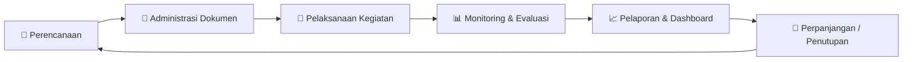
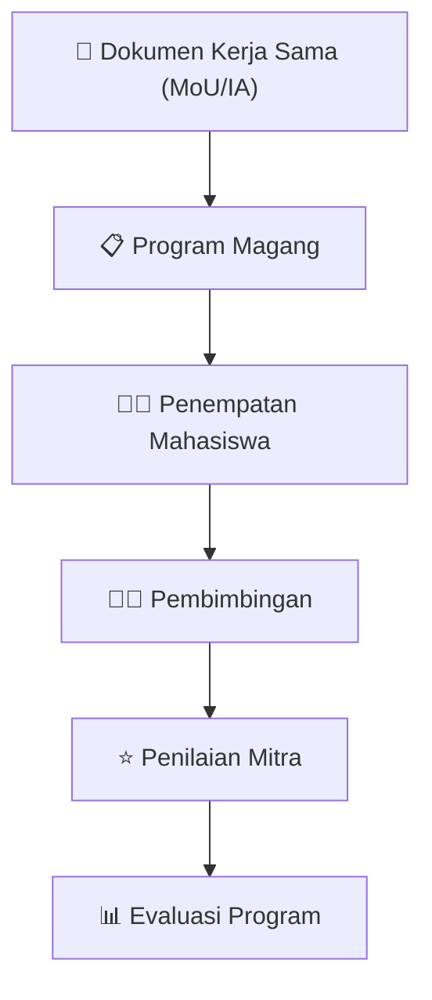
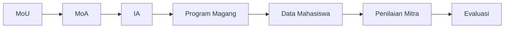
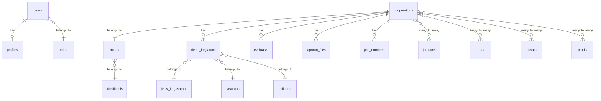
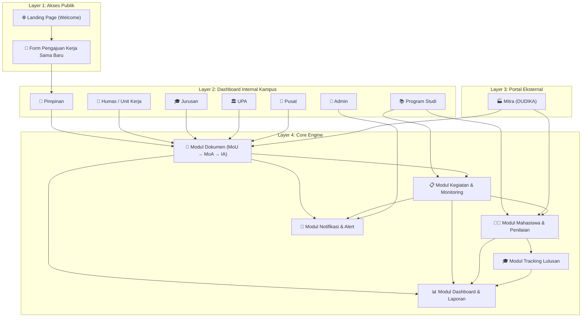
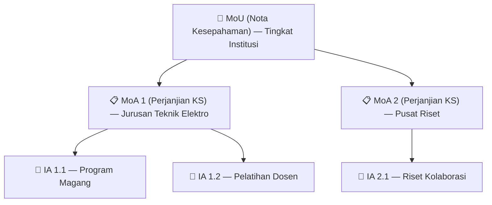
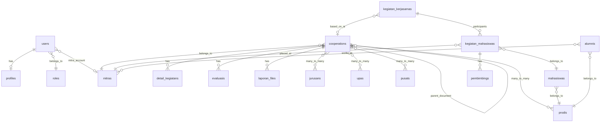

# 📋 Planning Pengembangan Sistem Informasi Kerja Sama Kampus–DUDIKA (WD4)
### *Smart Collaboration Lifecycle Management System*

> **Versi**: 1.0 — Dokumen Perencanaan Strategis  
> **Tanggal**: 27 Juli 2026  
> **Referensi**: [rencana_pengembangan_role.md](file:///c:/laragon/www/wd4/rencana_pengembangan_role.md)

---

## Daftar Isi
1. [Latar Belakang & Visi Sistem](#1-latar-belakang--visi-sistem)
2. [Analisis Permasalahan](#2-analisis-permasalahan)
3. [Arsitektur Sistem Saat Ini (As-Is)](#3-arsitektur-sistem-saat-ini-as-is)
4. [Arsitektur Sistem Target (To-Be)](#4-arsitektur-sistem-target-to-be)
5. [Ruang Lingkup Pengguna & Matriks Hak Akses (RBAC)](#5-ruang-lingkup-pengguna--matriks-hak-akses-rbac)
6. [Modul Pengembangan Fitur](#6-modul-pengembangan-fitur)
7. [Rancangan Database Baru](#7-rancangan-database-baru)
8. [Fase & Prioritas Pengembangan (Roadmap)](#8-fase--prioritas-pengembangan-roadmap)
9. [Metrik Keberhasilan (KPI)](#9-metrik-keberhasilan-kpi)

---

## 1. Latar Belakang & Visi Sistem

### 1.1 Kondisi Saat Ini
Pengelolaan kerja sama antara perguruan tinggi dan DUDIKA (Dunia Usaha, Dunia Industri, dan Dunia Kerja) masih menghadapi berbagai kendala. Sebagian besar data kerja sama masih dikelola secara manual menggunakan Microsoft Excel sehingga proses monitoring, evaluasi, dan pelaporan menjadi kurang efektif.

Sistem Informasi Kerja Sama (WD4) telah dikembangkan sebagai langkah awal menuju pusat data kerja sama (*centralized collaboration management system*). Namun, pengembangan lebih lanjut diperlukan agar sistem benar-benar mampu mendukung kebutuhan seluruh pemangku kepentingan kampus.

### 1.2 Visi Target
Mengembangkan WD4 menjadi **Smart Collaboration Lifecycle Management System** — platform terintegrasi yang mampu mengelola seluruh siklus hidup kerja sama, mulai dari:

**Tujuan Utama:**
1. Menjadi **pusat data kerja sama** (*Single Source of Truth*) bagi seluruh pemangku kepentingan.
2. Menghubungkan **dokumen kerja sama** (MoU → MoA → IA) dengan **seluruh aktivitas** yang dilaksanakan.
3. Memantau **status setiap kerja sama secara real-time**.
4. Mengelola **kegiatan berdasarkan jenis kerja sama** (pemagangan, penelitian, pelatihan, sertifikasi, dll.).
5. Memantau **perkembangan mahasiswa** dalam kegiatan kerja sama, termasuk penilaian dari mitra.
6. Menyediakan **informasi penyerapan lulusan** pada mitra kerja sama.
7. Menghasilkan **laporan dan dashboard eksekutif** yang mendukung pengambilan keputusan oleh pimpinan.

---

## 2. Analisis Permasalahan

### 2.1 Masalah 1: Kesulitan Mengelola dan Memantau Data Kerja Sama

| Aspek | Kondisi Saat Ini | Dampak |
|---|---|---|
| Penyimpanan Data | Tersebar di file Excel berbeda | Tidak ada satu sumber data yang akurat |
| Status Kerja Sama | Manual dihitung dari tanggal | Sulit mengetahui mana yang aktif / akan berakhir / sudah selesai |
| Riwayat Mitra | Tidak terpusat | Sulit menelusuri histori kerja sama sebuah instansi |
| Monitoring | Tidak ada mekanisme otomatis | Tidak ada notifikasi / early warning |
| Pelaporan | Dikerjakan manual (copy-paste) | Memakan waktu lama dan rawan kesalahan |

> **Analisis Codebase**: Sistem saat ini sudah memiliki model [Cooperation](file:///c:/laragon/www/wd4/app/Models/Cooperation.php) dengan field `status_dokumen` yang melacak alur dokumen (`Draft` → `Menunggu Evaluasi` → `Menunggu Validasi` → `Disahkan` → `Revisi`), namun **belum ada mekanisme otomatis** untuk mendeteksi dokumen yang mendekati kadaluarsa atau sudah berakhir berdasarkan `end_date`.

---

### 2.2 Masalah 2: Tidak Ada Informasi Lulusan yang Bekerja di Mitra

| Aspek | Kondisi Saat Ini | Dampak |
|---|---|---|
| Tracking Lulusan | Tidak ada di sistem | Kampus tidak tahu apakah lulusan bekerja di mitra kerja sama |
| Evaluasi Keberhasilan | Tidak terukur | Tidak bisa menghitung *absorption rate* lulusan |
| Akreditasi | Data harus dikumpulkan manual | Sulit mendukung IKU dan proses akreditasi |

> **Analisis Codebase**: Model [Mitra](file:///c:/laragon/www/wd4/app/Models/Mitra.php) saat ini hanya menyimpan data instansi (nama, alamat, klasifikasi). **Belum ada tabel `alumni` atau `lulusan`** dan belum ada relasi antara lulusan dengan mitra tempat mereka bekerja.

---

### 2.3 Masalah 3: Sulit Melakukan Monitoring Pelaksanaan per Jenis Kerja Sama

**Contoh Kasus: Pemagangan**

**Permasalahan yang terjadi saat ini:**
- Sulit mengetahui **mahasiswa yang sedang magang** dan **lokasi magang** setiap mahasiswa
- Sulit melihat **nilai dari pihak mitra**
- Sulit mengetahui **jumlah mahasiswa per mitra**
- Sulit melakukan **evaluasi keberhasilan program**
- Kondisi yang sama terjadi pada jenis kerja sama lain: **penelitian bersama, pelatihan, sertifikasi, pengabdian, dll.**

> **Analisis Codebase**: Model [KegiatanKerjasama](file:///c:/laragon/www/wd4/app/Models/KegiatanKerjasama.php) dan [DetailKegiatan](file:///c:/laragon/www/wd4/app/Models/DetailKegiatan.php) sudah ada, namun **belum ada tabel yang secara spesifik mencatat partisipan mahasiswa**, penempatan mereka ke mitra tertentu, atau penilaian individu dari mitra. Data kegiatan saat ini bersifat agregat (volume luaran, output, outcome) tanpa granularitas per-mahasiswa.

---

### 2.4 Masalah 4: Dokumen Kerja Sama Belum Terintegrasi dengan Pelaksanaan Kegiatan

**Rantai Keterkaitan Ideal:**

> **Analisis Codebase**: Model `Cooperation` sudah memiliki field `jenis` (MoU/MoA/SPK) dan relasi `perpanjanganDari()` untuk tracking perpanjangan, namun **belum ada relasi hierarkis eksplisit** antara MoU → MoA → IA. Artinya, pengguna tidak bisa menelusuri keterkaitan: "Dari MoU ini, lahir berapa MoA, dan dari MoA tersebut ada berapa IA yang sudah berjalan?"

---

## 3. Arsitektur Sistem Saat Ini (As-Is)

### 3.1 Role & Routing yang Sudah Tersedia

| No | Role | Route Prefix | Status | Controller Utama |
|----|------|-------------|--------|------------------|
| 1 | Admin | `/admin/*` | ✅ Aktif | [UserController](file:///c:/laragon/www/wd4/app/Http/Controllers/Admin/UserController.php), [MitraController](file:///c:/laragon/www/wd4/app/Http/Controllers/Admin/MitraController.php) |
| 2 | Pimpinan | `/pimpinan/*` | ✅ Aktif | [DashboardController](file:///c:/laragon/www/wd4/app/Http/Controllers/DashboardController.php) |
| 3 | Jurusan | `/jurusan/*` | ✅ Aktif | [KerjasamaJurusanController](file:///c:/laragon/www/wd4/app/Http/Controllers/Jurusan/KerjasamaJurusanController.php) |
| 4 | Unit Kerja (Humas) | `/unit/*` | ✅ Aktif | [KerjasamaUnitController](file:///c:/laragon/www/wd4/app/Http/Controllers/Unit/KerjasamaUnitController.php) |
| 5 | UPA | `/upa/*` | ✅ Aktif | [KerjasamaUpaController](file:///c:/laragon/www/wd4/app/Http/Controllers/Upa/KerjasamaUpaController.php) |
| 6 | Pusat | `/pusat/*` | ✅ Aktif | [KerjasamaPusatController](file:///c:/laragon/www/wd4/app/Http/Controllers/Pusat/KerjasamaPusatController.php) |
| 7 | **Prodi** | - | ❌ **Belum Ada** | - |
| 8 | **Mitra (DUDIKA)** | - | ❌ **Belum Ada** | - |

### 3.2 Fitur yang Sudah Tersedia per Role

| Fitur | Admin | Pimpinan | Jurusan | Unit Kerja | UPA | Pusat |
|---|:---:|:---:|:---:|:---:|:---:|:---:|
| Dashboard Statistik | ✅ | ✅ | ✅ | ✅ | ✅ | ✅ |
| CRUD Data Kerja Sama | - | - | ✅ | ✅ | ✅ | ✅ |
| CRUD Data Mitra | ✅ | - | ✅ | ✅ | ✅ | ✅ |
| Submit Dokumen ke Pimpinan | - | - | ✅ | ✅ | ✅ | ✅ |
| Validasi/Evaluasi Dokumen | - | ✅ | - | - | - | - |
| Pengajuan Mitra Baru (Publik) | - | ✅ | - | - | - | - |
| Evaluasi Kerja Sama | - | ✅ | ✅ | ✅ | ✅ | ✅ |
| Laporan (PDF/Excel) | - | ✅ | ✅ | - | ✅ | ✅ |
| Master Data (User, Role, dll.) | ✅ | - | - | - | - | - |
| Analitik (Status/Geo/Klasifikasi) | - | - | ✅ | ✅ | ✅ | ✅ |

### 3.3 Model & Database yang Sudah Ada

---

## 4. Arsitektur Sistem Target (To-Be)

### 4.1 Diagram Arsitektur Lengkap

### 4.2 Hierarki Dokumen Kerja Sama (Document Chain)

Fitur baru yang akan menghubungkan hierarki dokumen legal secara eksplisit:

Implementasi pada database: Menambahkan kolom `parent_cooperation_id` pada tabel `cooperations` untuk membentuk relasi **self-referencing tree** (MoU → MoA → IA).

---

## 5. Ruang Lingkup Pengguna & Matriks Hak Akses (RBAC)

### 5.1 Daftar Role Lengkap

| No | Role | Tipe | Status Saat Ini | Deskripsi |
|----|------|------|:-:|---|
| 1 | **Admin** | Internal | ✅ Ada | Mengelola seluruh data master, pengguna, referensi, dan pengaturan sistem |
| 2 | **Pimpinan** | Internal | ✅ Ada | Monitoring, evaluasi, dan pengambilan keputusan strategis |
| 3 | **Humas** (Unit Kerja) | Internal | ✅ Ada | Asisten Pimpinan; administrasi kerja sama, verifikasi data, komunikasi mitra, pengelolaan dokumen |
| 4 | **Jurusan** | Internal | ✅ Ada | Mengelola pelaksanaan kerja sama tingkat jurusan, mengusulkan kegiatan, monitoring & evaluasi |
| 5 | **Program Studi** (Prodi) | Internal | ❌ **Baru** | Mengelola kegiatan kerja sama yang berkaitan langsung dengan mahasiswa (magang, penelitian, sertifikasi, pelatihan, dll.) |
| 6 | **UPA** | Internal | ✅ Ada | Mengelola kerja sama di lingkup Unit Pelaksana Akademik |
| 7 | **Pusat** | Internal | ✅ Ada | Mengelola kerja sama tingkat pusat/unit khusus |
| 8 | **Mitra** (DUDIKA) | Eksternal | ❌ **Baru** | Portal kolaborasi industri eksternal |

### 5.2 Matriks Hak Akses Lengkap (RBAC Matrix)

| Fitur / Modul | Admin | Pimpinan | Humas | Jurusan | Prodi | UPA | Pusat | Mitra |
|---|:---:|:---:|:---:|:---:|:---:|:---:|:---:|:---:|
| **Master Data** | | | | | | | | |
| Kelola User & Role | ✅ | - | - | - | - | - | - | - |
| Kelola Jenis Kerja Sama | ✅ | - | - | - | - | - | - | - |
| Kelola Data Mitra | ✅ | - | ✅ | ✅ | - | ✅ | ✅ | - |
| Kelola Jurusan/Prodi/UPA/Pusat | ✅ | - | - | - | - | - | - | - |
| Kelola Klasifikasi | ✅ | - | - | - | - | - | - | - |
| Kirim Akses Login Mitra | ✅ | - | - | - | - | - | - | - |
| **Dokumen Kerja Sama** | | | | | | | | |
| Input/Edit Dokumen (MoU/MoA/IA) | - | - | ✅ | ✅ | - | ✅ | ✅ | - |
| Submit Dokumen ke Pimpinan | - | - | ✅ | ✅ | - | ✅ | ✅ | - |
| Validasi & Sahkan Dokumen | - | ✅ | - | - | - | - | - | - |
| Review Draf Dokumen Online | - | - | - | - | - | - | - | ✅ |
| Lihat Dokumen Kerja Sama Sendiri | - | - | - | - | - | - | - | ✅ |
| **Pengajuan Kerja Sama** | | | | | | | | |
| Terima & Validasi Pengajuan Baru | - | ✅ | - | - | - | - | - | - |
| Ajukan Kerja Sama Baru (Portal) | - | - | - | - | - | - | - | ✅ |
| Ajukan Perpanjangan | - | - | - | - | - | - | - | ✅ |
| **Kegiatan & Monitoring** | | | | | | | | |
| Input/Edit Kegiatan Kerja Sama | - | - | ✅ | ✅ | ✅ | ✅ | ✅ | - |
| Input Peserta/Mahasiswa Kegiatan | - | - | - | - | ✅ | - | - | - |
| Beri Penilaian Mahasiswa | - | - | - | - | - | - | - | ✅ |
| Monitoring Mahasiswa Aktif | - | ✅ | - | ✅ | ✅ | - | - | ✅ |
| **Evaluasi** | | | | | | | | |
| Isi Form Evaluasi | - | - | ✅ | ✅ | - | ✅ | ✅ | - |
| Submit Evaluasi ke Pimpinan | - | - | ✅ | ✅ | - | ✅ | ✅ | - |
| Validasi Evaluasi | - | ✅ | - | - | - | - | - | - |
| Beri Umpan Balik Kerja Sama | - | - | - | - | - | - | - | ✅ |
| **Laporan & Dashboard** | | | | | | | | |
| Dashboard Eksekutif (Seluruh Unit) | - | ✅ | - | - | - | - | - | - |
| Dashboard Per-Unit | - | - | ✅ | ✅ | ✅ | ✅ | ✅ | - |
| Dashboard Mitra (Portal) | - | - | - | - | - | - | - | ✅ |
| Export Laporan PDF/Excel | ✅ | ✅ | ✅ | ✅ | - | ✅ | ✅ | - |
| Analitik (Status/Geo/Klasifikasi) | ✅ | ✅ | ✅ | ✅ | - | ✅ | ✅ | - |
| **Tracking Lulusan** | | | | | | | | |
| Input Data Lulusan Bekerja di Mitra | - | - | - | - | ✅ | - | - | ✅ |
| Lihat Statistik Penyerapan Lulusan | - | ✅ | ✅ | ✅ | ✅ | - | - | ✅ |
| **Komunikasi** | | | | | | | | |
| Terima Notifikasi Sistem | ✅ | ✅ | ✅ | ✅ | ✅ | ✅ | ✅ | ✅ |
| Hubungi Administrator | - | - | - | - | - | - | - | ✅ |

---

## 6. Modul Pengembangan Fitur

### 6.1 Modul A: Manajemen Akun & Portal Mitra (DUDIKA)

**Tujuan**: Menyediakan portal akses bagi mitra industri untuk berkolaborasi dengan kampus secara digital.

**Sub-Fitur:**

| ID | Fitur | Deskripsi | Referensi |
|----|-------|-----------|-----------|
| A1 | Pembuatan Akun Otomatis | Sistem auto-create akun saat Pimpinan menyetujui pengajuan | [rencana_pengembangan_role.md L102-L112](file:///c:/laragon/www/wd4/rencana_pengembangan_role.md#L102-L112) |
| A2 | Onboarding Mitra Eksisting | Filter status akun di Admin + tombol "Kirim Akses Login" | [rencana_pengembangan_role.md L182-L194](file:///c:/laragon/www/wd4/rencana_pengembangan_role.md#L182-L194) |
| A3 | Dashboard Mitra | Portal bagi mitra: lihat dokumen, review draf, beri penilaian | [rencana_pengembangan_role.md L90-L95](file:///c:/laragon/www/wd4/rencana_pengembangan_role.md#L90-L95) |
| A4 | Form Pengajuan Internal | "Ajukan Kerja Sama Baru" di dalam dashboard mitra (auto-fill profil) | [rencana_pengembangan_role.md L150-L158](file:///c:/laragon/www/wd4/rencana_pengembangan_role.md#L150-L158) |
| A5 | Proteksi Duplikasi Akun | Deteksi email terdaftar di landing page + smart redirect | [rencana_pengembangan_role.md L156-L158](file:///c:/laragon/www/wd4/rencana_pengembangan_role.md#L156-L158) |

**Perubahan Database:**
- Tambah kolom `mitra_id` pada tabel `users` (nullable, FK ke `mitras`)
- Tambah kolom `has_account` (virtual/computed) atau cek via join `users.mitra_id`

**Perubahan File:**
- **[BARU]** `app/Http/Controllers/Mitra/MitraDashboardController.php`
- **[BARU]** `app/Http/Controllers/Mitra/MitraPengajuanController.php`
- **[BARU]** `resources/views/mitra/*` (dashboard, pengajuan, review-draf, penilaian)
- **[MODIFIKASI]** [routes/web.php](file:///c:/laragon/www/wd4/routes/web.php) — tambah route group `role:mitra`
- **[MODIFIKASI]** [UsersSeeder.php](file:///c:/laragon/www/wd4/database/seeders/UsersSeeder.php) — tambah role `mitra`

---

### 6.2 Modul B: Role Program Studi (Prodi)

**Tujuan**: Menyediakan dashboard dan fitur bagi Prodi untuk mengelola kegiatan kerja sama yang berkaitan langsung dengan mahasiswa.

**Sub-Fitur:**

| ID | Fitur | Deskripsi |
|----|-------|-----------|
| B1 | Dashboard Prodi | Statistik kegiatan kerja sama di tingkat program studi |
| B2 | Input Kegiatan Kerja Sama | Mendaftarkan kegiatan magang, penelitian, pelatihan, sertifikasi, pengabdian |
| B3 | Penempatan Mahasiswa | Mendaftarkan mahasiswa ke mitra tertentu dalam kegiatan tertentu |
| B4 | Kalkulator Konversi SKS | Mengonversi skor kinerja industri menjadi nilai SKS |
| B5 | Matriks Pemetaan Kompetensi (CPL) | Mencocokkan CPL dengan standar kompetensi DUDIKA |
| B6 | Pencatatan Kegiatan Kampus Merdeka | Mendaftarkan mahasiswa ke 8 bentuk kegiatan luar kampus |

**Perubahan File:**
- **[BARU]** `app/Http/Controllers/Prodi/ProdiDashboardController.php`
- **[BARU]** `app/Http/Controllers/Prodi/ProdiKegiatanController.php`
- **[BARU]** `app/Http/Controllers/Prodi/ProdiMahasiswaController.php`
- **[BARU]** `resources/views/prodi/*`
- **[MODIFIKASI]** [routes/web.php](file:///c:/laragon/www/wd4/routes/web.php) — tambah route group `role:prodi`
- **[MODIFIKASI]** [UsersSeeder.php](file:///c:/laragon/www/wd4/database/seeders/UsersSeeder.php) — tambah role `prodi`

---

### 6.3 Modul C: Monitoring Pelaksanaan per Jenis Kerja Sama

**Tujuan**: Menyediakan mekanisme monitoring granular untuk setiap jenis kegiatan kerja sama.

**Sub-Fitur:**

| ID | Fitur | Deskripsi |
|----|-------|-----------|
| C1 | Modul Pemagangan | Tracking mahasiswa magang: penempatan, pembimbingan, penilaian mitra |
| C2 | Modul Penelitian Bersama | Tracking penelitian: judul, dosen, mitra, progress, output |
| C3 | Modul Pelatihan & Sertifikasi | Tracking peserta pelatihan/sertifikasi, sertifikat, hasil ujian |
| C4 | Modul Pengabdian | Tracking program pengabdian: lokasi, peserta, laporan |
| C5 | Dashboard Monitoring Per-Kegiatan | Visualisasi real-time: jumlah peserta, status, lokasi, nilai |

**Perubahan Database:**
- **[BARU]** Tabel `mahasiswas` (NIM, nama, prodi_id, angkatan, status)
- **[BARU]** Tabel `kegiatan_mahasiswas` (kegiatan_id, mahasiswa_id, mitra_id, periode, status, nilai_mitra)
- **[BARU]** Tabel `pembimbings` (kegiatan_mahasiswa_id, dosen_nama, tipe: internal/eksternal)

---

### 6.4 Modul D: Hierarki Dokumen & Integrasi Kegiatan

**Tujuan**: Menghubungkan rantai dokumen legal (MoU → MoA → IA) dengan kegiatan pelaksanaan.

**Sub-Fitur:**

| ID | Fitur | Deskripsi |
|----|-------|-----------|
| D1 | Document Chain (Tree) | Relasi self-referencing MoU → MoA → IA pada tabel `cooperations` |
| D2 | Visualisasi Hierarki | Tampilan tree/accordion yang menunjukkan hubungan dokumen induk-anak |
| D3 | Keterkaitan Dokumen ↔ Kegiatan | Link eksplisit antara IA dengan kegiatan pelaksanaan (magang, pelatihan, dll.) |
| D4 | Breadcrumb Tracking | Dari evaluasi, user bisa telusuri balik: Evaluasi → Kegiatan → IA → MoA → MoU |

**Perubahan Database:**
- Tambah kolom `parent_cooperation_id` (nullable, FK ke `cooperations.id`) pada tabel `cooperations`
- Tambah kolom `cooperation_id` (nullable, FK) pada tabel `kegiatan_kerjasamas` untuk menghubungkan kegiatan ke dokumen IA tertentu

---

### 6.5 Modul E: Tracking Lulusan & Penyerapan Tenaga Kerja

**Tujuan**: Melacak lulusan yang bekerja di perusahaan mitra kerja sama kampus.

**Sub-Fitur:**

| ID | Fitur | Deskripsi |
|----|-------|-----------|
| E1 | Database Alumni | Tabel alumni/lulusan: NIM, nama, prodi, tahun lulus, status bekerja |
| E2 | Relasi Alumni ↔ Mitra | Menghubungkan data alumni dengan mitra tempat bekerja |
| E3 | Dashboard Penyerapan | Statistik: berapa % lulusan yang bekerja di mitra kerja sama |
| E4 | Input oleh Prodi/Mitra | Prodi menginput data alumni, Mitra mengonfirmasi data karyawan |
| E5 | Laporan Akreditasi | Export data penyerapan lulusan untuk keperluan akreditasi & IKU |

**Perubahan Database:**
- **[BARU]** Tabel `alumnis` (id, nim, nama, prodi_id, tahun_lulus, email, telp)
- **[BARU]** Tabel `alumni_mitras` (id, alumni_id, mitra_id, posisi, tahun_mulai, status, sumber_data)

---

### 6.6 Modul F: Dashboard Eksekutif & Notifikasi Cerdas

**Tujuan**: Menyediakan dashboard real-time dan sistem notifikasi/alert otomatis bagi pimpinan.

**Sub-Fitur:**

| ID | Fitur | Deskripsi |
|----|-------|-----------|
| F1 | Dashboard Ringkasan Eksekutif | KPI utama: total kerja sama aktif, akan berakhir, distribusi per unit |
| F2 | Early Warning System | Notifikasi otomatis 30/60/90 hari sebelum dokumen kadaluarsa |
| F3 | Statistik Penyerapan | Grafik penyerapan lulusan per prodi, per mitra, per tahun |
| F4 | Heatmap Geografis | Peta sebaran mitra kerja sama (sudah ada dasar di analitik geo-mitra) |
| F5 | Laporan Periodik Otomatis | Sistem generate laporan bulanan/semester secara otomatis |

---

## 7. Rancangan Database Baru

### 7.1 Entity Relationship Diagram (Target)

### 7.2 Daftar Migrasi Database Baru

| No | Nama Migrasi | Tabel/Kolom | Tipe |
|----|---|---|---|
| 1 | `add_mitra_id_to_users_table` | `users.mitra_id` (nullable FK) | ALTER |
| 2 | `add_parent_to_cooperations_table` | `cooperations.parent_cooperation_id` (nullable FK) | ALTER |
| 3 | `add_cooperation_link_to_kegiatan` | `kegiatan_kerjasamas.cooperation_id` (nullable FK) | ALTER |
| 4 | `create_mahasiswas_table` | id, nim, nama, prodi_id, angkatan, email, telp, status | CREATE |
| 5 | `create_kegiatan_mahasiswas_table` | id, kegiatan_id, mahasiswa_id, mitra_id, periode_mulai, periode_selesai, status, nilai_mitra, catatan_mitra | CREATE |
| 6 | `create_pembimbings_table` | id, kegiatan_mahasiswa_id, nama_dosen, tipe (internal/eksternal) | CREATE |
| 7 | `create_alumnis_table` | id, nim, nama, prodi_id, tahun_lulus, email, telp | CREATE |
| 8 | `create_alumni_mitras_table` | id, alumni_id, mitra_id, posisi, tahun_mulai, status, sumber_data | CREATE |
| 9 | `add_prodi_role_to_roles_table` | roles: insert `prodi` | INSERT |
| 10 | `add_mitra_role_to_roles_table` | roles: insert `mitra` | INSERT |

---

## 8. Fase & Prioritas Pengembangan (Roadmap)

### Fase 1: Fondasi Multi-Role & Akun Mitra (Prioritas Tinggi)
> **Estimasi**: 3-4 minggu  
> **Prasyarat**: Tidak ada  
> **Referensi Keputusan**: [rencana_pengembangan_role.md](file:///c:/laragon/www/wd4/rencana_pengembangan_role.md)

| No | Task | Modul | Status |
|----|------|-------|--------|
| 1.1 | Tambah role `mitra` dan `prodi` ke tabel `roles` | A, B | ⬜ |
| 1.2 | Migrasi: tambah `mitra_id` ke tabel `users` | A | ⬜ |
| 1.3 | Middleware & route group baru untuk `role:mitra` dan `role:prodi` | A, B | ⬜ |
| 1.4 | Fitur "Kirim Akses Login" di dashboard Admin (onboarding mitra eksisting) | A2 | ⬜ |
| 1.5 | Pembuatan akun otomatis saat Pimpinan klik "Setujui" pada pengajuan | A1 | ⬜ |
| 1.6 | Proteksi duplikasi: cek email terdaftar di form publik | A5 | ⬜ |
| 1.7 | Dashboard Mitra: profil, daftar kerja sama, status dokumen | A3 | ⬜ |
| 1.8 | Form "Ajukan Kerja Sama Baru" di dashboard mitra (auto-fill) | A4 | ⬜ |
| 1.9 | Implementasi UX halaman login (Ajukan KS & Bantuan Akses) | - | ⬜ |
| 1.10 | Dashboard Prodi (statistik dasar) | B1 | ⬜ |

---

### Fase 2: Hierarki Dokumen & Integrasi Kegiatan (Prioritas Tinggi)
> **Estimasi**: 2-3 minggu  
> **Prasyarat**: Fase 1 selesai

| No | Task | Modul | Status |
|----|------|-------|--------|
| 2.1 | Migrasi: tambah `parent_cooperation_id` ke `cooperations` | D1 | ⬜ |
| 2.2 | Migrasi: tambah `cooperation_id` ke `kegiatan_kerjasamas` | D3 | ⬜ |
| 2.3 | Tampilan hierarki dokumen (tree view: MoU → MoA → IA) | D2 | ⬜ |
| 2.4 | Link kegiatan ke dokumen IA | D3 | ⬜ |
| 2.5 | Breadcrumb navigasi balik (Evaluasi → Kegiatan → IA → MoA → MoU) | D4 | ⬜ |
| 2.6 | Review Draf Online oleh Mitra | A3 | ⬜ |

---

### Fase 3: Monitoring Kegiatan & Pengelolaan Mahasiswa (Prioritas Sedang-Tinggi)
> **Estimasi**: 3-4 minggu  
> **Prasyarat**: Fase 2 selesai

| No | Task | Modul | Status |
|----|------|-------|--------|
| 3.1 | Migrasi: buat tabel `mahasiswas`, `kegiatan_mahasiswas`, `pembimbings` | C1 | ⬜ |
| 3.2 | Fitur Prodi: input kegiatan & penempatan mahasiswa ke mitra | B3, C1 | ⬜ |
| 3.3 | Fitur Mitra: portal penilaian mahasiswa magang | C1 | ⬜ |
| 3.4 | Dashboard monitoring per-kegiatan (status, jumlah, lokasi) | C5 | ⬜ |
| 3.5 | Modul pelatihan & sertifikasi | C3 | ⬜ |
| 3.6 | Modul penelitian bersama | C2 | ⬜ |
| 3.7 | Kalkulator Konversi SKS | B4 | ⬜ |

---

### Fase 4: Tracking Lulusan & Dashboard Eksekutif (Prioritas Sedang)
> **Estimasi**: 2-3 minggu  
> **Prasyarat**: Fase 3 selesai

| No | Task | Modul | Status |
|----|------|-------|--------|
| 4.1 | Migrasi: buat tabel `alumnis`, `alumni_mitras` | E1, E2 | ⬜ |
| 4.2 | Fitur Prodi: input data alumni | E4 | ⬜ |
| 4.3 | Fitur Mitra: konfirmasi data karyawan ex-alumni | E4 | ⬜ |
| 4.4 | Dashboard penyerapan lulusan | E3 | ⬜ |
| 4.5 | Laporan akreditasi/IKU (export) | E5 | ⬜ |

---

### Fase 5: Notifikasi Cerdas & Peningkatan Kualitas (Prioritas Rendah-Sedang)
> **Estimasi**: 2 minggu  
> **Prasyarat**: Fase 1-4 selesai

| No | Task | Modul | Status |
|----|------|-------|--------|
| 5.1 | Early Warning: notifikasi 30/60/90 hari sebelum dokumen kadaluarsa | F2 | ⬜ |
| 5.2 | Dashboard ringkasan eksekutif Pimpinan | F1 | ⬜ |
| 5.3 | Laporan periodik otomatis (scheduler) | F5 | ⬜ |
| 5.4 | Matriks Pemetaan Kompetensi (CPL ↔ Standar Industri) | B5 | ⬜ |
| 5.5 | Pencatatan Kegiatan Kampus Merdeka | B6 | ⬜ |

---

## 9. Metrik Keberhasilan (KPI)

| No | Indikator | Target | Cara Mengukur |
|----|-----------|--------|---------------|
| 1 | Seluruh 8 role terimplementasi & dapat login | 100% | Cek route & dashboard setiap role |
| 2 | Data kerja sama tersentralisasi (tidak ada lagi file Excel terpisah) | 100% | Seluruh unit input data via sistem |
| 3 | Setiap dokumen MoU memiliki child MoA/IA yang tertrack | ≥ 80% | Query `parent_cooperation_id` |
| 4 | Setiap kegiatan magang memiliki data mahasiswa terdaftar | ≥ 90% | Query `kegiatan_mahasiswas` |
| 5 | Mitra aktif yang memiliki akun login | ≥ 70% | Rasio `users.mitra_id` vs total `mitras` aktif |
| 6 | Waktu penyusunan laporan berkurang | ≤ 30 menit | Bandingkan dengan proses manual sebelumnya |
| 7 | Notifikasi dokumen kadaluarsa terkirim otomatis | 100% | Log notifikasi pada tabel `notifikasis` |
| 8 | Data penyerapan lulusan tersedia untuk akreditasi | ≥ 50% prodi | Query `alumni_mitras` per prodi |

---

> [!IMPORTANT]
> Dokumen ini adalah **rencana strategis tingkat tinggi** yang perlu dikoordinasikan dan divalidasi dengan pihak kampus sebelum implementasi dimulai. Setiap fase dapat dieksekusi secara bertahap sesuai keputusan prioritas dari pihak kampus.

> [!TIP]
> Untuk memulai implementasi, jalankan fase dari **Fase 1** terlebih dahulu karena fondasi role & akun mitra menjadi prasyarat untuk seluruh fitur lanjutan di fase berikutnya.
