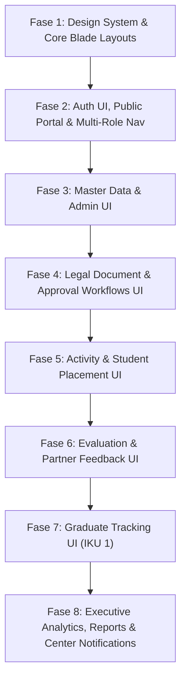

# 🎨 Tahapan & Roadmap Pengembangan Frontend Sistem Informasi Kerja Sama Kampus–DUDIKA (WD4)
### *Responsive, Modern, & Unified User Experience Architecture*

> **Versi**: 1.0 — Dokumen Panduan Tahapan Pengembangan Frontend (Lengkap Pemetaan Analysis & Backend Integration)  
> **Tanggal**: 12 Agustus 2026  
> **Referensi Utama**: 
> - [analysis-use-case.md](file:///c:/laragon/www/wd4/pengembangan-sistem/analysis-use-case.md) — 37 Use Cases & Matrix Aktor  
> - [analysis-flowchart.md](file:///c:/laragon/www/wd4/pengembangan-sistem/analysis-flowchart.md) — Flowcharts & Activity Diagrams  
> - [analysis-dfd.md](file:///c:/laragon/www/wd4/pengembangan-sistem/analysis-dfd.md) — Context Diagram, Level 0 & Level 1 (P1–P8)  
> - [analysis-erd.md](file:///c:/laragon/www/wd4/pengembangan-sistem/analysis-erd.md) — 28 Tabel Database  
> - [tahapan-pengembangan.md](file:///c:/laragon/www/wd4/pengembangan-sistem/tahapan-pengembangan.md) — Backend & System Architecture Roadmap (Fase 1–8)

---

## 📋 Daftar Isi

1. [Pendahuluan & Standar Desain Frontend](#1-pendahuluan--standar-desain-frontend)
   - 1.1 [Tujuan Dokumen](#11-tujuan-dokumen)
   - 1.2 [Prinsip Arsitektur Frontend & Konsistensi UI/UX](#12-prinsip-arsitektur-frontend--konsistensi-uiux)
2. [Pemetaan Komponen Frontend (Aktor, Layout, Views, & Endpoints)](#2-pemetaan-komponen-frontend-aktor-layout-views--endpoints)
   - 2.1 [Struktur Direktori Blade Templates](#21-struktur-direktori-blade-templates)
   - 2.2 [Matriks Aktor vs Komponen View Frontend](#22-matriks-aktor-vs-komponen-view-frontend)
3. [Roadmap 8 Fase Pengembangan Frontend (End-to-End Alignment)](#3-roadmap-8-fase-pengembangan-frontend-end-to-end-alignment)
   - [Fase 1: Standarisasi Design System & Core Blade Layouts](#fase-1-standarisasi-design-system--core-blade-layouts)
   - [Fase 2: UI Autentikasi, Portal Publik & Navigasi Multi-Role](#fase-2-ui-autentikasi-portal-publik--navigasi-multi-role)
   - [Fase 3: UI Modul Master Data & Manajemen Pengguna (Admin)](#fase-3-ui-modul-master-data--manajemen-pengguna-admin)
   - [Fase 4: UI Subsistem Dokumen Legal & Pengajuan Kerja Sama](#fase-4-ui-subsistem-dokumen-legal--pengajuan-kerja-sama)
   - [Fase 5: UI Subsistem Kegiatan & Penempatan Mahasiswa (Magang/MBKM)](#fase-5-ui-subsistem-kegiatan--penempatan-mahasiswa-magangmbkm)
   - [Fase 6: UI Subsistem Evaluasi Pelaksanaan & Umpan Balik Mitra](#fase-6-ui-subsistem-evaluasi-pelaksanaan--umpan-balik-mitra)
   - [Fase 7: UI Subsistem Tracking Lulusan / Alumni (IKU 1)](#fase-7-ui-subsistem-tracking-lulusan--alumni-iku-1)
   - [Fase 8: UI Subsistem Laporan, Dashboard Eksekutif & Center Notifikasi](#fase-8-ui-subsistem-laporan-dashboard-eksekutif--center-notifikasi)
4. [Matriks Pengetesan UI/UX & Definition of Done (DoD) Frontend](#4-matriks-pengetesan-uiux--definition-of-done-dod-frontend)

---

## 1. Pendahuluan & Standar Desain Frontend

### 1.1 Tujuan Dokumen
Dokumen ini disusun sebagai panduan langkah demi langkah (*step-by-step development roadmap*) untuk membangun antarmuka pengguna (Frontend/UI) Sistem Informasi Kerja Sama Kampus–DUDIKA (WD4). Pengembangan antarmuka ini memastikan keterhubungan yang presisi antara Blade Templates di Laravel, pengelolakan status via AJAX/Fetch, serta ketaatan pada Use Case (`UC01`–`UC36`), Flowchart bisnis, DFD, dan endpoint Backend yang telah diimplementasikan pada Fase 1 hingga Fase 8.

### 1.2 Prinsip Arsitektur Frontend & Konsistensi UI/UX
Pengembangan antarmuka mematuhi standar berikut:
1. **Blade Modularization**: Penggunaan `@extends`, `@section`, `@component`, dan `@include` untuk memisahkan layout utama, header, sidebar, footer, serta komponen modal agar bebas dari duplikasi kode.
2. **Visual Hierarchy & Premium Aesthetics**: Penggunaan palet warna harmonis (Primary Indigo/Navy, Success Emerald, Warning Amber, Danger Rose), tipografi bersih (Inter/Roboto), shadow halus, serta micro-interactions (hover effect, ripple button, smooth transition).
3. **Data Integrity & Interactive Feedback**:
   - Form menggunakan validasi *client-side* (HTML5 & Javascript) yang sejalan dengan `Request` validation di Laravel.
   - Penanganan error responsif (*Alert Toast*, *Inline Form Errors*, dan *Loading Spinners* saat proses submit data).
4. **Responsive Layout (Mobile First & Desktop Adaptive)**: Antarmuka harus beradaptasi secara mulus di berbagai perangkat (Desktop, Tablet, Mobile) dengan menggunakan responsive grid (Flexbox/CSS Grid).

---

## 2. Pemetaan Komponen Frontend (Aktor, Layout, Views, & Endpoints)

### 2.1 Struktur Direktori Blade Templates

Struktur direktori tampilan (`resources/views/`) dirancang modular berdasarkan peran aktor dan modul sistem:

```
resources/views/
├── components/                  # Shared UI Blade Components
│   ├── alert.blade.php          # Flash alert (success/error/warning)
│   ├── modal.blade.php          # Reusable Modal Dialog
│   ├── stat-card.blade.php      # Dashboard KPI Summary Card
│   ├── status-badge.blade.php   # Status Badge (Aktif, Menunggu, Kadaluarsa)
│   └── notification-dropdown.blade.php # Notification Bell Component
├── layouts/                     # Master Layouts
│   ├── app.blade.php            # Base HTML wrapper
│   ├── admin.blade.php          # Layout khusus Admin (/admin/*)
│   ├── internal.blade.php       # Layout Pimpinan, Jurusan, Prodi, UPA, Pusat
│   ├── mitra.blade.php          # Layout khusus Mitra DUDIKA (/mitra/*)
│   └── public.blade.php         # Layout Publik Landing Page & Guest Form
├── partials/                    # Partials (Sidebar, Header, Footer)
│   ├── navbar.blade.php
│   ├── footer.blade.php
│   ├── sidebar-admin.blade.php
│   ├── sidebar-internal.blade.php
│   └── sidebar-mitra.blade.php
├── admin/                       # Views khusus Admin (UC01-UC07)
│   ├── users/
│   ├── mitras/
│   ├── unit-kerja/
│   └── referensi/
├── auth/                        # Authenticated Core Dashboards & General Views
│   ├── login.blade.php
│   ├── pimpinan.blade.php
│   ├── jurusan.blade.php
│   ├── unit.blade.php
│   ├── upa.blade.php
│   ├── pusat.blade.php
│   └── layout/                  # Dedicated Internal Views Subfolders
│       ├── pimpinan/
│       ├── jurusan/
│       ├── upa/
│       └── pusat/
├── prodi/                       # Views khusus Program Studi (UC20, UC32)
│   ├── penempatan/
│   └── alumni/
├── mitra/                       # Views khusus Portal Mitra (UC21, UC26, UC29, UC32)
│   ├── dashboard.blade.php
│   ├── dokumen/
│   ├── penilaian/
│   ├── umpan-balik/
│   └── alumni/
└── public/                      # Landing Page & Public Forms (UC13, UC14)
    ├── welcome.blade.php
    ├── pengajuan.blade.php
    └── perpanjangan.blade.php
```

---

### 2.2 Matriks Aktor vs Komponen View Frontend

| Aktor | Role Key | Route Base | Main View Entry | Use Case Frontend Terkait |
|---|---|---|---|---|
| **Public / Guest** | `guest` | `/` | `public/welcome.blade.php` | UC13, UC14, UC35, UC36 |
| **Admin** | `admin` | `/admin/*` | `admin/dashboard.blade.php` | UC01–UC07, UC30, UC31, UC34, UC36 |
| **Pimpinan** | `pimpinan` | `/pimpinan/*` | `auth/pimpinan.blade.php` | UC11, UC12, UC16, UC17, UC22, UC25, UC27, UC30, UC31, UC33, UC34 |
| **Humas / Unit Kerja** | `humas` | `/unit/*` | `auth/unit.blade.php` | UC04, UC08–UC10, UC19, UC23, UC24, UC28, UC30, UC31, UC34 |
| **Jurusan** | `jurusan` | `/jurusan/*` | `auth/jurusan.blade.php` | UC04, UC08–UC10, UC19, UC22, UC23, UC24, UC28, UC30, UC31, UC34 |
| **Program Studi (Prodi)** | `prodi` | `/prodi/*` | `auth/prodi.blade.php` | UC19, UC20, UC22, UC28, UC32, UC33, UC34 |
| **UPA** | `upa` | `/upa/*` | `auth/upa.blade.php` | UC04, UC08–UC10, UC19, UC23, UC24, UC28, UC30, UC31, UC34 |
| **Pusat** | `pusat` | `/pusat/*` | `auth/pusat.blade.php` | UC04, UC08–UC10, UC19, UC23, UC24, UC28, UC30, UC31, UC34 |
| **Mitra DUDIKA** | `mitra` | `/mitra/*` | `mitra/dashboard.blade.php` | UC13, UC14, UC15, UC18, UC21, UC22, UC26, UC29, UC32, UC34 |

---

## 3. Roadmap 8 Fase Pengembangan Frontend (End-to-End Alignment)



---

### Fase 1: Standarisasi Design System & Core Blade Layouts

#### 1. Focus & Scope
Membangun fondasi antarmuka yang konsisten melalui pendefinisian design tokens, master layout, serta perpustakaan komponen Blade terpakai ulang (*reusable Blade UI components*).

#### 2. Item Pekerjaan Frontend
1. **CSS Design Tokens & Themeing**:
   - Membuat file CSS utama (`public/css/app.css` / `resources/css/custom.css`) yang memuat variabel CSS untuk warna, *typography*, *border-radius*, *box-shadow*, dan *z-index*.
2. **Master Layouts Templates**:
   - `layouts/app.blade.php`: Base document shell (`<html>`, `<head>`, `<body>`, Meta CSRF Token, CSS/JS Bundle).
   - `layouts/admin.blade.php`: Layout sidebar-left dengan topbar khusus dashboard admin.
   - `layouts/internal.blade.php`: Layout fleksibel untuk Pimpinan, Jurusan, Prodi, UPA, dan Pusat.
   - `layouts/mitra.blade.php`: Layout modern portal DUDIKA.
3. **Shared UI Blade Components**:
   - `components/status-badge.blade.php`: Merender label badge warna untuk status (Aktif: Emerald, Menunggu: Amber, Ditolak: Rose, Kadaluarsa: Gray).
   - `components/alert.blade.php`: Display dismissible alert pesan `session('success')` atau `session('error')`.
   - `components/modal.blade.php`: Wrapper modal dialog standar dengan header, body, footer tindakan.
   - `components/stat-card.blade.php`: Widget kartu indikator angka utama dengan icon SVG dan persentase perubahan.

#### 3. Pemetaan Diagram Analysis
- 📄 **[analysis-use-case.md](file:///c:/laragon/www/wd4/pengembangan-sistem/analysis-use-case.md)**:
  - **Section 3.1 & 3.2 (System Boundary & Matrix Aktor)**: Merancang layout shell (`layouts/`) untuk mengakomodasi 9 Aktor (`Admin`, `Pimpinan`, `Humas`, `Jurusan`, `Prodi`, `UPA`, `Pusat`, `Mitra`, `Guest`) dan 37 Use Cases.
  - **Section 5 (General UI Requirements)**: Standar responsivitas layar (Grid System), penanganan error Toast/Alert container (`components/alert.blade.php`), dan Modal Shell Dialog (`components/modal.blade.php`).
- 📄 **[analysis-flowchart.md](file:///c:/laragon/www/wd4/pengembangan-sistem/analysis-flowchart.md)**:
  - **Section 1.1 (End-to-End System Navigation Flowchart)**: Alur navigasi antarmuka dasar dari Landing/Login menuju Dashboard masing-masing Aktor.
  - **Standar UI Dialog Modal**: Template Modal Box seragam yang digunakan di seluruh alur Activity Diagram (Modal Konfirmasi Hapus, Modal Approval, Modal Input).
- 📄 **[analysis-dfd.md](file:///c:/laragon/www/wd4/pengembangan-sistem/analysis-dfd.md)**:
  - **Section 3 (Context Diagram & DFD Level 0)**: Struktur Navigasi Topbar Header dan Sidebar yang memisahkan area antarmuka *External Entities* (Admin, Pimpinan, Unit Kerja Internal, dan Mitra DUDIKA).
- 📄 **[analysis-erd.md](file:///c:/laragon/www/wd4/pengembangan-sistem/analysis-erd.md)**:
  - **Section 4.1 (Tabel Data Pengguna & Akses)**: Pengaksesan variabel sesi `users`, `roles`, `profiles`, dan `mitras` yang disuntikkan ke Blade Partial (`sidebar` & `navbar`) untuk menampilkan identitas akun aktif.

#### 4. Pemetaan Codebase & Controller Backend
- **Target File**: `resources/views/layouts/*`, `resources/views/components/*`, `resources/views/partials/*`, `public/css/app.css`
- **Verification**: Base layout ter-render tanpa error syntax Blade dan memiliki komponen visual yang konsisten.

---

### Fase 2: UI Autentikasi, Portal Publik & Navigasi Multi-Role

#### 1. Focus & Scope
Menyediakan antarmuka halaman publik, formulir login terpadu, modal kirim credential login mitra (`UC07`), serta bilah navigasi dinamis yang menyesuaikan hak akses pengguna (`RBAC`).

#### 2. Item Pekerjaan Frontend
1. **Public Landing Page (`UC36`)**:
   - File: `resources/views/public/welcome.blade.php` (atau `resources/views/auth/welcome.blade.php`).
   - Fitur UI: Hero Banner, Stat Counter (Total MoU, MoA, IA), Filter Pencarian Dokumen Publik, dan Widget Tracking Pengajuan Kerja Sama Mitra.
2. **Halaman Autentikasi (`UC36`)**:
   - `resources/views/auth/login.blade.php`: Form login bersih dengan toggle show/hide password, link reset password, dan captcha/CSRF protection.
   - `resources/views/auth/forgot-password.blade.php` & `reset-password.blade.php`: Form permohonan dan reset token password.
3. **Dynamic Sidebar Navigation (`UC36`)**:
   - Edit `resources/views/partials/sidebar-*.blade.php` untuk menampilkan menu spesifik berdasarkan `$user->role->name`.
   - Penambahan menu `Penempatan Mahasiswa` & `Data Alumni` untuk role `prodi`.
   - Penambahan menu `Portal Mitra` (Penilaian, Umpan Balik, Alumni) untuk role `mitra`.
4. **Modal Kirim Akses Login Mitra (`UC07`)**:
   - Komponen UI di tabel Mitra (Admin) berupa tombol "Kirim Credential" yang membuka modal konfirmasi email sebelum trigger backend `POST /admin/mitra/{id}/send-login`.

#### 3. Pemetaan Codebase & Controller Backend
- **Endpoint Backend**: `POST /login`, `POST /lupa-password`, `POST /admin/mitra/{id}/send-login`
- **Controller**: `LoginController.php`, `PasswordResetController.php`, `MitraController.php`
- **Target Views**: `resources/views/auth/login.blade.php`, `resources/views/admin/mitras/index.blade.php`

---

### Fase 3: UI Modul Master Data & Manajemen Pengguna (Admin)

#### 1. Focus & Scope
Mengoptimalkan antarmuka pengawasan dan manajemen data master (Master Users, Roles, Data Mitra, Master Unit Kerja, dan Referensi Kerja Sama) untuk aktor Admin.

#### 2. Item Pekerjaan Frontend
1. **UI Pengelolaan Pengguna & Role (`UC01`, `UC02`)**:
   - `resources/views/admin/users/index.blade.php`: Data Table daftar pengguna lengkap dengan badge status role, avatar, modal tambah user, dan modal edit role/profile.
2. **UI Pengelolaan Data Mitra & Klasifikasi (`UC03`)**:
   - `resources/views/admin/mitras/index.blade.php`: Tabel mitra dengan filter multi-kategori (PT, Industri, Pemda, NGO), indikator kelengkapan profil, dan modal ubah status aktif/non-aktif.
3. **UI Pengelolaan Data Unit Kerja (`UC04`)**:
   - Form CRUD untuk Jurusan (`jurusan/index.blade.php`), Prodi (`prodi/index.blade.php`), UPA (`upa/index.blade.php`), dan Pusat (`pusat/index.blade.php`).
4. **UI Master Referensi & Indikator IKU (`UC05`, `UC06`)**:
   - Interaktif Form untuk Jenis Kerja Sama, Sasaran Strategis, dan Indikator Kinerja Utama (IKU).

#### 3. Pemetaan Codebase & Controller Backend
- **Endpoint Backend**: `GET/POST/PUT/DELETE /admin/users`, `/admin/mitras`, `/admin/jurusans`, `/admin/prodis`, `/admin/upas`, `/admin/pusats`, `/admin/sasarans`, `/admin/indikators`
- **Controller**: `UserController.php`, `MitraController.php`, `JurusanController.php`, `ProdiController.php`, `UpaController.php`, `PusatController.php`, `SasaranController.php`, `IndikatorController.php`

---

### Fase 4: UI Subsistem Dokumen Legal & Pengajuan Kerja Sama

#### 1. Focus & Scope
Membangun wizard form pengajuan kerja sama oleh mitra publik, pengelolaan dokumen legal perikatan (MoU → MoA → IA), serta antarmuka verifikasi & pengesahan dokumen oleh pimpinan.

#### 2. Item Pekerjaan Frontend
1. **Form Pengajuan Kerja Sama Baru Publik/Mitra (`UC13`, `UC18`)**:
   - `resources/views/auth/pengajuan-mitra.blade.php`: Multi-step form interaktif (Data Perusahaan -> Jenis Kerja Sama -> Upload Draft/Proposal -> Submit) dengan masukan tanggal otomatis dan indikator upload file.
2. **Form Pengajuan Perpanjangan (`UC14`)**:
   - `resources/views/auth/perpanjangan.blade.php`: Form pencarian dokumen existing berdasarkan nomor PKS, autocomplete data mitra, dan upload pertimbangan perpanjangan.
3. **UI Manajemen Dokumen Legal MoU/MoA/IA (`UC08`, `UC09`, `UC10`)**:
   - Modul daftar dokumen dengan penanda hierarki (MoU Induk -> MoA Turunan -> IA Implementation), Viewer PDF terintegrasi (*Modal PDF Preview*), serta penomoran otomatis PKS.
4. **UI Validasi, Revisi & Approval Pimpinan (`UC11`, `UC12`, `UC16`, `UC17`)**:
   - Modal Review Dokumen pada dashboard Pimpinan dengan radio button tindakan (*Setujui*, *Revisi*, *Tolak*), textarea catatan perbaikan, dan preview cepat berkas lampiran.

#### 3. Pemetaan Codebase & Controller Backend
- **Endpoint Backend**: `POST /pengajuan-kerjasama`, `POST /perpanjangan-kerjasama`, `POST /pimpinan/kerjasama/{id}/approve`, `POST /mitra/dokumen/{id}/review`
- **Controller**: `PublicPengajuanKerjasamaController.php`, `PengajuanKerjasamaMitraController.php`, `MitraDokumenController.php`, `KerjasamaUnitController.php`

---

### Fase 5: UI Subsistem Kegiatan & Penempatan Mahasiswa (Magang/MBKM)

#### 1. Focus & Scope
Membangun antarmuka pengelolaan kegiatan turunan kerja sama (`UC19`), form penginputan penempatan mahasiswa oleh Prodi (`UC20`), formulir penilaian mahasiswa oleh Mitra (`UC21`), dan dashboard pemantauan (`UC22`).

#### 2. Item Pekerjaan Frontend
1. **UI Input & Detail Kegiatan Kerja Sama (`UC19`)**:
   - Form pembuatan kegiatan kerja sama di tingkat unit kerja dengan masukan volume luaran, anggaran, sasaran IKU, dan penanggung jawab.
2. **UI Form Penempatan Mahasiswa oleh Prodi (`UC20`)**:
   - File Baru: `resources/views/prodi/penempatan/index.blade.php` & `create.blade.php`.
   - Element UI: Table penempatan aktif, Modal Form Input (NIM, Nama Mahasiswa, Select Mitra KS, Select Kegiatan, Tanggal Mulai-Selesai, Pembimbing Field).
3. **UI Form Penilaian Mahasiswa oleh Mitra (`UC21`)**:
   - File Baru: `resources/views/mitra/penilaian/index.blade.php` & `edit.blade.php`.
   - Element UI: Portal Mitra untuk melihat mahasiswa magang di tempatnya, slider/input nilai skala 1-100 (Kedisiplinan, Softskill, Technical Skill), dan textarea catatan kualitatif.
4. **UI Monitoring Penempatan Mahasiswa (`UC22`)**:
   - Kartu statistik jumlah mahasiswa aktif di industri pada dashboard Pimpinan dan Prodi dengan fitur pencarian dan filter prodi/mitra.

#### 3. Pemetaan Codebase & Controller Backend
- **Endpoint Backend**: `GET/POST /prodi/penempatan`, `GET/PUT /mitra/penilaian/{id}`, `GET /unit/kegiatan`
- **Controller**: `PenempatanMahasiswaController.php` (Prodi), `PenilaianMahasiswaController.php` (Mitra), `KegiatanKerjasamaController.php` (Unit)

---

### Fase 6: UI Subsistem Evaluasi Pelaksanaan & Umpan Balik Mitra

#### 1. Focus & Scope
Menyediakan formulir mandiri evaluasi kegiatan oleh unit pelaksana (`UC23`, `UC24`), antarmuka validasi evaluasi oleh Pimpinan (`UC25`), serta portal pengisian umpan balik/survei kepuasan oleh Mitra (`UC26`).

#### 2. Item Pekerjaan Frontend
1. **UI Form Self-Assessment & Submit Evaluasi Unit (`UC23`, `UC24`)**:
   - `resources/views/unit/evaluasi/index.blade.php`: Form pencatatan ketercapaian kegiatan, upload bukti laporan pelaksanaan (PDF), kendala, dan solusi sebelum di-submit ke Pimpinan.
2. **UI Review & Validasi Evaluasi Pimpinan (`UC25`)**:
   - Komponen tabel evaluasi masuk di dashboard Pimpinan, tombol modal review evaluasi, dan aksi validasi (*Disetujui / Perlu Revisi*).
3. **UI Form Umpan Balik Mitra / Survey Kepuasan (`UC26`)**:
   - File Baru: `resources/views/mitra/umpan-balik/index.blade.php` & `edit.blade.php`.
   - Element UI: Star Rating Component (Skala 1-5 bintang untuk aspek pelayanan, fasilitas, kualifikasi mhs), textarea saran kemitraan, dan konfirmasi submit.

#### 4. Pemetaan Codebase & Controller Backend
- **Endpoint Backend**: `GET/POST /unit/evaluasi`, `POST /pimpinan/evaluasi/{id}/validate`, `GET/PUT /mitra/umpan-balik/{id}`
- **Controller**: `EvaluasiUnitController.php`, `EvaluasiPimpinanController.php`, `UmpanBalikController.php`

---

### Fase 7: UI Subsistem Tracking Lulusan / Alumni (IKU 1)

#### 1. Focus & Scope
Membangun antarmuka perekaman data alumni terikat mitra oleh Prodi (`UC32`), portal verifikasi status kerja alumni oleh Mitra (`UC32`), serta widget visualisasi statistik penyerapan alumni untuk pemenuhan IKU 1 (`UC33`).

#### 2. Item Pekerjaan Frontend
1. **UI Management Data Alumni oleh Prodi (`UC32`)**:
   - File Baru: `resources/views/prodi/alumni/index.blade.php` & `create.blade.php`.
   - Element UI: Table daftar alumni prodi, Form tambah alumni (NIM, Nama, Tahun Lulus, Select Mitra DUDIKA, Posisi Pekerjaan, Tahun Mulai).
2. **UI Verifikasi Alumni oleh Mitra (`UC32`)**:
   - File Baru: `resources/views/mitra/alumni/index.blade.php`.
   - Element UI: Tabel alumni kampus yang tercatat bekerja di mitra tersebut, dropdown ubah status (`Aktif`, `Resign`, `Pensiun`) dan tombol update instan.
3. **UI Widget Stats Penyerapan Lulusan - IKU 1 (`UC33`)**:
   - Widget KPI Card pada dashboard Pimpinan & Prodi: Total Alumni, Alumni Bekerja di Mitra KS, Persentase Penyerapan IKU 1 (`%`), serta Bar Chart per perbandingan Prodi.

#### 3. Pemetaan Codebase & Controller Backend
- **Endpoint Backend**: `GET/POST /prodi/alumni`, `GET/PUT /mitra/alumni/{id}`, `GET /prodi/dashboard`
- **Controller**: `AlumniMitraController.php` (Prodi), `AlumniMitraController.php` (Mitra), `DashboardController.php`

---

### Fase 8: UI Subsistem Laporan, Dashboard Eksekutif & Center Notifikasi

#### 1. Focus & Scope
Mengembangkan dashboard analitik eksekutif terpadu (`UC27`, `UC31`), pusat notifikasi sistem & early warning bell (`UC34`), serta modal filter dan ekspor laporan PDF/Excel (`UC30`).

#### 2. Item Pekerjaan Frontend
1. **UI Executive Dashboard Analytics (`UC27`, `UC31`)**:
   - File: `resources/views/auth/pimpinan.blade.php` & `resources/views/auth/layout/pimpinan/*.blade.php`.
   - Chart Integration (Chart.js / ApexCharts):
     - *Funnel Conversion Chart*: Visualisasi MoU → MoA → IA.
     - *Bar/Line Chart*: Tren pertumbuhan nilai kontrak & jumlah kerja sama bulanan.
     - *Doughnut Chart*: Sebaran mitra berdasarkan klasifikasi industri.
     - *IKU Metric Gauge*: Capaian sasaran strategis institusi.
2. **Notification Center & Early Warning System Bell (`UC34`)**:
   - Component: `resources/views/components/notification-dropdown.blade.php` di Navbar Topbar.
   - Live Update (Fetch API `/api/notifikasi`): Menampilkan badge merah jumlah notifikasi *unread*, dropdown list notifikasi masuk (termasuk peringatan dokumen kadaluarsa H-90, H-60, H-30), dan aksi "Tandai Dibaca".
3. **UI Export Laporan & Filter Modal (`UC30`)**:
   - File: `resources/views/auth/layout/pimpinan/laporan_pdf.blade.php` & Modal Filter Laporan.
   - Element UI: Modal Filter (Tipe Dokumen, Rentang Tanggal, Pelaksana, Status), Tombol **Export PDF** (Trigger download PDF), dan Tombol **Export Excel/CSV** (Trigger file `.csv`).

#### 3. Pemetaan Codebase & Controller Backend
- **Endpoint Backend**: `GET /api/notifikasi`, `POST /api/notifikasi/{id}/mark-read`, `GET /pimpinan/laporan/pdf`, `GET /pimpinan/laporan/excel`
- **Controller**: `NotifikasiController.php`, `LaporanPimpinanController.php`, `DashboardController.php`

---

## 4. Matriks Pengetesan UI/UX & Definition of Done (DoD) Frontend

Setiap komponen antarmuka dianggap selesai (*Done*) apabila memenuhi indikator kualitas berikut:

| Kriteria Pengujian | Metode Verifikasi | Target Standar Kualitas |
|---|---|---|
| **Responsivitas View Layout** | Browser DevTools (Mobile, Tablet, Desktop Viewports) | Bebas dari horizontal scrollbar yang rusak (*broken layout*) pada layar min-width 320px. |
| **Integrasi Form & Validasi** | Manual Form Submission dengan input valid/invalid | Pesan error validasi muncul di bawah masing-masing input field tanpa merusak UI. |
| **Aksesibilitas & Hak Akses UI** | Cross-login antar aktor (Admin, Pimpinan, Prodi, Mitra) | Element navigasi dan tombol aksi tersembunyi/ditampilkan secara presisi sesuai Role RBAC. |
| **Notifikasi & Interactive Feedback** | Trigger event notifikasi & proses submit | Flash alert *success/error* tampil jelas; icon lonceng notifikasi ter-update secara *real-time*. |
| **Visualisasi Chart & Analytics** | Render data pada Dashboard Pimpinan & Jurusan | Chart ter-render mulus tanpa error Javascript console saat dataset kosong atau terisi. |
| **Kelancaran Preview & Export File** | Klik tombol PDF Preview, Export PDF, dan Export CSV | Berkas PDF ter-render rapi; berkas CSV terunduh dengan format header kolom yang sesuai. |

---
*Dokumen ini disusun secara terstruktur untuk menjadi panduan kerja pengembangan Frontend Sistem Informasi Kerja Sama Kampus–DUDIKA (WD4).*
