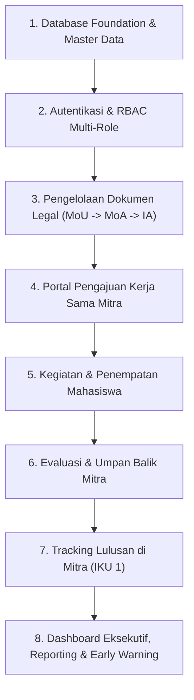
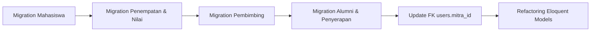
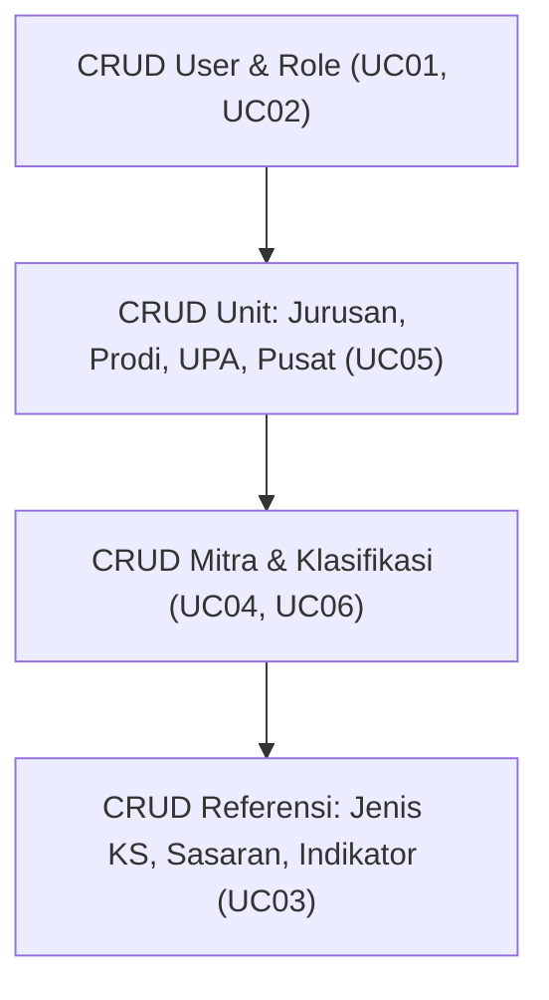
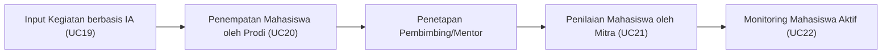
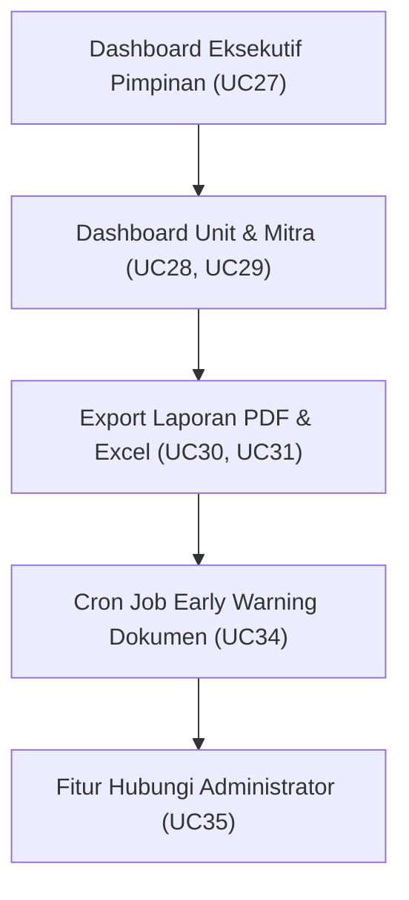

# 🚀 Tahapan & Roadmap Pengembangan Sistem Informasi Kerja Sama Kampus–DUDIKA (WD4)
### *Smart Collaboration Lifecycle Management System*

> **Versi**: 1.1 — Dokumen Panduan Tahapan Pengembangan Sistem (Lengkap Pemetaan Diagram Analysis)  
> **Tanggal**: 11 Agustus 2026  
> **Referensi Utama**: 
> - [analysis-use-case.md](file:///c:/laragon/www/wd4/pengembangan-sistem/analysis-use-case.md) — 37 Use Cases & Matrix Aktor  
> - [analysis-flowchart.md](file:///c:/laragon/www/wd4/pengembangan-sistem/analysis-flowchart.md) — Activity Diagrams & End-to-End Business Flow  
> - [analysis-dfd.md](file:///c:/laragon/www/wd4/pengembangan-sistem/analysis-dfd.md) — Context Diagram, Level 0 & Level 1 (P1–P8, D1–D10)  
> - [analysis-erd.md](file:///c:/laragon/www/wd4/pengembangan-sistem/analysis-erd.md) — 28 Tabel Database & Matriks Relasi  
> - [planning.md](file:///c:/laragon/www/wd4/pengembangan-sistem/planning.md) — Arsitektur Target & Strategi Sistem  

---

## 📋 Daftar Isi

1. [Pendahuluan & Prinsip Pengembangan](#1-pendahuluan--prinsip-pengembangan)
2. [Analisis Gap & Pemetaan Komponen (As-Is vs To-Be)](#2-analisis-gap--pemetaan-komponen-as-is-vs-to-be)
   - 2.1 [Matriks Aktor & Hak Akses (RBAC)](#21-matriks-aktor--hak-akses-rbac)
   - 2.2 [Matriks Data Store & Tabel Database](#22-matriks-data-store--tabel-database)
   - 2.3 [Matriks Proses DFD Level 0](#23-matriks-proses-dfd-level-0)
3. [Roadmap 8 Fase Pengembangan Sistem (Dilengkapi Pemetaan Diagram Analysis)](#3-roadmap-8-fase-pengembangan-sistem)
   - [Fase 1: Restrukturisasi Basis Data & Model Eloquent](#fase-1-restrukturisasi-basis-data--model-eloquent)
   - [Fase 2: Autentikasi, RBAC & Akses Login Mitra](#fase-2-autentikasi-rbac--akses-login-mitra)
   - [Fase 3: Subsistem Master Data](#fase-3-subsistem-master-data)
   - [Fase 4: Subsistem Dokumen & Pengajuan Kerja Sama](#fase-4-subsistem-dokumen--pengajuan-kerja-sama)
   - [Fase 5: Subsistem Kegiatan & Penempatan Mahasiswa](#fase-5-subsistem-kegiatan--penempatan-mahasiswa)
   - [Fase 6: Subsistem Evaluasi Kerja Sama & Umpan Balik](#fase-6-subsistem-evaluasi-kerja-sama--umpan-balik)
   - [Fase 7: Subsistem Tracking Lulusan / Alumni](#fase-7-subsistem-tracking-lulusan--alumni)
   - [Fase 8: Subsistem Laporan, Dashboard Eksekutif & Notifikasi](#fase-8-subsistem-laporan-dashboard-eksekutif--notifikasi)
4. [Matriks Pengujian & Definition of Done (DoD)](#4-matriks-pengujian--definition-of-done-dod)

---

## 1. Pendahuluan & Prinsip Pengembangan

### 1.1 Tujuan Dokumen
Dokumen ini disusun sebagai panduan langkah teknis berurutan (*step-by-step development roadmap*) untuk melakukan pengembangan Sistem Informasi Kerja Sama Kampus–DUDIKA (WD4). Panduan ini memetakan secara presisi kondisi sistem saat ini (*As-Is*) dengan spesifikasi target (*To-Be*) yang tertuang pada dokumen analisis Use Case, Flowchart, DFD, dan ERD.

### 1.2 Prinsip Ketergantungan Data (*Data Dependency Order*)
Pengembangan sistem tidak dilakukan secara acak, melainkan harus mematuhi urutan ketergantungan data (*data workflow dependencies*):

---

## 2. Analisis Gap & Pemetaan Komponen (As-Is vs To-Be)

### 2.1 Matriks Aktor & Hak Akses (RBAC)

| No | Aktor | Code Role | Status Saat Ini | Target Spesifikasi (Use Case) | Tindakan Pengembangan |
|---|---|---|---|---|---|
| 1 | **Admin** | `admin` | ✅ Ada (`/admin/*`) | UC01–UC07, UC30, UC31, UC34, UC36 | Tambahkan UC07 (Kirim Login Mitra) |
| 2 | **Pimpinan** | `pimpinan` | ✅ Ada (`/pimpinan/*`) | UC11, UC12, UC16, UC17, UC22, UC25, UC27, UC30, UC31, UC33, UC34, UC36 | Integrasi validasi evaluasi & pengajuan |
| 3 | **Humas** | `humas` | ✅ Ada (`/unit/*`) | UC04, UC08–UC10, UC19, UC23, UC24, UC28, UC30, UC31, UC33, UC34, UC36 | Sempurnakan alur evaluasi & laporan unit |
| 4 | **Jurusan** | `jurusan` | ✅ Ada (`/jurusan/*`) | UC04, UC08–UC10, UC19, UC22, UC23, UC24, UC28, UC30, UC31, UC33, UC34, UC36 | Sempurnakan pivot `cooperation_jurusan` |
| 5 | **Program Studi** | `prodi` | ❌ **Belum Ada** | UC19, UC20, UC22, UC28, UC32, UC33, UC34, UC36 | **NEW**: Tambah route `/prodi/*`, Controller & UI |
| 6 | **UPA** | `upa` | ✅ Ada (`/upa/*`) | UC04, UC08–UC10, UC19, UC23, UC24, UC28, UC30, UC31, UC34, UC36 | Sempurnakan pivot `cooperation_upa` |
| 7 | **Pusat** | `pusat` | ✅ Ada (`/pusat/*`) | UC04, UC08–UC10, UC19, UC23, UC24, UC28, UC30, UC31, UC34, UC36 | Sempurnakan pivot `cooperation_pusat` |
| 8 | **Mitra** | `mitra` | ❌ **Belum Ada** | UC13, UC14, UC15, UC18, UC21, UC22, UC26, UC29, UC32, UC33, UC34, UC35, UC36 | **NEW**: Tambah route `/mitra/*`, Portal Auth & UI |

---

### 2.2 Matriks Data Store & Tabel Database

| Kode DFD | Data Store DFD | Tabel ERD Target (28 Tabel) | Status di Codebase | Tindakan Migration & Models |
|---|---|---|---|---|
| **D1** | Data Pengguna | `roles`, `users`, `profiles` | ✅ Ada | Tambah FK `users.mitra_id` |
| **D2** | Data Mitra | `klasifikasis`, `mitras` | ✅ Ada | Sempurnakan atribut `status_akses`, `kota`, `provinsi` |
| **D3** | Data Dokumen KS | `cooperations`, `pks_numbers`, `laporan_files`, `cooperation_jurusan`, `cooperation_prodi`, `cooperation_upa`, `cooperation_pusat` | ✅ Ada | Pastikan relasi hierarki `parent_cooperation_id` (MoU→MoA→IA) & pivot unit terhubung rapi |
| **D4** | Data Kegiatan | `kegiatan_kerjasamas`, `detail_kegiatans` | ✅ Ada | Lengkapi atribut volume luaran, output, outcome |
| **D5** | Data Mahasiswa | `mahasiswas`, `kegiatan_mahasiswas`, `pembimbings` | ❌ **Belum Ada** | **NEW Migration & Models**: Penempatan & Penilaian Mahasiswa |
| **D6** | Data Evaluasi | `evaluasis` | 🟡 Sebagian | Restrukturisasi atribut evaluasi unit & umpan balik mitra |
| **D7** | Data Alumni | `alumnis`, `alumni_mitras` | ❌ **Belum Ada** | **NEW Migration & Models**: Tracking Lulusan di Mitra |
| **D8** | Data Notifikasi | `notifikasis` | ✅ Ada | Sempurnakan relasi penerima & tautan URL aksi |
| **D9** | Data Unit | `jurusans`, `prodis`, `upas`, `pusats` | ✅ Ada | Sudah sesuai |
| **D10** | Data Referensi | `jenis_kerjasamas`, `sasarans`, `indikators` | ✅ Ada | Sudah sesuai |

---

### 2.3 Matriks Proses DFD Level 0

| Kode Proses | Nama Proses DFD | Subsistem Terkait | Status Implementasi |
|---|---|---|---|
| **P1** | Mengelola Data Master | Master Data (Pengguna, Role, Unit, Mitra, Referensi) | 🟡 80% (Perlu UC07 Akses Login Mitra) |
| **P2** | Mengelola Dokumen Kerja Sama | Dokumen (MoU/MoA/IA, Draft, Submit) | 🟡 75% (Perlu penyempurnaan hierarki MoU→MoA→IA) |
| **P3** | Mengelola Pengajuan Kerja Sama | Portal Pengajuan Mitra (Baru & Perpanjangan) | 🟡 60% (Perlu pemisahan portal mitra terautentikasi) |
| **P4** | Memvalidasi Dokumen dan Pengajuan | Validasi Pimpinan & Auto-Create Account | 🟡 70% (Perlu fitur auto-create user role mitra saat disetujui) |
| **P5** | Mengelola Kegiatan dan Monitoring | Activity & Student Internship Placement | 🔴 30% (Perlu modul penempatan MHS & penilaian mitra) |
| **P6** | Mengelola Evaluasi | Evaluation & Partner Feedback | 🟡 50% (Perlu modul umpan balik mitra via portal) |
| **P7** | Mengelola Tracking Lulusan | Graduate Absorption Rate (IKU 1) | 🔴 0% (Perlu modul alumni & penyerapan kerja) |
| **P8** | Membuat Laporan dan Dashboard | Executive Dashboard & Export | 🟡 65% (Perlu Dashboard Prodi & Dashboard Mitra) |

---

## 3. Roadmap 8 Fase Pengembangan Sistem

---

### 📌 Fase 1: Restrukturisasi Basis Data & Model Eloquent
> **Tujuan**: Menyiapkan fondasi 28 tabel basis data (ERD) dan relasi Eloquent ORM di Laravel agar siap menampung seluruh alur data DFD.

#### 📍 Pemetaan Spesifik per Diagram & Dokumen Analisis:
- 📄 **[analysis-erd.md](file:///c:/laragon/www/wd4/pengembangan-sistem/analysis-erd.md)**:
  - **Section 3**: Diagram ERD Konseptual & Logikal (Entitas `users`, `mahasiswas`, `kegiatan_mahasiswas`, `pembimbings`, `alumnis`, `alumni_mitras`).
  - **Section 4.1**: Tabel 2 `users` (penambahan FK `mitra_id` untuk akun mitra).
  - **Section 4.3**: Tabel 10 `cooperations` (self-referencing FK `parent_cooperation_id` MoU→MoA→IA).
  - **Section 4.5**: Subsistem Kegiatan & Penempatan Mahasiswa (Tabel 22 `mahasiswas`, Tabel 23 `kegiatan_mahasiswas`, Tabel 24 `pembimbings`).
  - **Section 4.7**: Subsistem Tracking Lulusan (Tabel 26 `alumnis`, Tabel 27 `alumni_mitras`).
  - **Section 5 & 7**: Matriks Relasi, Kardinalitas & Traceability Matriks DFD ↔ ERD ↔ Use Case.
- 📄 **[analysis-dfd.md](file:///c:/laragon/www/wd4/pengembangan-sistem/analysis-dfd.md)**:
  - **Section 2.2**: Data Store `D1 Data Pengguna`, `D5 Data Mahasiswa`, `D7 Data Alumni`.
  - **Section 4.1**: DFD Level 0 (Menyediakan fondasi penyimpanan data store D1, D5, D7 untuk Proses P1, P5, P7).
- 📄 **[analysis-use-case.md](file:///c:/laragon/www/wd4/pengembangan-sistem/analysis-use-case.md)**:
  - **Section 3.1 & 4.4**: Modul Kegiatan & Monitoring (`UC20` Menginput Peserta Mahasiswa, `UC21` Memberi Penilaian Mahasiswa, `UC22` Memonitoring Mahasiswa Aktif).
  - **Section 3.1 & 4.7**: Modul Tracking Lulusan (`UC32` Menginput Data Lulusan Bekerja di Mitra, `UC33` Melihat Statistik Penyerapan Lulusan).
  - **Section 3.1 & 4.1**: Modul Master Data (`UC07` Mengirim Akses Login Mitra).
- 📄 **[analysis-flowchart.md](file:///c:/laragon/www/wd4/pengembangan-sistem/analysis-flowchart.md)**:
  - Menyediakan skema tabel yang mendasari Flowchart Section 3.7 (`UC07`), Section 6 (`UC19`–`UC22`), dan Section 9 (`UC32`–`UC33`).

#### Langkah Execution:
1. **Migration 1.1 — Data Mahasiswa**
   - File: `database/migrations/xxxx_xx_xx_create_mahasiswas_table.php`
   - Kolom: `id`, `nim` (UNIQUE), `nama`, `prodi_id` (FK `prodis`), `angkatan`, `email`, `telepon`, `status` (`Aktif`, `Lulus`, `Cuti`, `DO`), `timestamps`.
2. **Migration 1.2 — Penempatan Mahasiswa di Kegiatan**
   - File: `database/migrations/xxxx_xx_xx_create_kegiatan_mahasiswas_table.php`
   - Kolom: `id`, `kegiatan_id` (FK `kegiatan_kerjasamas`), `mahasiswa_id` (FK `mahasiswas`), `mitra_id` (FK `mitras`), `periode_mulai`, `periode_selesai`, `status`, `nilai_mitra` (DECIMAL 5,2), `catatan_mitra`, `timestamps`.
3. **Migration 1.3 — Pembimbing & Mentor**
   - File: `database/migrations/xxxx_xx_xx_create_pembimbings_table.php`
   - Kolom: `id`, `kegiatan_mahasiswa_id` (FK `kegiatan_mahasiswas`), `nama_pembimbing`, `tipe` (`Internal`, `Eksternal`), `kontak`, `timestamps`.
4. **Migration 1.4 — Data Alumni**
   - File: `database/migrations/xxxx_xx_xx_create_alumnis_table.php`
   - Kolom: `id`, `nim` (UNIQUE), `nama`, `prodi_id` (FK `prodis`), `tahun_lulus`, `email`, `telepon`, `timestamps`.
5. **Migration 1.5 — Penyerapan Alumni di Mitra**
   - File: `database/migrations/xxxx_xx_xx_create_alumni_mitras_table.php`
   - Kolom: `id`, `alumni_id` (FK `alumnis`), `mitra_id` (FK `mitras`), `posisi`, `tahun_mulai`, `status`, `sumber_data`, `timestamps`.
6. **Migration 1.6 — Penyesuaian Akun User Mitra**
   - File: `database/migrations/xxxx_xx_xx_add_mitra_id_to_users_table.php`
   - Kolom: Tambah `mitra_id` (FK `mitras`, NULLABLE) pada tabel `users`.
7. **Refactoring Models & Relasi Eloquent**
   - Buat Model: `Mahasiswa.php`, `KegiatanMahasiswa.php`, `Pembimbing.php`, `Alumni.php`, `AlumniMitra.php`.
   - Update Model: `User.php` (relasi `mitra()`), `Mitra.php` (relasi `users()`, `kegiatanMahasiswas()`, `alumniMitras()`), `Cooperation.php` (relasi `parent()`, `children()`).

---

## diagram yang akan dibuat
### **1. Apa Saja yang Akan Dibuat pada Fase 1?**

Pada **Fase 1**, komponen yang dikerjakan adalah **fondasi struktur tabel basis data (migration)** dan **relasi model Eloquent (ORM)** agar sistem memiliki penampung data (*data store*) yang siap sebelum fitur-fitur transaksi dikembangkan:

1. **Migration 1.1**: Tabel `mahasiswas` (Data peserta mahasiswa).
2. **Migration 1.2**: Tabel `kegiatan_mahasiswas` (Data penempatan mahasiswa di mitra & nilai dari mitra).
3. **Migration 1.3**: Tabel `pembimbings` (Data dosen pembimbing & mentor industri).
4. **Migration 1.4**: Tabel `alumnis` (Data repositori lulusan).
5. **Migration 1.5**: Tabel `alumni_mitras` (Data penyerapan alumni bekerja di mitra).
6. **Migration 1.6**: Penambahan kolom `mitra_id` (FK ke `mitras`) pada tabel `users` untuk akun login portal mitra.
7. **Refactoring Eloquent Models**: Pembuatan model `Mahasiswa.php`, `KegiatanMahasiswa.php`, `Pembimbing.php`, `Alumni.php`, `AlumniMitra.php`, serta pembaruan relasi pada `User.php`, `Mitra.php`, dan `Cooperation.php`.

### **2. Pemetaan per Dokumen & Diagram Analisis:**

#### **📄 A. analysis-erd.md**

- **Section 3 (Diagram ERD Konseptual & Logikal)**: Entitas `users`, `mahasiswas`, `kegiatan_mahasiswas`, `pembimbings`, `alumnis`, dan `alumni_mitras`.
- **Section 4.1 (Tabel 2 `users`)**: Penambahan FK `mitra_id`.
- **Section 4.3 (Tabel 10 `cooperations`)**: Penyiapan relasi *self-referencing* `parent_cooperation_id` (MoU → MoA → IA).
- **Section 4.5 (Subsistem Kegiatan & Penempatan Mahasiswa)**:
    - Tabel 22 (`mahasiswas`)
    - Tabel 23 (`kegiatan_mahasiswas`)
    - Tabel 24 (`pembimbings`)
- **Section 4.7 (Subsistem Tracking Lulusan)**:
    - Tabel 26 (`alumnis`)
    - Tabel 27 (`alumni_mitras`)
- **Section 5 & 7**: Matriks relasi kardinalitas dan traceability tabel database.

#### **📄 B. analysis-dfd.md**

- **Section 2.2 (Data Store)**:
    - `D1 Data Pengguna` (`users`, `profiles`, `roles`)
    - `D5 Data Mahasiswa` (`mahasiswas`, `kegiatan_mahasiswas`, `pembimbings`)
    - `D7 Data Alumni` (`alumnis`, `alumni_mitras`)
- **Section 4.1 (DFD Level 0)**: Menyiapkan media penyimpanan untuk mendukung aliran data pada **Proses P1** (Mengelola Data Master), **Proses P5** (Mengelola Kegiatan & Monitoring), dan **Proses P7** (Mengelola Tracking Lulusan).

#### **📄 C. analysis-use-case.md**

- **Section 3.1 (Use Case Diagram Utama)** & **Section 4.4 (Subsistem Kegiatan & Monitoring)**:
    - `UC20`: Menginput Peserta Mahasiswa Kegiatan
    - `UC21`: Memberi Penilaian Mahasiswa
    - `UC22`: Memonitoring Mahasiswa Aktif
- **Section 3.1** & **Section 4.7 (Subsistem Tracking Lulusan)**:
    - `UC32`: Menginput Data Lulusan Bekerja di Mitra
    - `UC33`: Melihat Statistik Penyerapan Lulusan
- **Section 3.1** & **Section 4.1 (Subsistem Master Data)**:
    - `UC07`: Mengirim Akses Login Mitra (relasi `users.mitra_id`)

#### **📄 D. analysis-flowchart.md**

- **Section 3.7**: Flowchart `UC07` (Mengirim Akses Login Mitra).
- **Section 6**: Subsistem Kegiatan dan Monitoring (Flowchart 6.2 `UC20`, Flowchart 6.3 `UC21`, Flowchart 6.4 `UC22`).
- **Section 9**: Subsistem Tracking Lulusan (Flowchart 9.1 `UC32`, Flowchart 9.2 `UC33`).

### 📌 Fase 2: Autentikasi, RBAC & Akses Login Mitra
> **Tujuan**: Mengaktifkan hak akses untuk Aktor **Program Studi (Prodi)** dan **Mitra (DUDIKA)** serta fungsi pengiriman akses login mitra oleh Admin.

#### 1. Apa Saja yang Akan Dibuat pada Fase 2?
1. **Pembaruan Seeder Role & Permission (`RoleSeeder.php`)**: Memastikan 8 Role terdaftar (`admin`, `pimpinan`, `humas`, `jurusan`, `prodi`, `upa`, `pusat`, `mitra`).
2. **Middleware & Route Grouping**:
   - Route `/prodi/*` dengan middleware `role:prodi`.
   - Route `/mitra/*` dengan middleware `role:mitra`.
3. **Pengembangan Fitur Kirim Akses Login Mitra (UC07)**:
   - Method `sendAccessLogin(Mitra $mitra)` di `Admin/MitraController.php`.
   - Cek email mitra → auto-generate password acak aman → buat user role `mitra` dengan `mitra_id` → kirim email credential via Mailable `SendMitraCredentialMail`.
4. **Modifikasi Controller Autentikasi (`LoginController.php` & `RegisterController.php`)**:
   - Penyesuaian `authenticated()` untuk memetakan redirect multi-role ke dashboard masing-masing.
   - Pengecekan status akun aktif/non-aktif (`E {"Akun Aktif?"}`).
5. **View Email & Interface Admin**:
   - Template Mail Blade: `resources/views/emails/mitra_credential.blade.php`.
   - Tombol "Kirim Akses Login" pada daftar Mitra di `admin/mitra/index.blade.php`.

#### 2. Pemetaan per Dokumen & Diagram Analisis:
- 📄 **[analysis-erd.md](file:///c:/laragon/www/wd4/pengembangan-sistem/analysis-erd.md)**:
  - **Section 3 (Diagram ERD)**: Relasi `roles` `1:N` `users`, `users` `1:1` `profiles`, `users` `M:1` `mitras` (`users.mitra_id`).
  - **Section 4.1 (Master Data & Pengguna)**:
    - Tabel 1 (`roles`): pendaftaran role `prodi` & `mitra`.
    - Tabel 2 (`users`): kolom `email`, `password`, `role_id`, `mitra_id`.
    - Tabel 3 (`profiles`): profil akun.
    - Tabel 5 (`mitras`): kolom `email`, `status_akses`.
- 📄 **[analysis-dfd.md](file:///c:/laragon/www/wd4/pengembangan-sistem/analysis-dfd.md)**:
  - **Section 2.1 (External Entity)**: Entity E1 (Admin) & E8 (Mitra).
  - **Section 2.2 (Data Store)**: Data Store `D1 Data Pengguna` & `D2 Data Mitra`.
  - **Section 4.1 (DFD Level 0)**: Aliran data `Admin` → `P1` (Credential Mitra) → `P1` → `Mitra` (Credential Login).
  - **Section 5 / DFD Level 1.1 (P1)**:
    - **Proses 1.1**: Mengelola Data Pengguna.
    - **Proses 1.2**: Mengelola Data Role.
    - **Proses 1.6**: Mengirim Akses Login Mitra (`P16`).
- 📄 **[analysis-use-case.md](file:///c:/laragon/www/wd4/pengembangan-sistem/analysis-use-case.md)**:
  - **Section 1**: Identifikasi Aktor 5 (Program Studi) & Aktor 8 (Mitra DUDIKA).
  - **Section 2.1 (Admin)**: `UC01` (Mengelola Data Pengguna), `UC02` (Mengelola Data Role), `UC07` (Mengirim Akses Login Mitra).
  - **Section 2.5 & 2.8**: Identifikasi Aktor Prodi & Mitra (`UC36` Login, `UC37` Logout).
  - **Section 4.1 & 4.8**: Diagram Subsistem Master Data & Autentikasi (`UC36 Login`, `UC37 Logout` untuk 8 Aktor).
  - **Section 5.1 (Relasi `<<include>>`)**: `UC07` (Mengirim Akses Login Mitra) `<<include>>` → `UC36` (Login/Generate Credential).
  - **Section 6 (Deskripsi Use Case)**: `UC01`, `UC07`, `UC36`, `UC37`.
- 📄 **[analysis-flowchart.md](file:///c:/laragon/www/wd4/pengembangan-sistem/analysis-flowchart.md)**:
  - **Section 2.1 (UC36 — Login)**: Activity Diagram Flowchart Login Multi-Role (Kredensial → Akun Aktif → Role Redirect J1–J8 → Log Login).
  - **Section 2.2 (UC37 — Logout)**: Activity Diagram Logout.
  - **Section 3.7 (UC07 — Mengirim Akses Login Mitra)**: Activity Diagram Flowchart Kirim Akses Login (Filter `has_account = false` → Cek Email → Auto-create User `mitra` → Password Acak → Kirim Email Credential).

#### Langkah Execution:
1. **Seeder Update**
   - Pastikan `RoleSeeder` mendaftarkan kode role: `admin`, `pimpinan`, `humas`, `jurusan`, `prodi`, `upa`, `pusat`, `mitra`.
2. **Middleware & Route Grouping**
   - Daftarkan Route Group `/prodi/*` dengan middleware `role:prodi`.
   - Daftarkan Route Group `/mitra/*` dengan middleware `role:mitra`.
3. **Pengembangan Fitur Kirim Akses Login Mitra (UC07 / DFD 1.6 / Flowchart 3.7)**
   - Tambah method `sendAccessLogin(Mitra $mitra)` pada `Admin/MitraController.php`.
   - **Logika**: Cek email mitra -> Auto-generate password acak aman -> Buat data `users` dengan `role_id` mitra & `mitra_id` -> Kirim credential via Mailable `SendMitraCredentialMail`.
4. **Penyesuaian Redirect Multi-Role Login (UC36 / Flowchart 2.1)**
   - Update `Auth/LoginController.php` untuk memetakan redirect pasca-login:
     - `prodi` → `/prodi/dashboard`
     - `mitra` → `/mitra/dashboard`

---

### 📌 Fase 3: Subsistem Master Data
> **Tujuan**: Memastikan seluruh data referensi kampus dan industri terkelola dengan baik oleh Admin dan Unit Terkait.

#### 1. Apa Saja yang Akan Dibuat pada Fase 3?
1. **Master Data User & Role (UC01, UC02)**: Interface CRUD Pengguna (`Admin/UserController`) dan Role (`Admin/RoleController`) dengan hak akses RBAC.
2. **Master Data Unit Kerja & Akademik (UC05)**: Interface CRUD Jurusan, Prodi, UPA, dan Pusat oleh Admin (`Admin/JurusanController`, `ProdiController`, `UpaController`, `PusatController`).
3. **Master Data Mitra & Klasifikasi Industri (UC04, UC06)**: Controller & UI (`Admin/MitraController` & `KlasifikasiController`) dengan pencarian, filter geolokasi (provinsi/kota), serta kategori industri (BUMN, Swasta, Pemerintah, Edukasi). Akses mengelola mitra dibuka untuk Admin, Humas, Jurusan, UPA, dan Pusat.
4. **Master Data Referensi IKU (UC03)**: Controller & UI `JenisKerjasamaController`, `SasaranController` (IKU 6), dan `IndikatorController` untuk mengelola jenis kegiatan (Magang, Penelitian Bersama, Sertifikasi, Dosen Tamu) serta parameter sasaran/indikator.

#### 2. Pemetaan per Dokumen & Diagram Analisis:
- 📄 **[analysis-erd.md](file:///c:/laragon/www/wd4/pengembangan-sistem/analysis-erd.md)**:
  - **Section 3 (Diagram ERD)**: Entitas Master & Akses (`roles`, `users`, `profiles`, `klasifikasis`, `mitras`, `jurusans`, `prodis`, `upas`, `pusats`, `jenis_kerjasamas`, `sasarans`, `indikators`).
  - **Section 4.1 (Master Data & Pengguna)**: Tabel 1 (`roles`), Tabel 2 (`users`), Tabel 3 (`profiles`), Tabel 4 (`klasifikasis`), Tabel 5 (`mitras`).
  - **Section 4.2 (Unit Kerja & Akademik)**: Tabel 6 (`jurusans`), Tabel 7 (`prodis`), Tabel 8 (`upas`), Tabel 9 (`pusats`).
  - **Section 4.5 (Kegiatan & Referensi)**: Tabel 17 (`jenis_kerjasamas`), Tabel 18 (`sasarans`), Tabel 19 (`indikators`).
- 📄 **[analysis-dfd.md](file:///c:/laragon/www/wd4/pengembangan-sistem/analysis-dfd.md)**:
  - **Section 2.1 (External Entity)**: Entity E1 (Admin), E3 (Humas), E4 (Jurusan), E6 (UPA), E7 (Pusat).
  - **Section 2.2 (Data Store)**: Data Store `D1 Data Pengguna`, `D2 Data Mitra`, `D9 Data Unit`, `D10 Data Referensi`.
  - **Section 4.1 (DFD Level 0)**: `P1 Mengelola Data Master`.
  - **Section 5 / DFD Level 1.1 (P1)**:
    - **Proses 1.1**: Mengelola Data Pengguna (`P11` ↔ `D1`).
    - **Proses 1.2**: Mengelola Data Role (`P12` ↔ `D1`).
    - **Proses 1.3**: Mengelola Data Mitra (`P13` ↔ `D2`).
    - **Proses 1.4**: Mengelola Data Unit (`P14` ↔ `D9`).
    - **Proses 1.5**: Mengelola Data Referensi (`P15` ↔ `D10`).
- 📄 **[analysis-use-case.md](file:///c:/laragon/www/wd4/pengembangan-sistem/analysis-use-case.md)**:
  - **Section 2.1 (Admin)**: `UC01` (Mengelola User), `UC02` (Role), `UC03` (Jenis KS), `UC04` (Mitra), `UC05` (Unit), `UC06` (Klasifikasi).
  - **Section 2.3, 2.4, 2.6, 2.7 (Unit Internal)**: `UC04` (Mengelola Data Mitra).
  - **Section 3.1 & 4.1**: Modul Master Data (`UC01`–`UC06`).
  - **Section 6 (Deskripsi Use Case)**: Deskripsi `UC01` & `UC04`.
  - **Section 7 (Matriks Aktor vs Use Case)**: Matriks akses UC01–UC06.
- 📄 **[analysis-flowchart.md](file:///c:/laragon/www/wd4/pengembangan-sistem/analysis-flowchart.md)**:
  - **Section 3.1 (UC01)**: Flowchart CRUD Pengguna.
  - **Section 3.2 (UC02)**: Flowchart CRUD Role.
  - **Section 3.3 (UC03)**: Flowchart CRUD Jenis KS.
  - **Section 3.4 (UC04)**: Flowchart CRUD Mitra.
  - **Section 3.5 (UC05)**: Flowchart CRUD Unit.
  - **Section 3.6 (UC06)**: Flowchart CRUD Klasifikasi Mitra.

#### Langkah Execution:
1. **Master Data User & Role (UC01, UC02 / DFD 1.1, 1.2)**
   - Sempurnakan Interface `Admin/UserController` & `Admin/RoleController`.
2. **Master Data Unit Kerja & Akademik (UC05 / DFD 1.4)**
   - Sempurnakan pengelolaan data Jurusan, Prodi, UPA, dan Pusat oleh Admin.
3. **Master Data Mitra & Klasifikasi (UC04, UC06 / DFD 1.3, 1.5)**
   - Interface pencarian, filter geolokasi (provinsi/kota), dan klasifikasi industri untuk Admin, Humas, Jurusan, UPA, Pusat.
4. **Master Data Referensi IKU (UC03 / DFD 1.5)**
   - Kelola tabel `jenis_kerjasamas`, `sasarans` (IKU), dan `indikators`.

---

### 📌 Fase 4: Subsistem Dokumen & Pengajuan Kerja Sama
> **Tujuan**: Mengelola rantai perikatan legal (MoU → MoA → IA/SPK), proses submission, approval Pimpinan, serta Portal Pengajuan Mitra.

   - Pengisian nomor PKS multi-pihak (`pks_numbers`) dan upload PDF (`laporan_files`).
2. **Submit Dokumen ke Pimpinan (UC10 / DFD 2.5 / Flowchart 4.3)**
   - Action Submit: Cek kelengkapan data & file PDF -> Ubah status `Draft` → `Menunggu Evaluasi` -> Trigger notifikasi ke Pimpinan.
3. **Validasi & Pengesahan Pimpinan (UC11, UC12 / DFD 4.1–4.4 / Flowchart 4.4, 4.5)**
   - Interface Pimpinan: Review detail dokumen & PDF lampiran.
   - Action 1: Setuju Validasi (`Status: Menunggu Validasi`).
   - Action 2: Sahkan (`Status: Disahkan`, simpan `tanggal_pengesahan`).
   - Action 3: Revisi (`Status: Revisi`, simpan `catatan_pimpinan` & kirim notifikasi ke unit).
4. **Portal Pengajuan Kerja Sama Baru & Perpanjangan oleh Mitra (UC15, UC18 / DFD 3.1–3.6 / Flowchart 5.1)**
   - Form Publik (Landing Page) & Form Portal Mitra (`/mitra/pengajuan/create`).
   - Upload Proposal PDF & Ruang Lingkup Usulan. Status awal: `Menunggu`.
5. **Approval Pengajuan Mitra & Auto-Create Akun (UC16, UC17, UC-AA / DFD 4.5, 4.6 / Flowchart 5.3)**
   - Pimpinan meninjau pengajuan mitra.
   - Jika disetujui: Eksekusi relasi `<<extend>>` `Membuat Akun Mitra Otomatis` (**UC-AA**). Generate user akun role `mitra`, set status `Aktif`, dan kirimkan notifikasi persetujuan + credential login ke mitra.
6. **Review Draf & View Dokumen Sendiri oleh Mitra (UC13, UC14 / DFD 2.6 / Flowchart 4.6, 4.7)**
   - Portal Mitra: Lihat dokumen terikat, preview PDF online, dan berikan catatan review draf online.

---

### 📌 Fase 5: Subsistem Kegiatan & Penempatan Mahasiswa
> **Tujuan**: Mengelola kegiatan pelaksanaan kerja sama berbasis IA (magang, penelitian, dll.), penempatan peserta mahasiswa, dan penilaian industri oleh mitra.

#### 📍 Pemetaan Spesifik per Diagram & Dokumen Analisis:
- 📄 **[analysis-erd.md](file:///c:/laragon/www/wd4/pengembangan-sistem/analysis-erd.md)**: Section 4.5 (Tabel `kegiatan_kerjasamas`, `detail_kegiatans`, `mahasiswas`, `kegiatan_mahasiswas`, `pembimbings`).
- 📄 **[analysis-dfd.md](file:///c:/laragon/www/wd4/pengembangan-sistem/analysis-dfd.md)**: Section 9 / DFD Level 1.5 (Proses 5.1–5.6 `Mengelola Kegiatan dan Monitoring`).
- 📄 **[analysis-use-case.md](file:///c:/laragon/www/wd4/pengembangan-sistem/analysis-use-case.md)**: Section 4.4 (`UC19` Menginput Kegiatan, `UC20` Input Peserta Mahasiswa, `UC21` Penilaian Mitra, `UC22` Monitoring Mahasiswa).
- 📄 **[analysis-flowchart.md](file:///c:/laragon/www/wd4/pengembangan-sistem/analysis-flowchart.md)**: Section 6 (Flowchart 6.1 `UC19`, 6.2 `UC20`, 6.3 `UC21`, 6.4 `UC22`).

#### Langkah Execution:
1. **Menginput Kegiatan Kerja Sama (UC19 / DFD 5.1 / Flowchart 6.1)**
   - Controller: `KegiatanKerjasamaController.php`.
   - Pilih Dokumen IA yang berstatus `Disahkan`.
   - Form Rincian (`detail_kegiatans`): Jenis KS, Sasaran IKU, Indikator, Target Volume Luaran, Output, & Outcome.
2. **Menginput Peserta Mahasiswa & Penempatan (UC20 / DFD 5.2–5.4 / Flowchart 6.2)**
   - Controller: `Prodi/PenempatanMahasiswaController.php`.
   - Form Penempatan: Input NIM, Nama, Angkatan, Pilih Mitra Tujuan, Periode Magang/Kegiatan.
   - Tambahkan Pembimbing Internal (Dosen) & Mentor Eksternal (Mitra) ke `pembimbings`.
3. **Memberi Penilaian Mahasiswa oleh Mitra (UC21 / DFD 5.5 / Flowchart 6.3)**
   - Controller: `Mitra/PenilaianMahasiswaController.php`.
   - Interface Portal Mitra: Tampilkan daftar mahasiswa magang/aktif di instansi mitra.
   - Form Penilaian: Input Nilai Angka (0–100), Catatan Evaluasi Performa, & Feedback Kedisiplinan.
4. **Memonitoring Mahasiswa Aktif (UC22 / DFD 5.6 / Flowchart 6.4)**
   - Dashboard Monitoring untuk Pimpinan, Jurusan, Prodi, dan Mitra.
   - Menampilkan statistik real-time: Jumlah mahasiswa aktif per lokasi mitra, status progres kegiatan, dan rata-rata nilai penilaian mitra.

---

### 📌 Fase 6: Subsistem Evaluasi Kerja Sama & Umpan Balik
> **Tujuan**: Mengukur tingkat keberhasilan pelaksanaan kerja sama secara periodik dan menampung umpan balik (*satisfaction feedback*) dari mitra DUDIKA.

#### 📍 Pemetaan Spesifik per Diagram & Dokumen Analisis:
- 📄 **[analysis-erd.md](file:///c:/laragon/www/wd4/pengembangan-sistem/analysis-erd.md)**: Section 4.6 (Tabel `evaluasis`).
- 📄 **[analysis-dfd.md](file:///c:/laragon/www/wd4/pengembangan-sistem/analysis-dfd.md)**: Section 10 / DFD Level 1.6 (Proses 6.1–6.6 `Mengelola Evaluasi`).
- 📄 **[analysis-use-case.md](file:///c:/laragon/www/wd4/pengembangan-sistem/analysis-use-case.md)**: Section 4.5 (`UC23` Form Evaluasi, `UC24` Submit Evaluasi, `UC25` Validasi Evaluasi, `UC26` Umpan Balik Mitra).
- 📄 **[analysis-flowchart.md](file:///c:/laragon/www/wd4/pengembangan-sistem/analysis-flowchart.md)**: Section 7 (Flowchart 7.1 `UC23`, 7.2 `UC24`, 7.3 `UC25`, 7.4 `UC26`).

#### Langkah Execution:
1. **Mengisi Form Evaluasi Berkala oleh Unit Pengusul (UC23 / DFD 6.1–6.3 / Flowchart 7.1)**
   - Unit Pengusul (Humas, Jurusan, UPA, Pusat) memilih Dokumen KS yang berjalan.
   - Form Evaluasi: Realisasi Volume Luaran, Realisasi Output & Outcome, Kendala Lapangan, Rekomendasi Tindak Lanjut, dan Kesimpulan (`Sangat Baik`, `Baik`, `Cukup`, `Perlu Perbaikan`). Status awal: `Draft`.
2. **Mensubmit Evaluasi ke Pimpinan (UC24 / DFD 6.4 / Flowchart 7.2)**
   - Action Submit: Ubah status `Draft` → `Menunggu Validasi`, kirim notifikasi ke Pimpinan.
3. **Memvalidasi Evaluasi oleh Pimpinan (UC25 / DFD 6.5 / Flowchart 7.3)**
   - Interface Pimpinan: Tinjau hasil evaluasi unit.
   - Action: Validasi (`Divalidasi`) atau Minta Revisi (`Perlu Revisi`).
4. **Memberi Umpan Balik Kerja Sama oleh Mitra (UC26 / DFD 6.6 / Flowchart 7.4)**
   - Portal Mitra: Form Kuesioner Umpan Balik Kerja Sama.
   - Input: Rating Kepuasan (1–5), Aspek Layanan Kampus, Saran Perbaikan, dan Kesediaan Perpanjangan Kerja Sama.

---

### 📌 Fase 7: Subsistem Tracking Lulusan / Alumni
> **Tujuan**: Memantau penyerapan tenaga kerja alumni kampus di perusahaan mitra DUDIKA untuk pemenuhan Indikator Kinerja Utama (IKU 1).

#### 📍 Pemetaan Spesifik per Diagram & Dokumen Analisis:
- 📄 **[analysis-erd.md](file:///c:/laragon/www/wd4/pengembangan-sistem/analysis-erd.md)**: Section 4.7 (Tabel `alumnis`, `alumni_mitras`).
- 📄 **[analysis-dfd.md](file:///c:/laragon/www/wd4/pengembangan-sistem/analysis-dfd.md)**: Section 11 / DFD Level 1.7 (Proses 7.1–7.4 `Mengelola Tracking Lulusan`).
- 📄 **[analysis-use-case.md](file:///c:/laragon/www/wd4/pengembangan-sistem/analysis-use-case.md)**: Section 4.7 (`UC32` Input Data Lulusan di Mitra, `UC33` Statistik Penyerapan Lulusan).
- 📄 **[analysis-flowchart.md](file:///c:/laragon/www/wd4/pengembangan-sistem/analysis-flowchart.md)**: Section 9 (Flowchart 9.1 `UC32`, 9.2 `UC33`).

#### Langkah Execution:
1. **Menginput Data Lulusan Bekerja di Mitra (UC32 / DFD 7.1–7.3 / Flowchart 9.1)**
   - **Entry via Prodi**: Controller `Prodi/AlumniMitraController.php` menginput data alumni (NIM, Nama, Prodi), memilih Mitra tempat bekerja, Jabatan/Posisi, dan Tahun Mulai.
   - **Konfirmasi via Mitra**: Portal Mitra (`/mitra/alumni`) menampilkan daftar alumni yang bekerja di instansi mereka untuk dikonfirmasi/diverifikasi.
2. **Melihat Statistik Penyerapan Lulusan (UC33 / DFD 7.4 / Flowchart 9.2)**
   - Widget & Analytics Dashboard untuk Pimpinan, Humas, Jurusan, Prodi, dan Mitra.
   - Visualisasi: persentase lulusan terserap per mitra, distribusi alumni per prodi di DUDIKA, dan tren penyerapan tahunan.

---

### 📌 Fase 8: Subsistem Laporan, Dashboard Eksekutif & Notifikasi
> **Tujuan**: Menghasilkan dashboard eksekutif terintegrasi, laporan analitik yang dapat diekspor, serta sistem notifikasi otomatis (*Early Warning System*).

#### 📍 Pemetaan Spesifik per Diagram & Dokumen Analisis:
- 📄 **[analysis-erd.md](file:///c:/laragon/www/wd4/pengembangan-sistem/analysis-erd.md)**: Section 4.8 (Tabel `notifikasis`).
- 📄 **[analysis-dfd.md](file:///c:/laragon/www/wd4/pengembangan-sistem/analysis-dfd.md)**: Section 12 / DFD Level 1.8 (Proses 8.1–8.4 `Membuat Laporan dan Dashboard`).
- 📄 **[analysis-use-case.md](file:///c:/laragon/www/wd4/pengembangan-sistem/analysis-use-case.md)**: Section 4.6 (`UC27` Dashboard Eksekutif, `UC28` Dashboard Unit, `UC29` Dashboard Mitra, `UC30` Export Laporan, `UC31` Analitik), Section 4.8 (`UC34` Notifikasi Sistem, `UC35` Hubungi Admin).
- 📄 **[analysis-flowchart.md](file:///c:/laragon/www/wd4/pengembangan-sistem/analysis-flowchart.md)**: Section 8 (Flowchart 8.1 `UC27`, 8.2 `UC28`, 8.3 `UC29`, 8.4 `UC30`), Section 10 (Flowchart 10.1 `UC34`, 10.2 `UC35`).

#### Langkah Execution:
1. **Melihat Dashboard Eksekutif Pimpinan (UC27 / DFD 8.1 / Flowchart 8.1)**
   - Controller: `Pimpinan/DashboardController.php`.
   - Ringkasan KPI: Total Dokumen KS Aktif, Total Mitra, Total Mahasiswa Magang, Rate Penyerapan Lulusan, Chart Tren KS pertahun, dan Peta Sebaran Mitra (Geo-normalization).
2. **Dashboard Operational per-Unit & Dashboard Mitra (UC28, UC29 / DFD 8.2, 8.3 / Flowchart 8.2, 8.3)**
   - Dashboard Humas/Jurusan/Prodi/UPA/Pusat: Filter spesifik sesuai lingkup unit masing-masing.
   - Dashboard Mitra: Ringkasan dokumen aktif mitra, pengajuan berjalan, mahasiswa magang aktif, dan umpan balik.
3. **Mengekspor Laporan & Analitik (UC30, UC31 / DFD 8.4 / Flowchart 8.4)**
   - Export Engine PDF & Excel (`maatwebsite/excel` & `barryvdh/laravel-dompdf`).
   - Filter parameter: Rentang Tanggal, Status Dokumen, Jenis KS, Unit Kerja, & Klasifikasi Mitra.
4. **Sistem Notifikasi & Early Warning Scheduler (UC34 / Flowchart 10.1)**
   - Artisan Command: `php artisan ks:check-expiration`.
   - Cron Job harian: Deteksi dokumen KS yang berstatus `Aktif` dengan `end_date` yang akan berakhir dalam H-60 dan H-30 hari.
   - Auto-insert ke tabel `notifikasis` dan kirim email peringatan perpanjangan ke Unit Pengusul & Mitra.
5. **Menghubungi Administrator (UC35 / Flowchart 10.2)**
   - Form bantuan pada Portal Mitra untuk mengirimkan tiket pesan/kendala langsung ke Admin sistem.

---

## 4. Matriks Pengujian & Definition of Done (DoD)

Untuk memastikan setiap tahapan pengembangan berjalan sesuai standar kualitas, berikut kriteria **Definition of Done (DoD)** yang wajib dipenuhi:

| Fase | Kriteria Selesai (*Definition of Done*) | Metode Verifikasi |
|---|---|---|
| **Fase 1** | 28 tabel database terbuat melalui Migration Laravel tanpa error. Seluruh model Eloquent terhubung dengan relasi yang tepat (`hasMany`, `belongsTo`, `belongsToMany`). | Executed `php artisan migrate:fresh --seed` & Unit Test Models |
| **Fase 2** | Role `prodi` dan `mitra` dapat login dan masuk ke dashboard masing-masing. Admin dapat mengeksekusi fitur kirim akses login mitra (UC07) dan email terkirim. | Functional Test Login & Email Sandbox |
| **Fase 3** | Admin dan Unit dapat mengelola seluruh Master Data (User, Role, Unit, Mitra, Klasifikasi, Jenis KS, Sasaran, Indikator) tanpa bug validasi. | CRUD Testing pada UI Admin |
| **Fase 4** | Dokumen MoU → MoA → IA dapat dibuat berjenjang. Dokumen dapat disubmit ke Pimpinan, divalidasi, disahkan, atau direvisi. Mitra dapat mengajukan KS baru/perpanjangan dan akun terbuat otomatis saat disetujui. | User Acceptance Testing (UAT) Alur Dokumen & Pengajuan |
| **Fase 5** | Unit dapat menginput kegiatan berbasis IA. Prodi dapat memasukkan data penempatan mahasiswa. Mitra dapat menginput nilai mahasiswa di portal mitra. Status monitoring ter-update real-time. | Simulation Test Penempatan & Penilaian Mahasiswa |
| **Fase 6** | Unit dapat menginput evaluasi berkala dan disubmit ke Pimpinan. Pimpinan dapat memvalidasi evaluasi. Mitra dapat memberi umpan balik rating/kepuasan. | Test Form Evaluasi & Umpan Balik |
| **Fase 7** | Prodi dapat menginput alumni bekerja di mitra dan Mitra dapat mengonfirmasinya. Grafik statistik penyerapan alumni tampil dengan benar pada dashboard. | Test Data Alumni & Calculation Rate |
| **Fase 8** | Dashboard Pimpinan, Unit, dan Mitra menampilkan statistik akurat. Laporan PDF/Excel dapat didownload terfilter. Cron Job notifikasi H-60/H-30 kadaluarsa berjalan sukses. | Executive Review & Cron Scheduler Test |

---

> [!TIP]
> Dokumen ini harus digunakan oleh tim pengembang sebagai **checklist harian** selama eksekusi pengerjaan source code pada direktori [app/](file:///c:/laragon/www/wd4/app), [database/](file:///c:/laragon/www/wd4/database), dan [routes/](file:///c:/laragon/www/wd4/routes).
